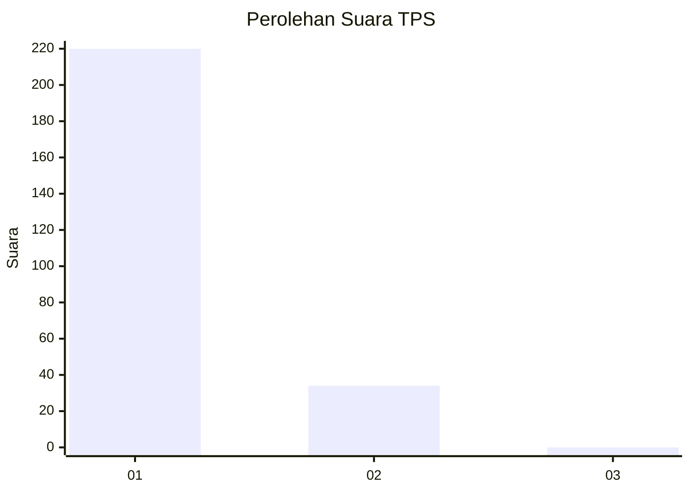
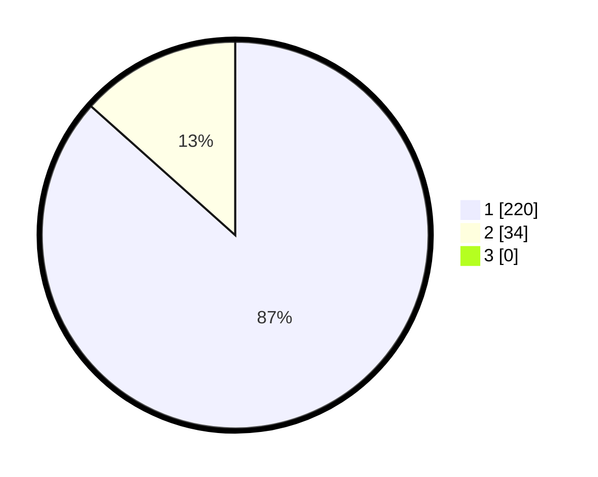

# Hasil

## Grafik

## Tabel

| No. | Nama Paslon    | Suara | Suara (raw) | Persentase |
|:--- |:-------------- | -----:| -----------:| ----------:|
| 1   | ANIES MUHAIMIN | 220   | [220][p-1]  | 86,61      |
| 2   | PRABOWO GIBRAN | 34    | [34][p-2]   | 13,39      |
| 3   | GANJAR MAHFUD  | 0     | [0][p-3]    | 0,00       |

[p-1]: https://github.com/gigit-pemilu/pemilu-2024-35-jawa-timur/blob/main/pilpres/hitung-suara/sub/35-jawa-timur/sub/27-sampang/sub/12-ketapang/sub/2006-pangereman/sub/004-tps/sub/paslon-1.txt
[p-2]: https://github.com/gigit-pemilu/pemilu-2024-35-jawa-timur/blob/main/pilpres/hitung-suara/sub/35-jawa-timur/sub/27-sampang/sub/12-ketapang/sub/2006-pangereman/sub/004-tps/sub/paslon-2.txt
[p-3]: https://github.com/gigit-pemilu/pemilu-2024-35-jawa-timur/blob/main/pilpres/hitung-suara/sub/35-jawa-timur/sub/27-sampang/sub/12-ketapang/sub/2006-pangereman/sub/004-tps/sub/paslon-3.txt

## Foto C Plano

https://sirekap-obj-formc.kpu.go.id/cf74/pemilu/ppwp/35/27/12/20/06/3527122006004-20240215-074124--cdd3fedf-bd61-4327-b41d-d5c8025c291a.jpg

https://sirekap-obj-formc.kpu.go.id/cf74/pemilu/ppwp/35/27/12/20/06/3527122006004-20240215-074358--be98f330-48b8-406d-8d98-210ca0ad959f.jpg

https://sirekap-obj-formc.kpu.go.id/cf74/pemilu/ppwp/35/27/12/20/06/3527122006004-20240215-074457--a380c766-4534-48ee-9d80-499c3cf55145.jpg

## Metadata

| Key        | Value               |
| ---------- | ------------------- |
| Time Stamp | 2024-02-16 02:30:27 |

