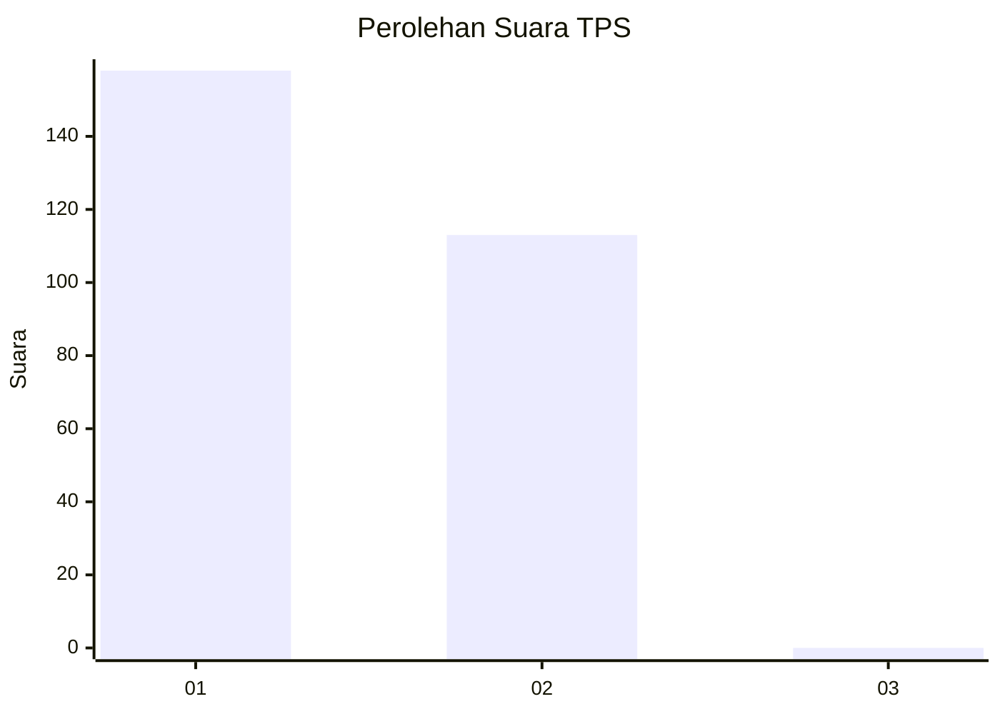
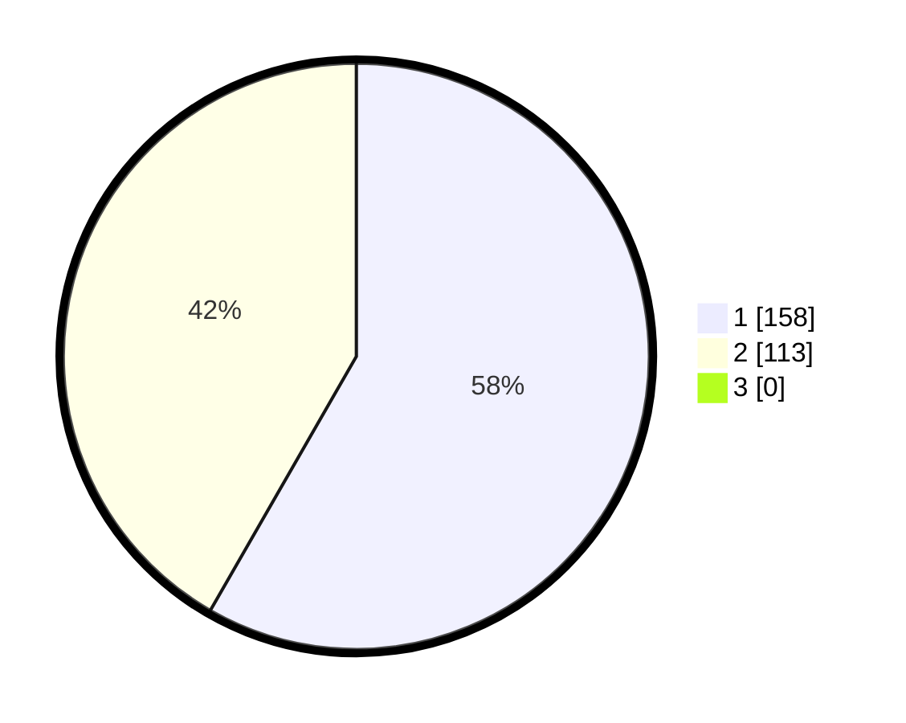

# Hasil

## Grafik

## Tabel

| No. | Nama Paslon    | Suara | Suara (raw) | Persentase |
|:--- |:-------------- | -----:| -----------:| ----------:|
| 1   | ANIES MUHAIMIN | 158   | [158][p-1]  | 58,30      |
| 2   | PRABOWO GIBRAN | 113   | [113][p-2]  | 41,70      |
| 3   | GANJAR MAHFUD  | 0     | [0][p-3]    | 0,00       |

[p-1]: https://github.com/gigit-pemilu/pemilu-2024/blob/main/pilpres/hitung-suara/sub/35-jawa-timur/sub/27-sampang/sub/12-ketapang/sub/2006-pangereman/sub/005-tps/sub/paslon-1.txt
[p-2]: https://github.com/gigit-pemilu/pemilu-2024/blob/main/pilpres/hitung-suara/sub/35-jawa-timur/sub/27-sampang/sub/12-ketapang/sub/2006-pangereman/sub/005-tps/sub/paslon-2.txt
[p-3]: https://github.com/gigit-pemilu/pemilu-2024/blob/main/pilpres/hitung-suara/sub/35-jawa-timur/sub/27-sampang/sub/12-ketapang/sub/2006-pangereman/sub/005-tps/sub/paslon-3.txt

## Foto C Plano

https://sirekap-obj-formc.kpu.go.id/b8c8/pemilu/ppwp/35/27/12/20/06/3527122006005-20240215-114508--b0fcd0ad-fec4-4cfa-ab05-59db24e39c47.jpg

https://sirekap-obj-formc.kpu.go.id/b8c8/pemilu/ppwp/35/27/12/20/06/3527122006005-20240215-091507--2f20f832-1266-42ff-9305-8ea024ee3a51.jpg

https://sirekap-obj-formc.kpu.go.id/b8c8/pemilu/ppwp/35/27/12/20/06/3527122006005-20240215-091630--54894b74-125e-4f1f-831f-0d98b53b0aeb.jpg

## Metadata

| Key        | Value               |
| ---------- | ------------------- |
| Time Stamp | 2024-02-17 09:30:03 |

