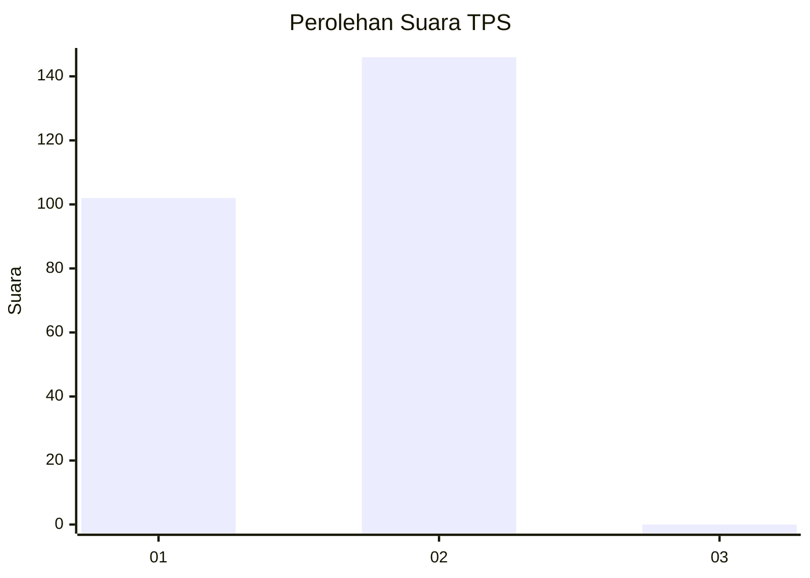
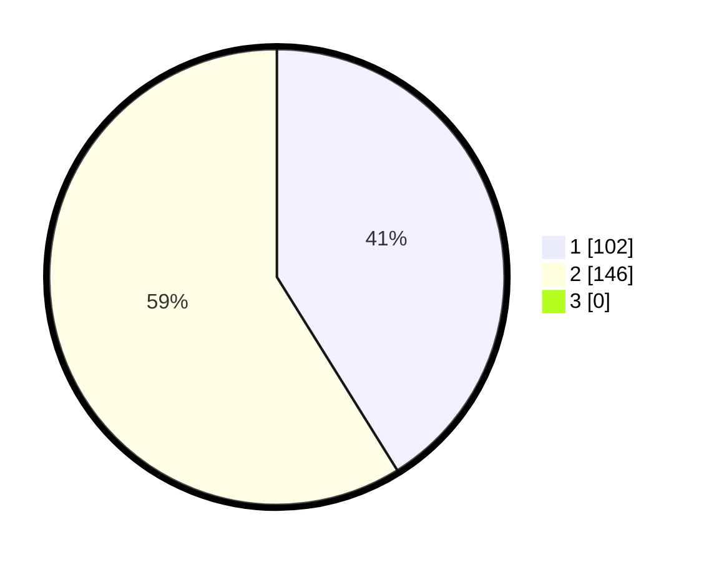

# Hasil

## Grafik

## Tabel

| No. | Nama Paslon    | Suara | Suara (raw) | Persentase |
|:--- |:-------------- | -----:| -----------:| ----------:|
| 1   | ANIES MUHAIMIN | 102   | [102][p-1]  | 41,13      |
| 2   | PRABOWO GIBRAN | 146   | [146][p-2]  | 58,87      |
| 3   | GANJAR MAHFUD  | 0     | [0][p-3]    | 0,00       |

[p-1]: https://github.com/gigit-pemilu/pemilu-2024/blob/main/pilpres/hitung-suara/sub/35-jawa-timur/sub/27-sampang/sub/12-ketapang/sub/2006-pangereman/sub/006-tps/sub/paslon-1.txt
[p-2]: https://github.com/gigit-pemilu/pemilu-2024/blob/main/pilpres/hitung-suara/sub/35-jawa-timur/sub/27-sampang/sub/12-ketapang/sub/2006-pangereman/sub/006-tps/sub/paslon-2.txt
[p-3]: https://github.com/gigit-pemilu/pemilu-2024/blob/main/pilpres/hitung-suara/sub/35-jawa-timur/sub/27-sampang/sub/12-ketapang/sub/2006-pangereman/sub/006-tps/sub/paslon-3.txt

## Foto C Plano

https://sirekap-obj-formc.kpu.go.id/d840/pemilu/ppwp/35/27/12/20/06/3527122006006-20240215-094836--c2b2ac0c-61f2-4deb-b98d-91ed2491f5c2.jpg

https://sirekap-obj-formc.kpu.go.id/d840/pemilu/ppwp/35/27/12/20/06/3527122006006-20240215-140924--5fbdb14d-a7a3-45fd-ad3d-df5b4524ef66.jpg

https://sirekap-obj-formc.kpu.go.id/d840/pemilu/ppwp/35/27/12/20/06/3527122006006-20240215-094657--558ae2d0-132b-4110-8760-62a045d992c1.jpg

## Metadata

| Key        | Value               |
| ---------- | ------------------- |
| Time Stamp | 2024-02-15 22:30:27 |

