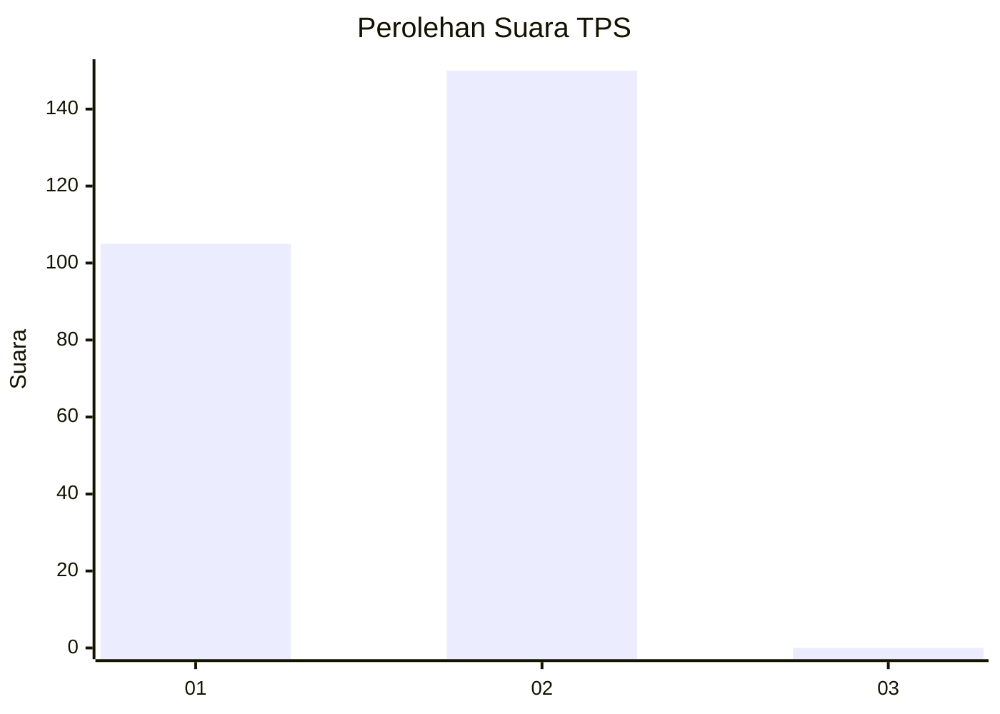
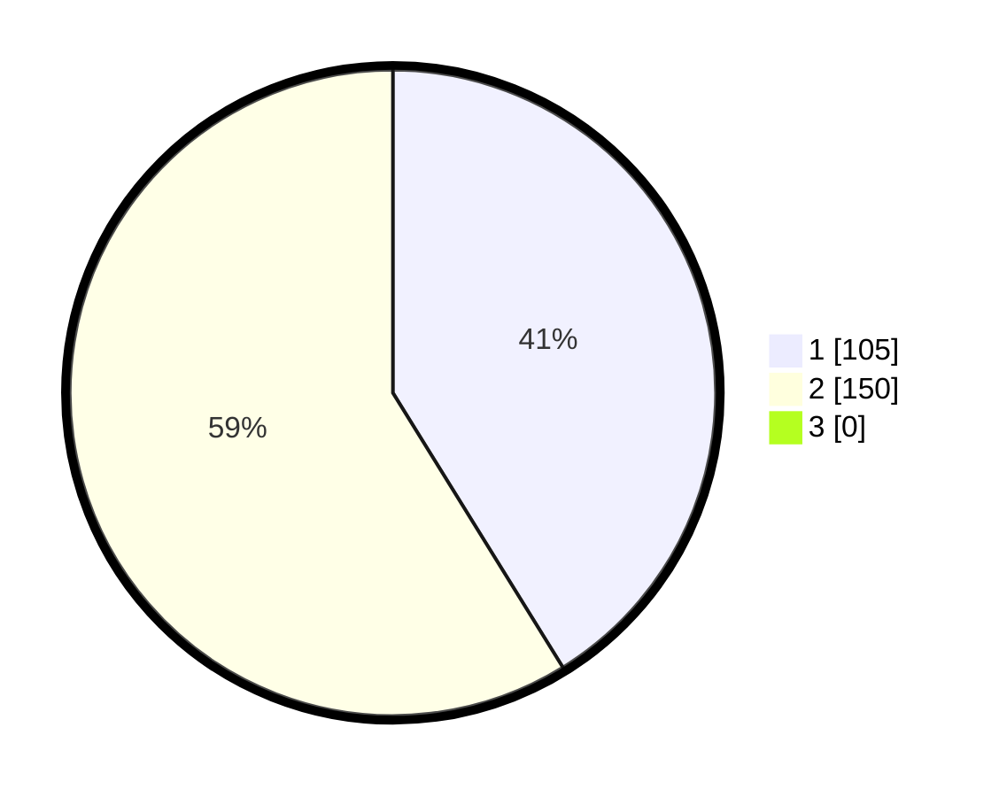

# Hasil

## Grafik

## Tabel

| No. | Nama Paslon    | Suara | Suara (raw) | Persentase |
|:--- |:-------------- | -----:| -----------:| ----------:|
| 1   | ANIES MUHAIMIN | 105   | [105][p-1]  | 41,18      |
| 2   | PRABOWO GIBRAN | 150   | [150][p-2]  | 58,82      |
| 3   | GANJAR MAHFUD  | 0     | [0][p-3]    | 0,00       |

[p-1]: https://github.com/gigit-pemilu/pemilu-2024/blob/main/pilpres/hitung-suara/sub/35-jawa-timur/sub/27-sampang/sub/12-ketapang/sub/2006-pangereman/sub/007-tps/sub/paslon-1.txt
[p-2]: https://github.com/gigit-pemilu/pemilu-2024/blob/main/pilpres/hitung-suara/sub/35-jawa-timur/sub/27-sampang/sub/12-ketapang/sub/2006-pangereman/sub/007-tps/sub/paslon-2.txt
[p-3]: https://github.com/gigit-pemilu/pemilu-2024/blob/main/pilpres/hitung-suara/sub/35-jawa-timur/sub/27-sampang/sub/12-ketapang/sub/2006-pangereman/sub/007-tps/sub/paslon-3.txt

## Foto C Plano

https://sirekap-obj-formc.kpu.go.id/38b1/pemilu/ppwp/35/27/12/20/06/3527122006007-20240215-080708--10436dad-a69f-49ce-8dfb-d61c4eba7921.jpg

https://sirekap-obj-formc.kpu.go.id/38b1/pemilu/ppwp/35/27/12/20/06/3527122006007-20240215-083315--549e63d2-cb49-4d98-a253-467f4b98826c.jpg

https://sirekap-obj-formc.kpu.go.id/38b1/pemilu/ppwp/35/27/12/20/06/3527122006007-20240215-103756--ded417b2-43d3-4e5f-991d-1e68efa633c2.jpg

## Metadata

| Key        | Value               |
| ---------- | ------------------- |
| Time Stamp | 2024-02-17 09:30:03 |

