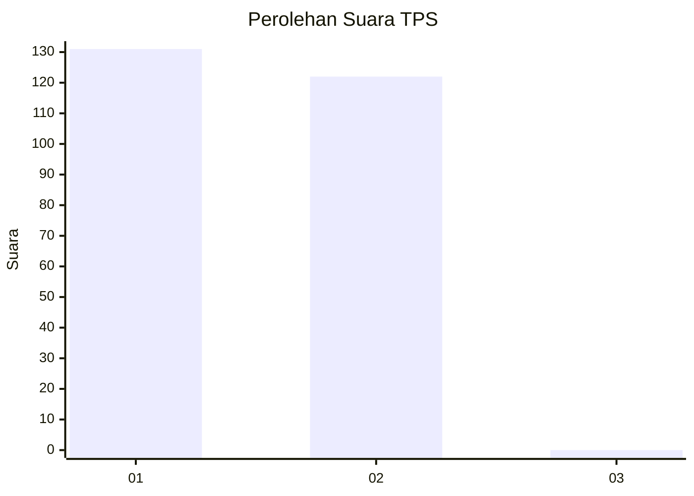
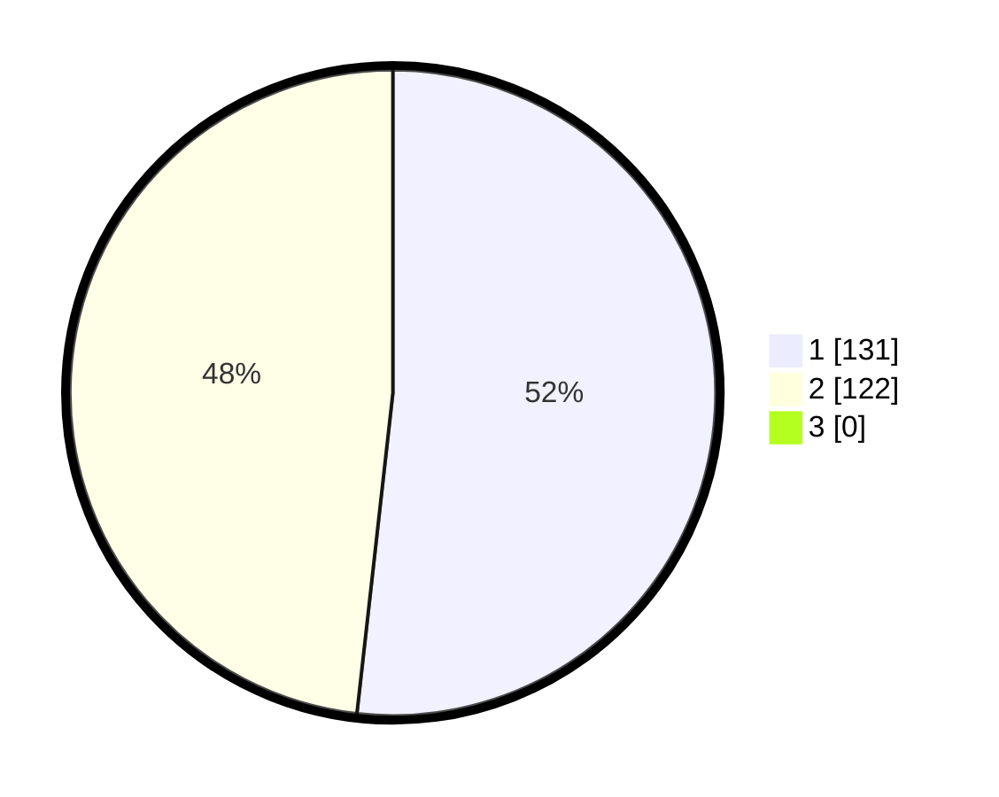

# Hasil

## Grafik

## Tabel

| No. | Nama Paslon    | Suara | Suara (raw) | Persentase |
|:--- |:-------------- | -----:| -----------:| ----------:|
| 1   | ANIES MUHAIMIN | 131   | [131][p-1]  | 51,78      |
| 2   | PRABOWO GIBRAN | 122   | [122][p-2]  | 48,22      |
| 3   | GANJAR MAHFUD  | 0     | [0][p-3]    | 0,00       |

[p-1]: https://github.com/gigit-pemilu/pemilu-2024-35-jawa-timur/blob/main/pilpres/hitung-suara/sub/35-jawa-timur/sub/27-sampang/sub/12-ketapang/sub/2006-pangereman/sub/009-tps/sub/paslon-1.txt
[p-2]: https://github.com/gigit-pemilu/pemilu-2024-35-jawa-timur/blob/main/pilpres/hitung-suara/sub/35-jawa-timur/sub/27-sampang/sub/12-ketapang/sub/2006-pangereman/sub/009-tps/sub/paslon-2.txt
[p-3]: https://github.com/gigit-pemilu/pemilu-2024-35-jawa-timur/blob/main/pilpres/hitung-suara/sub/35-jawa-timur/sub/27-sampang/sub/12-ketapang/sub/2006-pangereman/sub/009-tps/sub/paslon-3.txt

## Foto C Plano

https://sirekap-obj-formc.kpu.go.id/5ef1/pemilu/ppwp/35/27/12/20/06/3527122006009-20240215-091130--f72470b9-4437-435c-94d8-e3ecc2bdd301.jpg

https://sirekap-obj-formc.kpu.go.id/5ef1/pemilu/ppwp/35/27/12/20/06/3527122006009-20240215-123841--53d2d534-9be6-4260-82d3-56ae78ebcaee.jpg

https://sirekap-obj-formc.kpu.go.id/5ef1/pemilu/ppwp/35/27/12/20/06/3527122006009-20240215-123851--0adac1ac-999e-4084-9145-9b863f19d9af.jpg

## Metadata

| Key        | Value               |
| ---------- | ------------------- |
| Time Stamp | 2024-02-16 02:30:27 |

