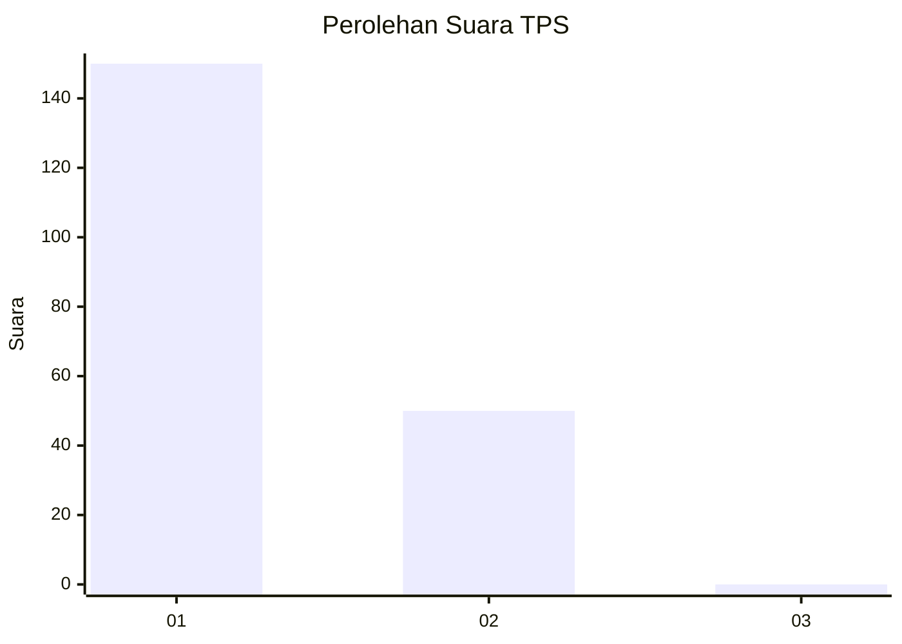
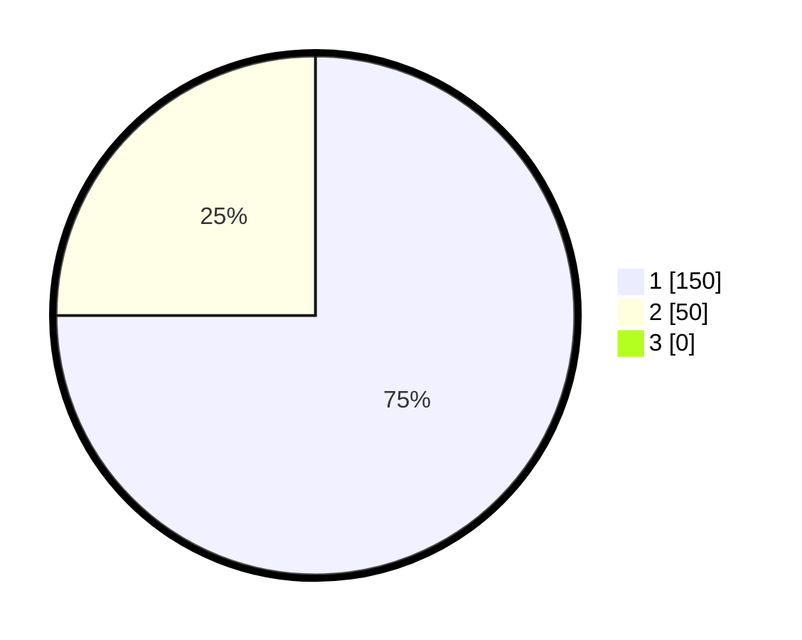

# Hasil

## Grafik

## Tabel

| No. | Nama Paslon    | Suara | Suara (raw) | Persentase |
|:--- |:-------------- | -----:| -----------:| ----------:|
| 1   | ANIES MUHAIMIN | 150   | [150][p-1]  | 75,00      |
| 2   | PRABOWO GIBRAN | 50    | [50][p-2]   | 25,00      |
| 3   | GANJAR MAHFUD  | 0     | [0][p-3]    | 0,00       |

[p-1]: https://github.com/gigit-pemilu/pemilu-2024-35-jawa-timur/blob/main/pilpres/hitung-suara/sub/35-jawa-timur/sub/27-sampang/sub/12-ketapang/sub/2006-pangereman/sub/020-tps/sub/paslon-1.txt
[p-2]: https://github.com/gigit-pemilu/pemilu-2024-35-jawa-timur/blob/main/pilpres/hitung-suara/sub/35-jawa-timur/sub/27-sampang/sub/12-ketapang/sub/2006-pangereman/sub/020-tps/sub/paslon-2.txt
[p-3]: https://github.com/gigit-pemilu/pemilu-2024-35-jawa-timur/blob/main/pilpres/hitung-suara/sub/35-jawa-timur/sub/27-sampang/sub/12-ketapang/sub/2006-pangereman/sub/020-tps/sub/paslon-3.txt

## Foto C Plano

https://sirekap-obj-formc.kpu.go.id/4758/pemilu/ppwp/35/27/12/20/06/3527122006020-20240215-091434--75fba172-711e-4a68-90c9-28154c49d31d.jpg

https://sirekap-obj-formc.kpu.go.id/4758/pemilu/ppwp/35/27/12/20/06/3527122006020-20240215-091518--155a4b5f-ad11-495a-90c3-521a4a260545.jpg

https://sirekap-obj-formc.kpu.go.id/4758/pemilu/ppwp/35/27/12/20/06/3527122006020-20240215-091711--e4d56cc5-d3bc-4197-81e9-5a84603d4bce.jpg

## Metadata

| Key        | Value               |
| ---------- | ------------------- |
| Time Stamp | 2024-02-17 01:00:00 |

