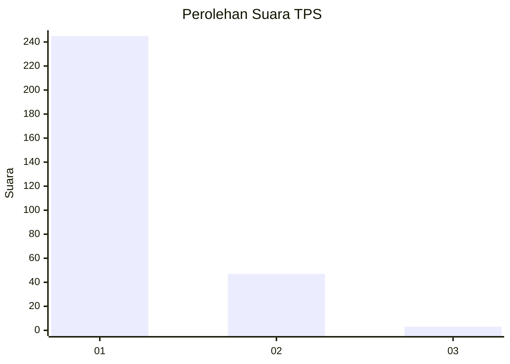
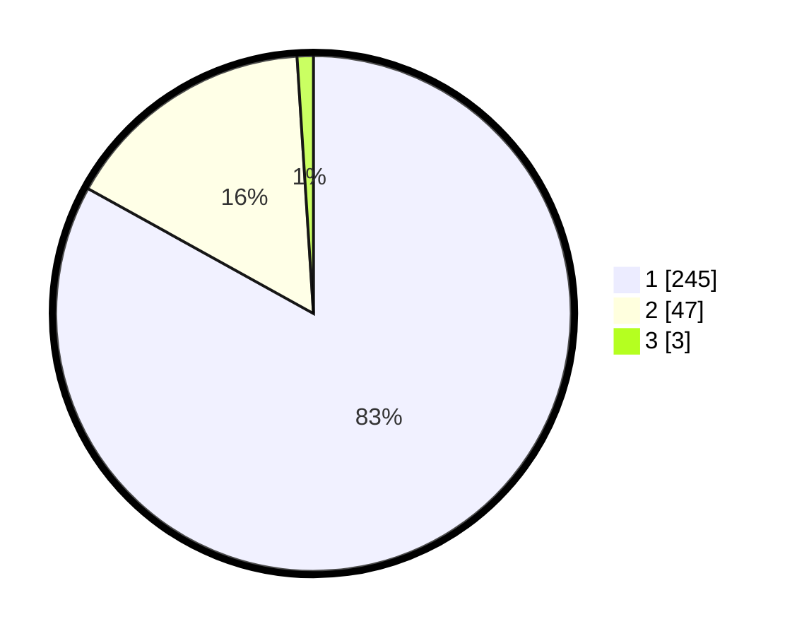

# Hasil

## Grafik

## Tabel

| No. | Nama Paslon    | Suara | Suara (raw) | Persentase |
|:--- |:-------------- | -----:| -----------:| ----------:|
| 1   | ANIES MUHAIMIN | 245   | [245][p-1]  | 83,05      |
| 2   | PRABOWO GIBRAN | 47    | [47][p-2]   | 15,93      |
| 3   | GANJAR MAHFUD  | 3     | [3][p-3]    | 1,02       |

[p-1]: https://github.com/gigit-pemilu/pemilu-2024/blob/main/pilpres/hitung-suara/sub/35-jawa-timur/sub/27-sampang/sub/12-ketapang/sub/2007-bira-barat/sub/001-tps/sub/paslon-1.txt
[p-2]: https://github.com/gigit-pemilu/pemilu-2024/blob/main/pilpres/hitung-suara/sub/35-jawa-timur/sub/27-sampang/sub/12-ketapang/sub/2007-bira-barat/sub/001-tps/sub/paslon-2.txt
[p-3]: https://github.com/gigit-pemilu/pemilu-2024/blob/main/pilpres/hitung-suara/sub/35-jawa-timur/sub/27-sampang/sub/12-ketapang/sub/2007-bira-barat/sub/001-tps/sub/paslon-3.txt

## Foto C Plano

https://sirekap-obj-formc.kpu.go.id/af6f/pemilu/ppwp/35/27/12/20/07/3527122007001-20240215-180545--77ae000e-3869-4e7c-837f-5b5bfcb1fe63.jpg

https://sirekap-obj-formc.kpu.go.id/af6f/pemilu/ppwp/35/27/12/20/07/3527122007001-20240215-164811--701d71b4-7612-4a5b-be44-c03bdd1848c6.jpg

https://sirekap-obj-formc.kpu.go.id/af6f/pemilu/ppwp/35/27/12/20/07/3527122007001-20240215-164844--3e0d0b18-51ed-4bdb-88ea-6df14e2877e9.jpg

## Metadata

| Key        | Value               |
| ---------- | ------------------- |
| Time Stamp | 2024-02-17 10:30:03 |

