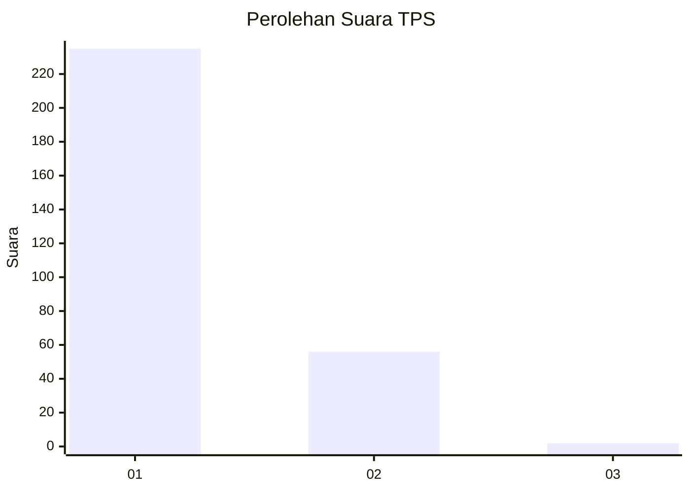
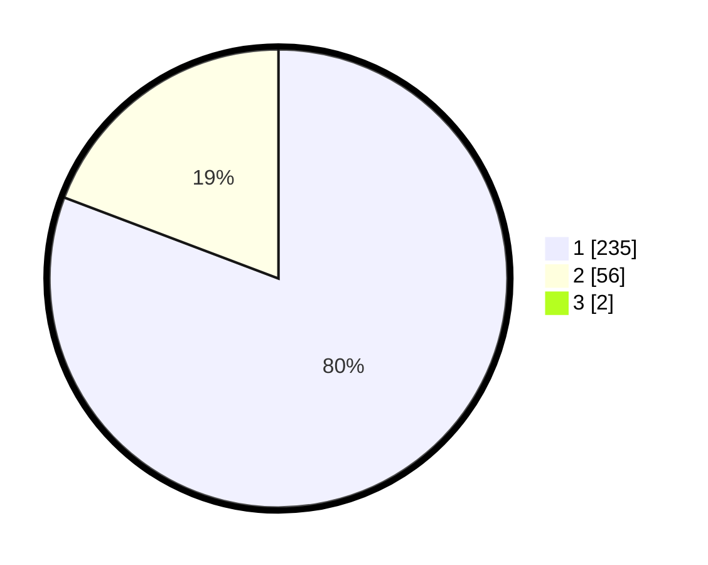

# Hasil

## Grafik

## Tabel

| No. | Nama Paslon    | Suara | Suara (raw) | Persentase |
|:--- |:-------------- | -----:| -----------:| ----------:|
| 1   | ANIES MUHAIMIN | 235   | [235][p-1]  | 80,20      |
| 2   | PRABOWO GIBRAN | 56    | [56][p-2]   | 19,11      |
| 3   | GANJAR MAHFUD  | 2     | [2][p-3]    | 0,68       |

[p-1]: https://github.com/gigit-pemilu/pemilu-2024/blob/main/pilpres/hitung-suara/sub/35-jawa-timur/sub/27-sampang/sub/12-ketapang/sub/2007-bira-barat/sub/002-tps/sub/paslon-1.txt
[p-2]: https://github.com/gigit-pemilu/pemilu-2024/blob/main/pilpres/hitung-suara/sub/35-jawa-timur/sub/27-sampang/sub/12-ketapang/sub/2007-bira-barat/sub/002-tps/sub/paslon-2.txt
[p-3]: https://github.com/gigit-pemilu/pemilu-2024/blob/main/pilpres/hitung-suara/sub/35-jawa-timur/sub/27-sampang/sub/12-ketapang/sub/2007-bira-barat/sub/002-tps/sub/paslon-3.txt

## Foto C Plano

https://sirekap-obj-formc.kpu.go.id/fe7b/pemilu/ppwp/35/27/12/20/07/3527122007002-20240215-191517--454bd173-83a4-425e-af4a-75b6612e80cf.jpg

https://sirekap-obj-formc.kpu.go.id/fe7b/pemilu/ppwp/35/27/12/20/07/3527122007002-20240215-164920--4aab71bd-6b34-4185-8c5f-10ae686957d9.jpg

https://sirekap-obj-formc.kpu.go.id/fe7b/pemilu/ppwp/35/27/12/20/07/3527122007002-20240215-165113--34f50846-8c5c-4cd8-af3c-fe947cc42018.jpg

## Metadata

| Key        | Value               |
| ---------- | ------------------- |
| Time Stamp | 2024-02-17 09:30:03 |

