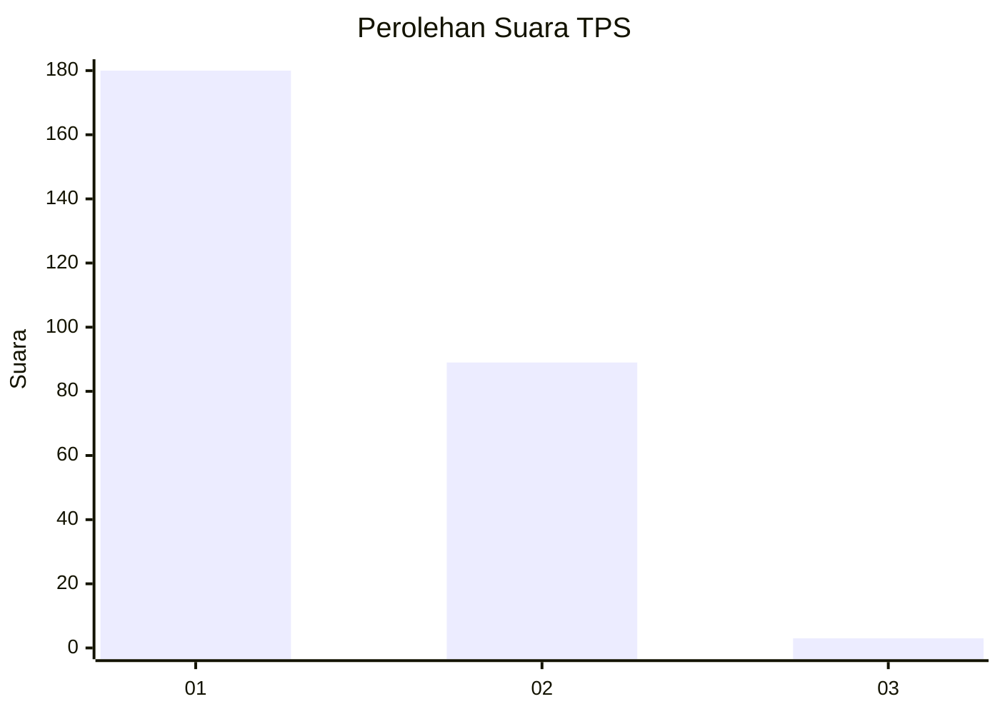
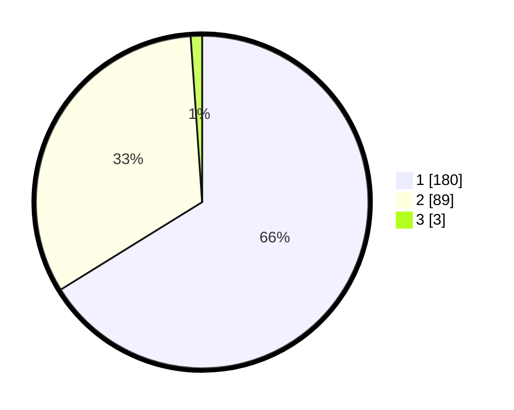

# Hasil

## Grafik

## Tabel

| No. | Nama Paslon    | Suara | Suara (raw) | Persentase |
|:--- |:-------------- | -----:| -----------:| ----------:|
| 1   | ANIES MUHAIMIN | 180   | [180][p-1]  | 66,18      |
| 2   | PRABOWO GIBRAN | 89    | [89][p-2]   | 32,72      |
| 3   | GANJAR MAHFUD  | 3     | [3][p-3]    | 1,10       |

[p-1]: https://github.com/gigit-pemilu/pemilu-2024-35-jawa-timur/blob/main/pilpres/hitung-suara/sub/35-jawa-timur/sub/27-sampang/sub/12-ketapang/sub/2007-bira-barat/sub/003-tps/sub/paslon-1.txt
[p-2]: https://github.com/gigit-pemilu/pemilu-2024-35-jawa-timur/blob/main/pilpres/hitung-suara/sub/35-jawa-timur/sub/27-sampang/sub/12-ketapang/sub/2007-bira-barat/sub/003-tps/sub/paslon-2.txt
[p-3]: https://github.com/gigit-pemilu/pemilu-2024-35-jawa-timur/blob/main/pilpres/hitung-suara/sub/35-jawa-timur/sub/27-sampang/sub/12-ketapang/sub/2007-bira-barat/sub/003-tps/sub/paslon-3.txt

## Foto C Plano

https://sirekap-obj-formc.kpu.go.id/9d86/pemilu/ppwp/35/27/12/20/07/3527122007003-20240215-174116--92800750-cfc8-432d-96d9-fa26af4aff3f.jpg

https://sirekap-obj-formc.kpu.go.id/9d86/pemilu/ppwp/35/27/12/20/07/3527122007003-20240215-150212--93ed2be3-da21-4acc-929a-84188cb59052.jpg

https://sirekap-obj-formc.kpu.go.id/9d86/pemilu/ppwp/35/27/12/20/07/3527122007003-20240215-172040--91fbe321-7eea-4fa0-bfb4-2029003b5a77.jpg

## Metadata

| Key        | Value               |
| ---------- | ------------------- |
| Time Stamp | 2024-02-17 01:00:00 |

