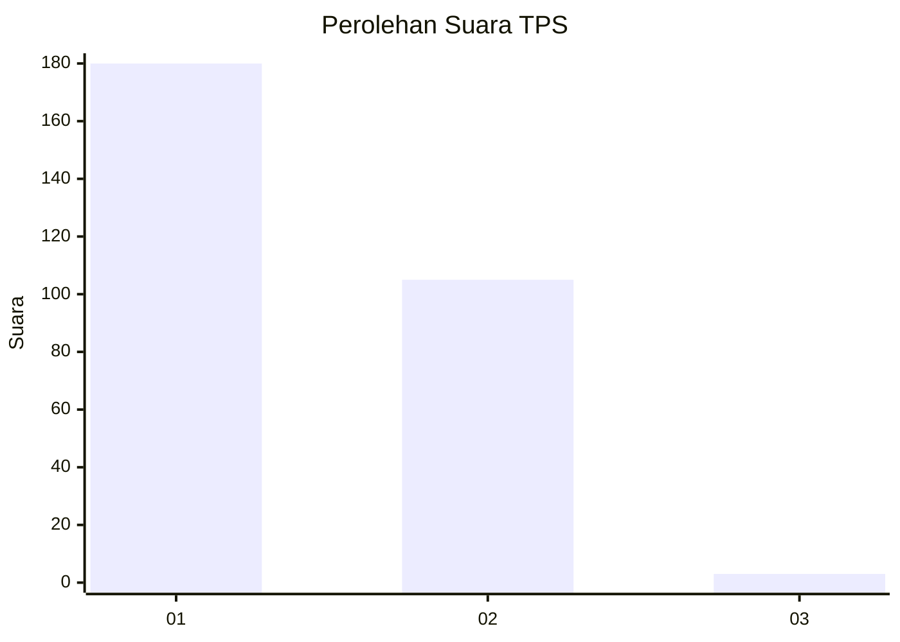
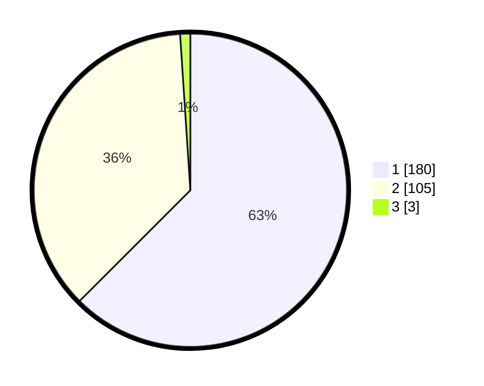

# Hasil

## Grafik

## Tabel

| No. | Nama Paslon    | Suara | Suara (raw) | Persentase |
|:--- |:-------------- | -----:| -----------:| ----------:|
| 1   | ANIES MUHAIMIN | 180   | [180][p-1]  | 62,50      |
| 2   | PRABOWO GIBRAN | 105   | [105][p-2]  | 36,46      |
| 3   | GANJAR MAHFUD  | 3     | [3][p-3]    | 1,04       |

[p-1]: https://github.com/gigit-pemilu/pemilu-2024-35-jawa-timur/blob/main/pilpres/hitung-suara/sub/35-jawa-timur/sub/27-sampang/sub/12-ketapang/sub/2007-bira-barat/sub/005-tps/sub/paslon-1.txt
[p-2]: https://github.com/gigit-pemilu/pemilu-2024-35-jawa-timur/blob/main/pilpres/hitung-suara/sub/35-jawa-timur/sub/27-sampang/sub/12-ketapang/sub/2007-bira-barat/sub/005-tps/sub/paslon-2.txt
[p-3]: https://github.com/gigit-pemilu/pemilu-2024-35-jawa-timur/blob/main/pilpres/hitung-suara/sub/35-jawa-timur/sub/27-sampang/sub/12-ketapang/sub/2007-bira-barat/sub/005-tps/sub/paslon-3.txt

## Foto C Plano

https://sirekap-obj-formc.kpu.go.id/40b4/pemilu/ppwp/35/27/12/20/07/3527122007005-20240215-173539--829f68f6-a9f3-49e1-8602-d420a5e2aad7.jpg

https://sirekap-obj-formc.kpu.go.id/40b4/pemilu/ppwp/35/27/12/20/07/3527122007005-20240215-173414--f0a0e023-b549-45af-858a-ac836227c099.jpg

https://sirekap-obj-formc.kpu.go.id/40b4/pemilu/ppwp/35/27/12/20/07/3527122007005-20240215-173639--4f140fde-605d-472d-9123-31b788f409cb.jpg

## Metadata

| Key        | Value               |
| ---------- | ------------------- |
| Time Stamp | 2024-02-25 13:00:00 |

