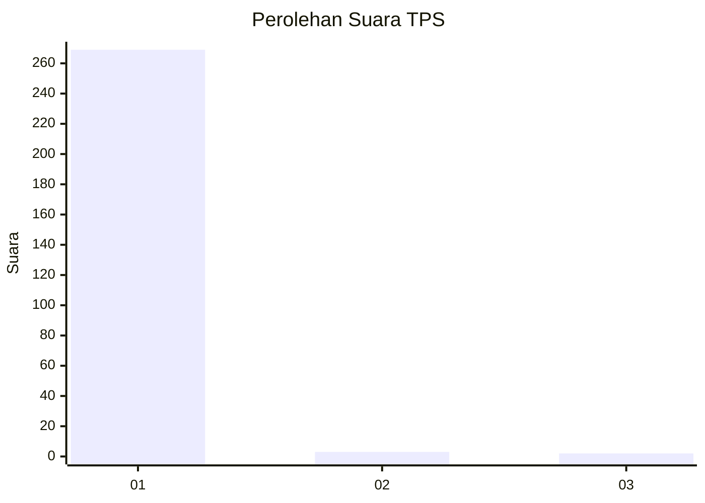
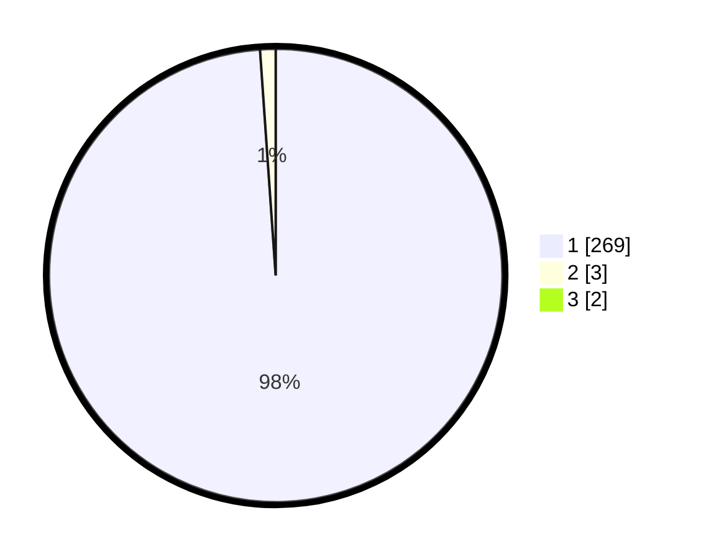

# Hasil

## Grafik

## Tabel

| No. | Nama Paslon    | Suara | Suara (raw) | Persentase |
|:--- |:-------------- | -----:| -----------:| ----------:|
| 1   | ANIES MUHAIMIN | 269   | [269][p-1]  | 98,18      |
| 2   | PRABOWO GIBRAN | 3     | [3][p-2]    | 1,09       |
| 3   | GANJAR MAHFUD  | 2     | [2][p-3]    | 0,73       |

[p-1]: https://github.com/gigit-pemilu/pemilu-2024/blob/main/pilpres/hitung-suara/sub/35-jawa-timur/sub/27-sampang/sub/12-ketapang/sub/2007-bira-barat/sub/006-tps/sub/paslon-1.txt
[p-2]: https://github.com/gigit-pemilu/pemilu-2024/blob/main/pilpres/hitung-suara/sub/35-jawa-timur/sub/27-sampang/sub/12-ketapang/sub/2007-bira-barat/sub/006-tps/sub/paslon-2.txt
[p-3]: https://github.com/gigit-pemilu/pemilu-2024/blob/main/pilpres/hitung-suara/sub/35-jawa-timur/sub/27-sampang/sub/12-ketapang/sub/2007-bira-barat/sub/006-tps/sub/paslon-3.txt

## Foto C Plano

https://sirekap-obj-formc.kpu.go.id/4e29/pemilu/ppwp/35/27/12/20/07/3527122007006-20240215-164550--c2adb5f5-741a-4aef-8582-884f8f619b3f.jpg

https://sirekap-obj-formc.kpu.go.id/4e29/pemilu/ppwp/35/27/12/20/07/3527122007006-20240215-164639--1e4cd84f-2e57-4117-aeab-767b0d8632b2.jpg

https://sirekap-obj-formc.kpu.go.id/4e29/pemilu/ppwp/35/27/12/20/07/3527122007006-20240215-164817--0e965e6f-a041-48d7-b219-1ef34a3e6f6c.jpg

## Metadata

| Key        | Value               |
| ---------- | ------------------- |
| Time Stamp | 2024-02-17 10:30:03 |

