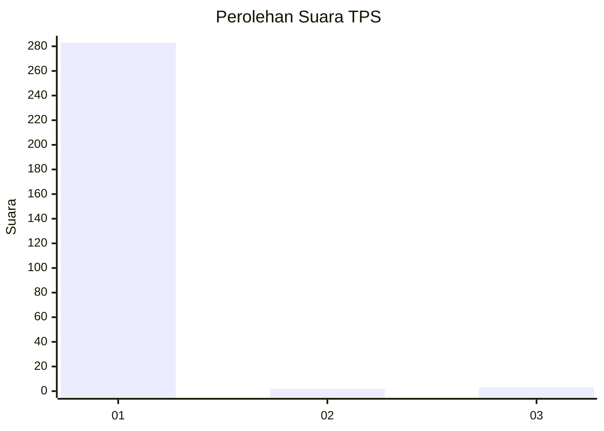
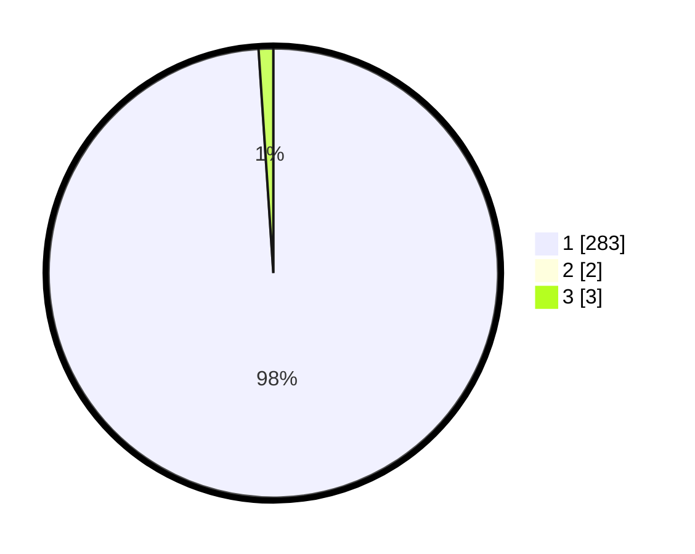

# Hasil

## Grafik

## Tabel

| No. | Nama Paslon    | Suara | Suara (raw) | Persentase |
|:--- |:-------------- | -----:| -----------:| ----------:|
| 1   | ANIES MUHAIMIN | 283   | [283][p-1]  | 98,26      |
| 2   | PRABOWO GIBRAN | 2     | [2][p-2]    | 0,69       |
| 3   | GANJAR MAHFUD  | 3     | [3][p-3]    | 1,04       |

[p-1]: https://github.com/gigit-pemilu/pemilu-2024-35-jawa-timur/blob/main/pilpres/hitung-suara/sub/35-jawa-timur/sub/27-sampang/sub/12-ketapang/sub/2007-bira-barat/sub/007-tps/sub/paslon-1.txt
[p-2]: https://github.com/gigit-pemilu/pemilu-2024-35-jawa-timur/blob/main/pilpres/hitung-suara/sub/35-jawa-timur/sub/27-sampang/sub/12-ketapang/sub/2007-bira-barat/sub/007-tps/sub/paslon-2.txt
[p-3]: https://github.com/gigit-pemilu/pemilu-2024-35-jawa-timur/blob/main/pilpres/hitung-suara/sub/35-jawa-timur/sub/27-sampang/sub/12-ketapang/sub/2007-bira-barat/sub/007-tps/sub/paslon-3.txt

## Foto C Plano

https://sirekap-obj-formc.kpu.go.id/fc96/pemilu/ppwp/35/27/12/20/07/3527122007007-20240215-171048--e63ebe33-7d42-438b-8d84-875b6d810015.jpg

https://sirekap-obj-formc.kpu.go.id/fc96/pemilu/ppwp/35/27/12/20/07/3527122007007-20240215-171150--d6bb9022-6206-4b84-888e-0620564abf33.jpg

https://sirekap-obj-formc.kpu.go.id/fc96/pemilu/ppwp/35/27/12/20/07/3527122007007-20240215-171405--db442fee-a114-4a8d-ba69-e4cde8c63744.jpg

## Metadata

| Key        | Value               |
| ---------- | ------------------- |
| Time Stamp | 2024-02-17 01:00:00 |

