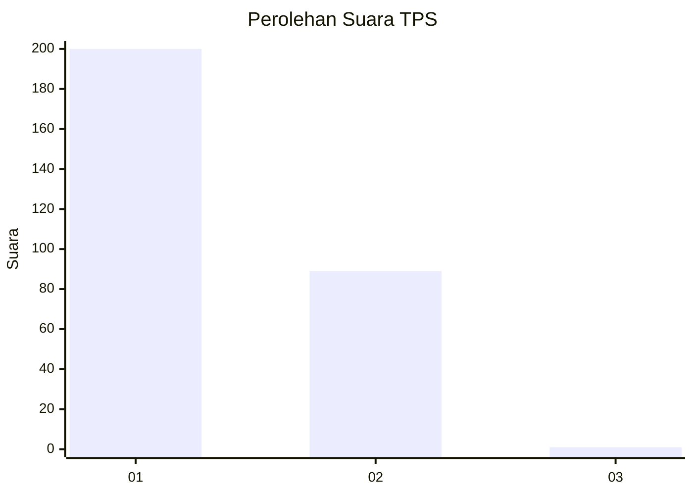
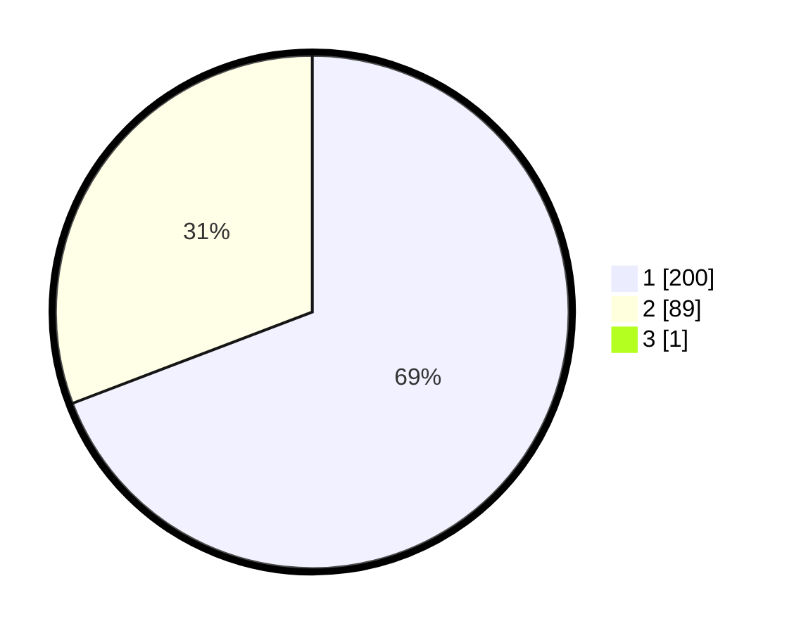

# Hasil

## Grafik

## Tabel

| No. | Nama Paslon    | Suara | Suara (raw) | Persentase |
|:--- |:-------------- | -----:| -----------:| ----------:|
| 1   | ANIES MUHAIMIN | 200   | [200][p-1]  | 68,97      |
| 2   | PRABOWO GIBRAN | 89    | [89][p-2]   | 30,69      |
| 3   | GANJAR MAHFUD  | 1     | [1][p-3]    | 0,34       |

[p-1]: https://github.com/gigit-pemilu/pemilu-2024-35-jawa-timur/blob/main/pilpres/hitung-suara/sub/35-jawa-timur/sub/27-sampang/sub/12-ketapang/sub/2007-bira-barat/sub/012-tps/sub/paslon-1.txt
[p-2]: https://github.com/gigit-pemilu/pemilu-2024-35-jawa-timur/blob/main/pilpres/hitung-suara/sub/35-jawa-timur/sub/27-sampang/sub/12-ketapang/sub/2007-bira-barat/sub/012-tps/sub/paslon-2.txt
[p-3]: https://github.com/gigit-pemilu/pemilu-2024-35-jawa-timur/blob/main/pilpres/hitung-suara/sub/35-jawa-timur/sub/27-sampang/sub/12-ketapang/sub/2007-bira-barat/sub/012-tps/sub/paslon-3.txt

## Foto C Plano

https://sirekap-obj-formc.kpu.go.id/1fa8/pemilu/ppwp/35/27/12/20/07/3527122007012-20240215-144705--cf2faaca-b17c-4b26-96af-5f8a313f3db3.jpg

https://sirekap-obj-formc.kpu.go.id/1fa8/pemilu/ppwp/35/27/12/20/07/3527122007012-20240215-144752--e2dce779-f9fa-4cd7-90b3-953a6016bfaa.jpg

https://sirekap-obj-formc.kpu.go.id/1fa8/pemilu/ppwp/35/27/12/20/07/3527122007012-20240215-144845--936343e1-5f6a-41a1-be75-0ca61c7600b2.jpg

## Metadata

| Key        | Value               |
| ---------- | ------------------- |
| Time Stamp | 2024-02-17 10:30:03 |

