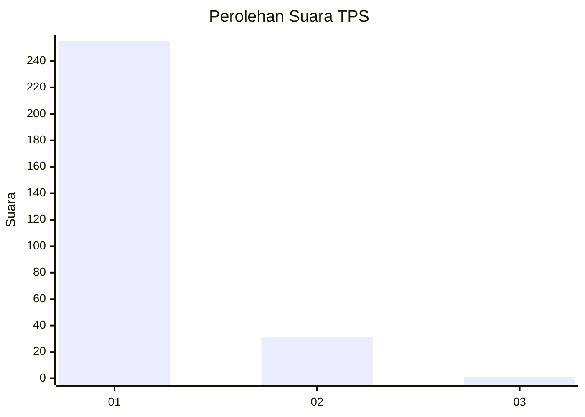
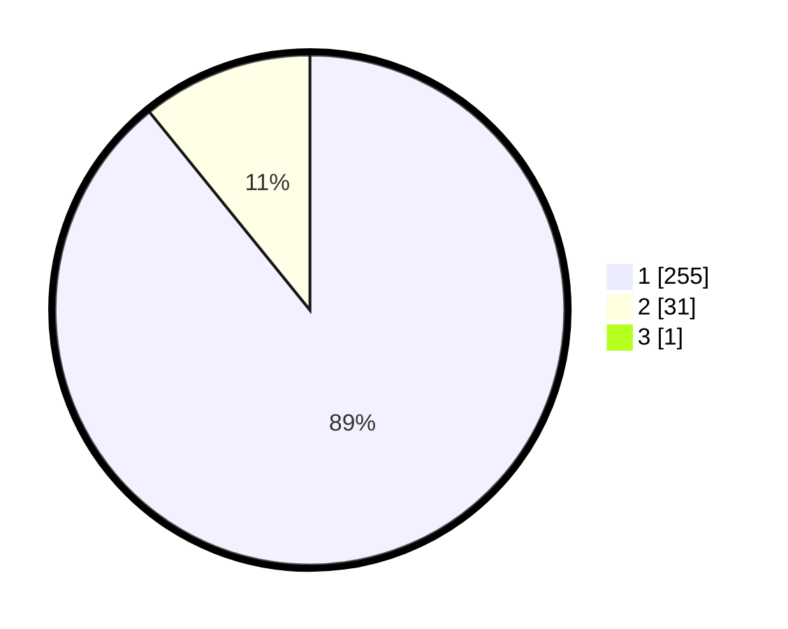

# Hasil

## Grafik

## Tabel

| No. | Nama Paslon    | Suara | Suara (raw) | Persentase |
|:--- |:-------------- | -----:| -----------:| ----------:|
| 1   | ANIES MUHAIMIN | 255   | [255][p-1]  | 88,85      |
| 2   | PRABOWO GIBRAN | 31    | [31][p-2]   | 10,80      |
| 3   | GANJAR MAHFUD  | 1     | [1][p-3]    | 0,35       |

[p-1]: https://github.com/gigit-pemilu/pemilu-2024-35-jawa-timur/blob/main/pilpres/hitung-suara/sub/35-jawa-timur/sub/27-sampang/sub/12-ketapang/sub/2007-bira-barat/sub/016-tps/sub/paslon-1.txt
[p-2]: https://github.com/gigit-pemilu/pemilu-2024-35-jawa-timur/blob/main/pilpres/hitung-suara/sub/35-jawa-timur/sub/27-sampang/sub/12-ketapang/sub/2007-bira-barat/sub/016-tps/sub/paslon-2.txt
[p-3]: https://github.com/gigit-pemilu/pemilu-2024-35-jawa-timur/blob/main/pilpres/hitung-suara/sub/35-jawa-timur/sub/27-sampang/sub/12-ketapang/sub/2007-bira-barat/sub/016-tps/sub/paslon-3.txt

## Foto C Plano

https://sirekap-obj-formc.kpu.go.id/9eba/pemilu/ppwp/35/27/12/20/07/3527122007016-20240215-154457--82f02a14-c991-4826-a0ef-ced575556429.jpg

https://sirekap-obj-formc.kpu.go.id/9eba/pemilu/ppwp/35/27/12/20/07/3527122007016-20240215-154640--b95b621a-fd8a-4999-9bc4-dc705146e7e6.jpg

https://sirekap-obj-formc.kpu.go.id/9eba/pemilu/ppwp/35/27/12/20/07/3527122007016-20240215-154755--b6b1b2a1-b717-49b1-870d-10c6d9444c6f.jpg

## Metadata

| Key        | Value               |
| ---------- | ------------------- |
| Time Stamp | 2024-02-17 01:00:00 |

