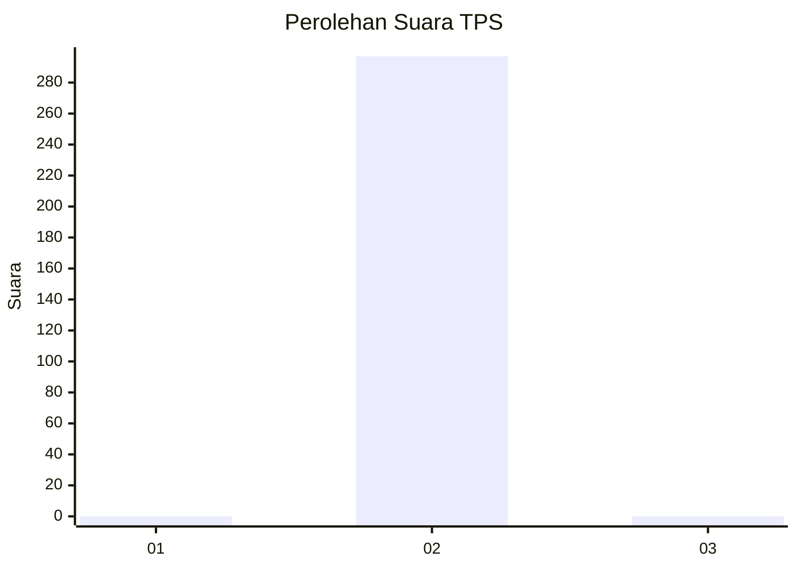
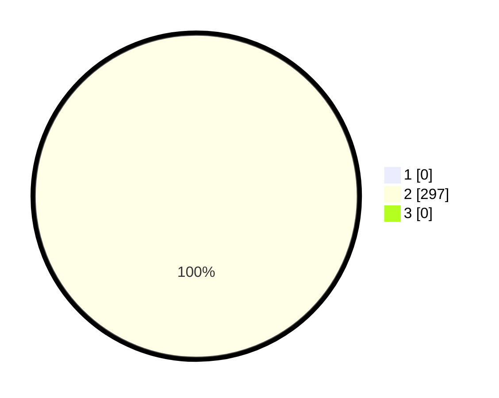

# Hasil

## Grafik

## Tabel

| No. | Nama Paslon    | Suara | Suara (raw) | Persentase |
|:--- |:-------------- | -----:| -----------:| ----------:|
| 1   | ANIES MUHAIMIN | 0     | [0][p-1]    | 0,00       |
| 2   | PRABOWO GIBRAN | 297   | [297][p-2]  | 100,00     |
| 3   | GANJAR MAHFUD  | 0     | [0][p-3]    | 0,00       |

[p-1]: https://github.com/gigit-pemilu/pemilu-2024-35-jawa-timur/blob/main/pilpres/hitung-suara/sub/35-jawa-timur/sub/27-sampang/sub/12-ketapang/sub/2009-ketapang-daya/sub/006-tps/sub/paslon-1.txt
[p-2]: https://github.com/gigit-pemilu/pemilu-2024-35-jawa-timur/blob/main/pilpres/hitung-suara/sub/35-jawa-timur/sub/27-sampang/sub/12-ketapang/sub/2009-ketapang-daya/sub/006-tps/sub/paslon-2.txt
[p-3]: https://github.com/gigit-pemilu/pemilu-2024-35-jawa-timur/blob/main/pilpres/hitung-suara/sub/35-jawa-timur/sub/27-sampang/sub/12-ketapang/sub/2009-ketapang-daya/sub/006-tps/sub/paslon-3.txt

## Foto C Plano

https://sirekap-obj-formc.kpu.go.id/aa1c/pemilu/ppwp/35/27/12/20/09/3527122009006-20240215-105016--108c2e52-7a4f-4e44-9101-a5b41ce7329b.jpg

https://sirekap-obj-formc.kpu.go.id/aa1c/pemilu/ppwp/35/27/12/20/09/3527122009006-20240215-105024--abca1f25-a758-4ee9-9841-ee273f4ad1a4.jpg

https://sirekap-obj-formc.kpu.go.id/aa1c/pemilu/ppwp/35/27/12/20/09/3527122009006-20240215-105036--eb17e18f-787d-4db1-b684-c7abe63d80c7.jpg

## Metadata

| Key        | Value               |
| ---------- | ------------------- |
| Time Stamp | 2024-02-17 09:30:03 |

