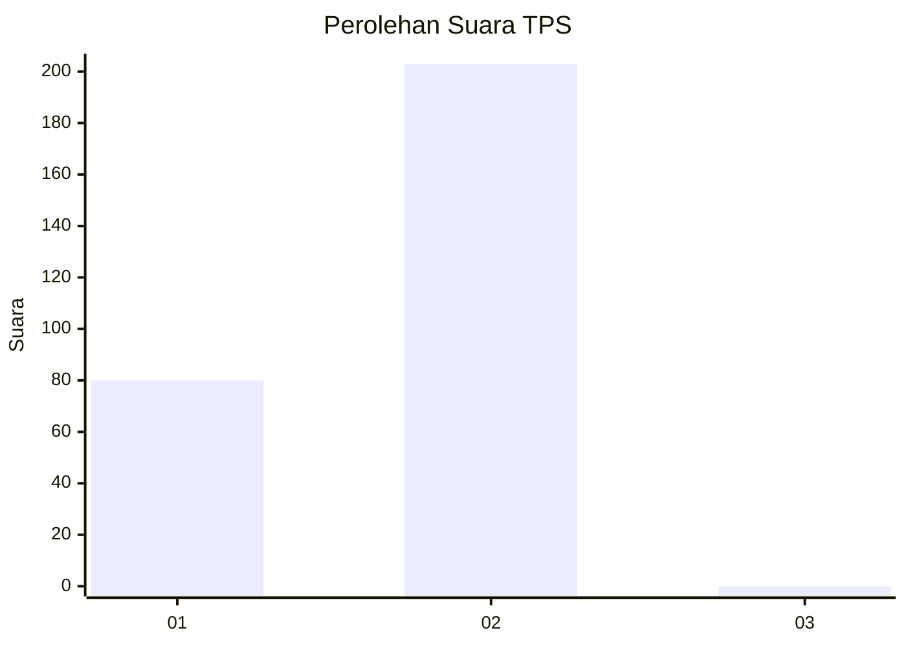
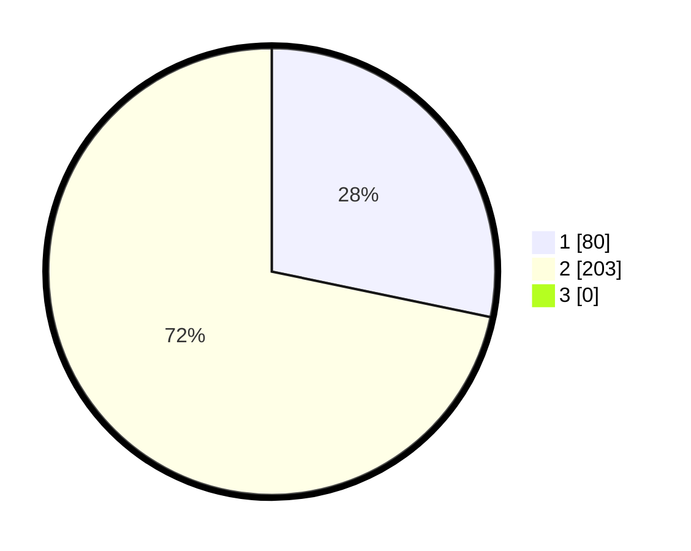

# Hasil

## Grafik

## Tabel

| No. | Nama Paslon    | Suara | Suara (raw) | Persentase |
|:--- |:-------------- | -----:| -----------:| ----------:|
| 1   | ANIES MUHAIMIN | 80    | [80][p-1]   | 28,27      |
| 2   | PRABOWO GIBRAN | 203   | [203][p-2]  | 71,73      |
| 3   | GANJAR MAHFUD  | 0     | [0][p-3]    | 0,00       |

[p-1]: https://github.com/gigit-pemilu/pemilu-2024-35-jawa-timur/blob/main/pilpres/hitung-suara/sub/35-jawa-timur/sub/27-sampang/sub/12-ketapang/sub/2009-ketapang-daya/sub/016-tps/sub/paslon-1.txt
[p-2]: https://github.com/gigit-pemilu/pemilu-2024-35-jawa-timur/blob/main/pilpres/hitung-suara/sub/35-jawa-timur/sub/27-sampang/sub/12-ketapang/sub/2009-ketapang-daya/sub/016-tps/sub/paslon-2.txt
[p-3]: https://github.com/gigit-pemilu/pemilu-2024-35-jawa-timur/blob/main/pilpres/hitung-suara/sub/35-jawa-timur/sub/27-sampang/sub/12-ketapang/sub/2009-ketapang-daya/sub/016-tps/sub/paslon-3.txt

## Foto C Plano

https://sirekap-obj-formc.kpu.go.id/6e18/pemilu/ppwp/35/27/12/20/09/3527122009016-20240215-091925--0f420c8b-31c6-4323-ba9d-dc2f29c6ae40.jpg

https://sirekap-obj-formc.kpu.go.id/6e18/pemilu/ppwp/35/27/12/20/09/3527122009016-20240215-091951--5aba9385-a470-4e36-8850-88c045c72804.jpg

https://sirekap-obj-formc.kpu.go.id/6e18/pemilu/ppwp/35/27/12/20/09/3527122009016-20240215-092013--7940b82a-4199-4107-89a4-31f82937e686.jpg

## Metadata

| Key        | Value               |
| ---------- | ------------------- |
| Time Stamp | 2024-02-16 10:30:29 |

