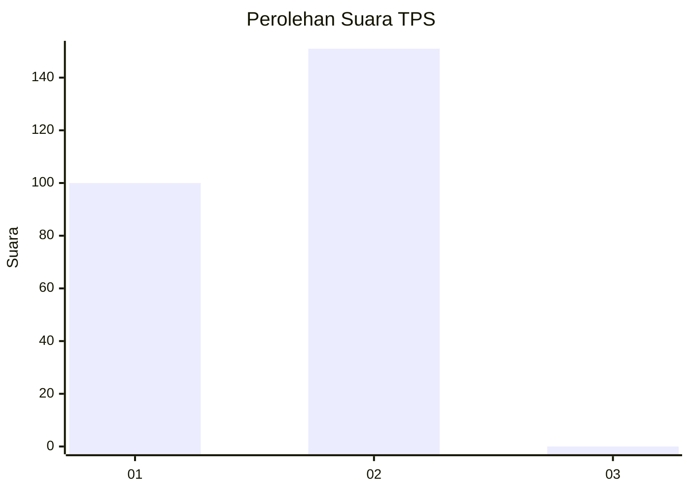
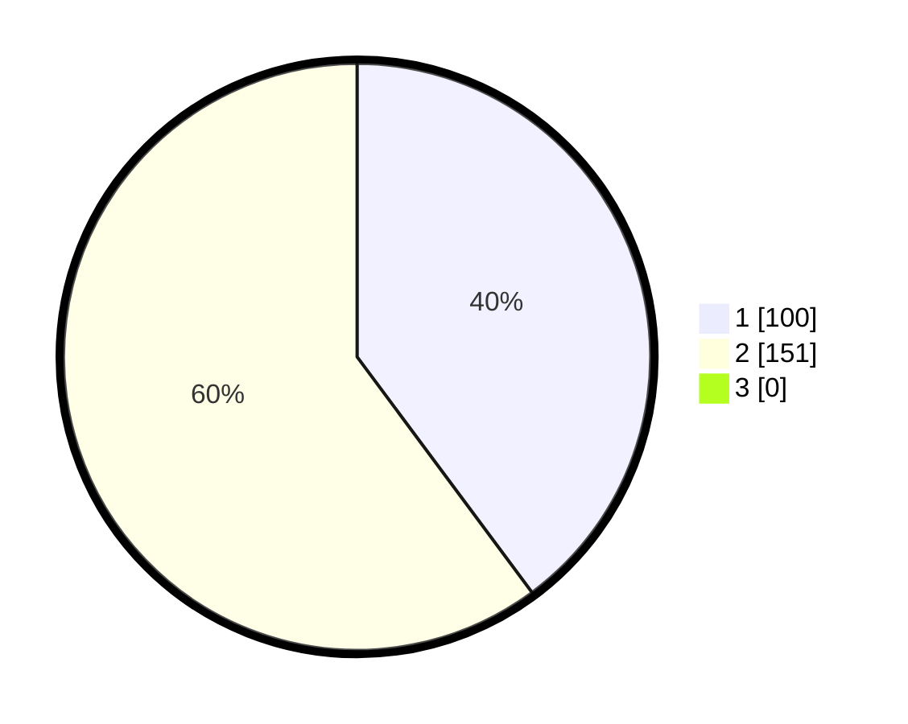

# Hasil

## Grafik

## Tabel

| No. | Nama Paslon    | Suara | Suara (raw) | Persentase |
|:--- |:-------------- | -----:| -----------:| ----------:|
| 1   | ANIES MUHAIMIN | 100   | [100][p-1]  | 39,84      |
| 2   | PRABOWO GIBRAN | 151   | [151][p-2]  | 60,16      |
| 3   | GANJAR MAHFUD  | 0     | [0][p-3]    | 0,00       |

[p-1]: https://github.com/gigit-pemilu/pemilu-2024-35-jawa-timur/blob/main/pilpres/hitung-suara/sub/35-jawa-timur/sub/27-sampang/sub/12-ketapang/sub/2009-ketapang-daya/sub/017-tps/sub/paslon-1.txt
[p-2]: https://github.com/gigit-pemilu/pemilu-2024-35-jawa-timur/blob/main/pilpres/hitung-suara/sub/35-jawa-timur/sub/27-sampang/sub/12-ketapang/sub/2009-ketapang-daya/sub/017-tps/sub/paslon-2.txt
[p-3]: https://github.com/gigit-pemilu/pemilu-2024-35-jawa-timur/blob/main/pilpres/hitung-suara/sub/35-jawa-timur/sub/27-sampang/sub/12-ketapang/sub/2009-ketapang-daya/sub/017-tps/sub/paslon-3.txt

## Foto C Plano

https://sirekap-obj-formc.kpu.go.id/638c/pemilu/ppwp/35/27/12/20/09/3527122009017-20240215-084723--38ffd710-5a19-49e9-90ec-a3b6f58a34f8.jpg

https://sirekap-obj-formc.kpu.go.id/638c/pemilu/ppwp/35/27/12/20/09/3527122009017-20240215-084847--992a3116-598b-41ac-b148-fcc3f6433d65.jpg

https://sirekap-obj-formc.kpu.go.id/638c/pemilu/ppwp/35/27/12/20/09/3527122009017-20240215-085000--887cc585-0dbf-4014-9d09-8cf4a28b88a8.jpg

## Metadata

| Key        | Value               |
| ---------- | ------------------- |
| Time Stamp | 2024-02-17 09:30:03 |

