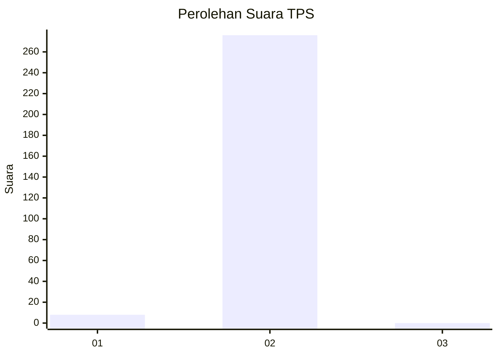
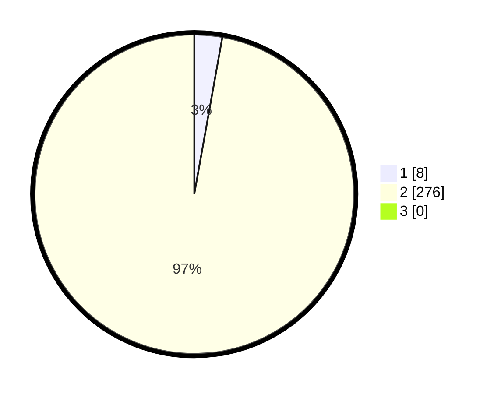

# Hasil

## Grafik

## Tabel

| No. | Nama Paslon    | Suara | Suara (raw) | Persentase |
|:--- |:-------------- | -----:| -----------:| ----------:|
| 1   | ANIES MUHAIMIN | 8     | [8][p-1]    | 2,82       |
| 2   | PRABOWO GIBRAN | 276   | [276][p-2]  | 97,18      |
| 3   | GANJAR MAHFUD  | 0     | [0][p-3]    | 0,00       |

[p-1]: https://github.com/gigit-pemilu/pemilu-2024/blob/main/pilpres/hitung-suara/sub/35-jawa-timur/sub/27-sampang/sub/12-ketapang/sub/2009-ketapang-daya/sub/020-tps/sub/paslon-1.txt
[p-2]: https://github.com/gigit-pemilu/pemilu-2024/blob/main/pilpres/hitung-suara/sub/35-jawa-timur/sub/27-sampang/sub/12-ketapang/sub/2009-ketapang-daya/sub/020-tps/sub/paslon-2.txt
[p-3]: https://github.com/gigit-pemilu/pemilu-2024/blob/main/pilpres/hitung-suara/sub/35-jawa-timur/sub/27-sampang/sub/12-ketapang/sub/2009-ketapang-daya/sub/020-tps/sub/paslon-3.txt

## Foto C Plano

https://sirekap-obj-formc.kpu.go.id/f2ce/pemilu/ppwp/35/27/12/20/09/3527122009020-20240214-225119--289e2f34-32bb-4d1d-90f3-bc0c0ba3920f.jpg

https://sirekap-obj-formc.kpu.go.id/f2ce/pemilu/ppwp/35/27/12/20/09/3527122009020-20240214-225253--081e50bb-d4c8-4e22-bd06-f23292d33441.jpg

https://sirekap-obj-formc.kpu.go.id/f2ce/pemilu/ppwp/35/27/12/20/09/3527122009020-20240214-225355--3dde4efa-4696-40f0-82e5-67812b067c38.jpg

## Metadata

| Key        | Value               |
| ---------- | ------------------- |
| Time Stamp | 2024-02-17 09:30:03 |

