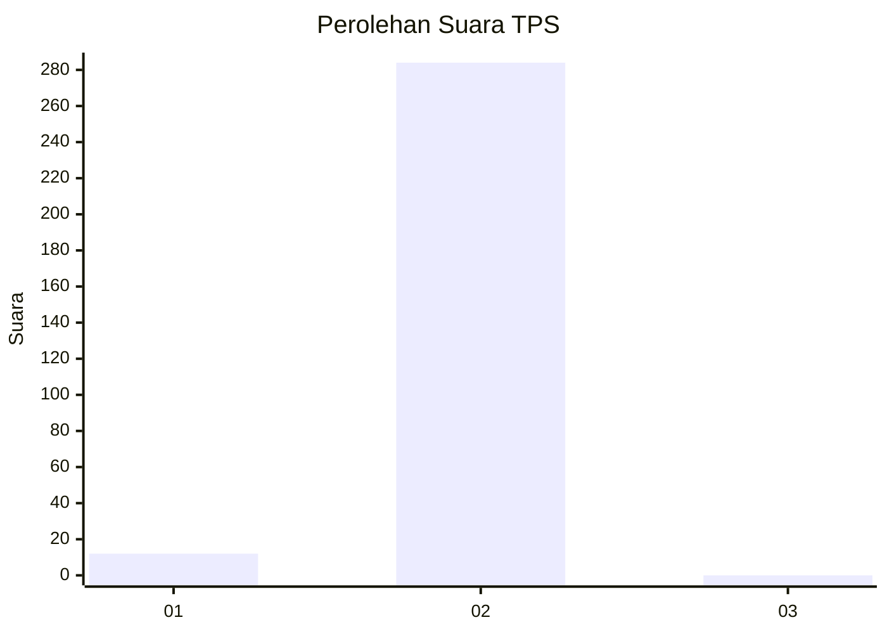
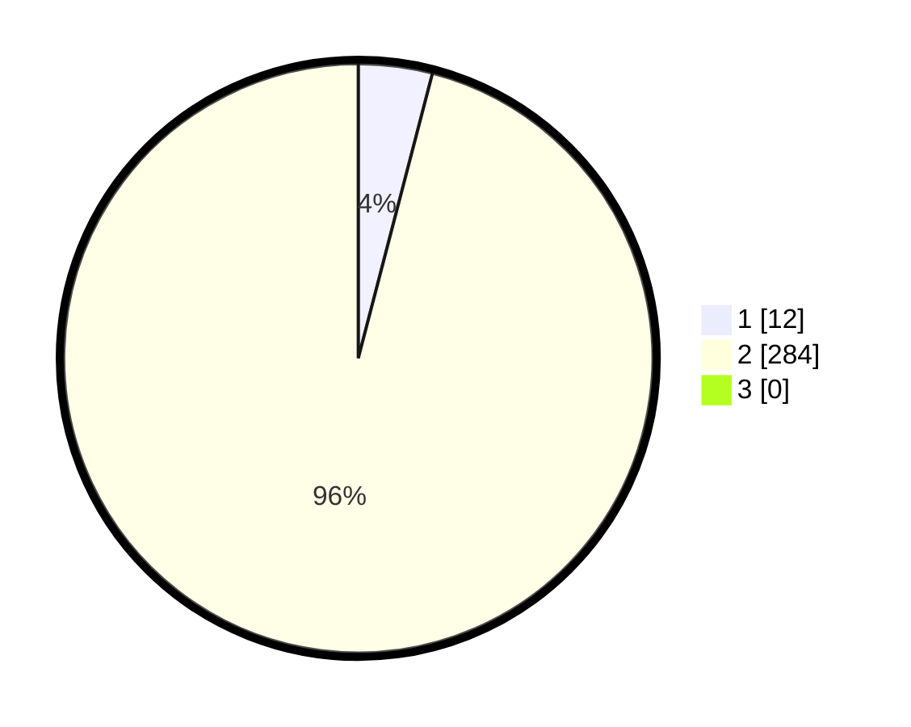

# Hasil

## Grafik

## Tabel

| No. | Nama Paslon    | Suara | Suara (raw) | Persentase |
|:--- |:-------------- | -----:| -----------:| ----------:|
| 1   | ANIES MUHAIMIN | 12    | [12][p-1]   | 4,05       |
| 2   | PRABOWO GIBRAN | 284   | [284][p-2]  | 95,95      |
| 3   | GANJAR MAHFUD  | 0     | [0][p-3]    | 0,00       |

[p-1]: https://github.com/gigit-pemilu/pemilu-2024/blob/main/pilpres/hitung-suara/sub/35-jawa-timur/sub/27-sampang/sub/12-ketapang/sub/2009-ketapang-daya/sub/021-tps/sub/paslon-1.txt
[p-2]: https://github.com/gigit-pemilu/pemilu-2024/blob/main/pilpres/hitung-suara/sub/35-jawa-timur/sub/27-sampang/sub/12-ketapang/sub/2009-ketapang-daya/sub/021-tps/sub/paslon-2.txt
[p-3]: https://github.com/gigit-pemilu/pemilu-2024/blob/main/pilpres/hitung-suara/sub/35-jawa-timur/sub/27-sampang/sub/12-ketapang/sub/2009-ketapang-daya/sub/021-tps/sub/paslon-3.txt

## Foto C Plano

https://sirekap-obj-formc.kpu.go.id/2a55/pemilu/ppwp/35/27/12/20/09/3527122009021-20240214-225452--aeaa172d-52a4-4c0d-af60-feab77734ccb.jpg

https://sirekap-obj-formc.kpu.go.id/2a55/pemilu/ppwp/35/27/12/20/09/3527122009021-20240214-225803--34ba7968-1290-47d5-8ca3-f81d89c6edf3.jpg

https://sirekap-obj-formc.kpu.go.id/2a55/pemilu/ppwp/35/27/12/20/09/3527122009021-20240214-225855--607c4213-3f38-4c38-931f-be3cb6847d13.jpg

## Metadata

| Key        | Value               |
| ---------- | ------------------- |
| Time Stamp | 2024-02-17 10:30:03 |

