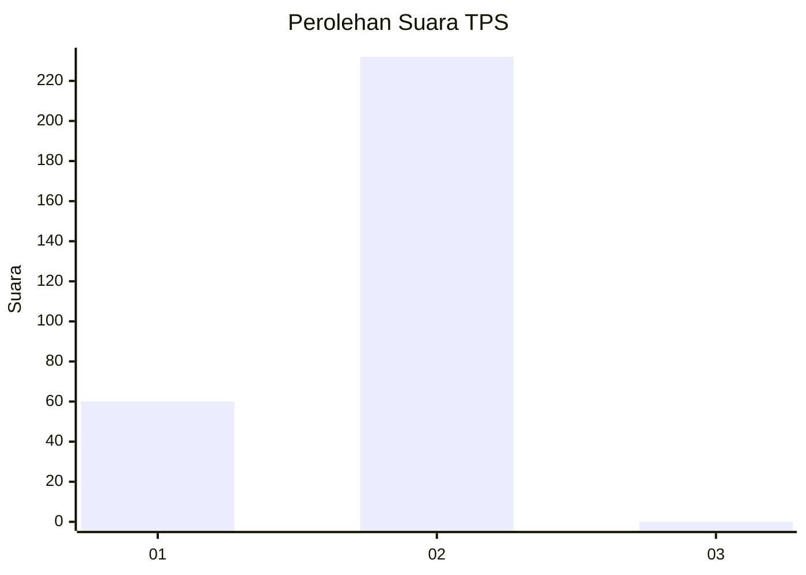
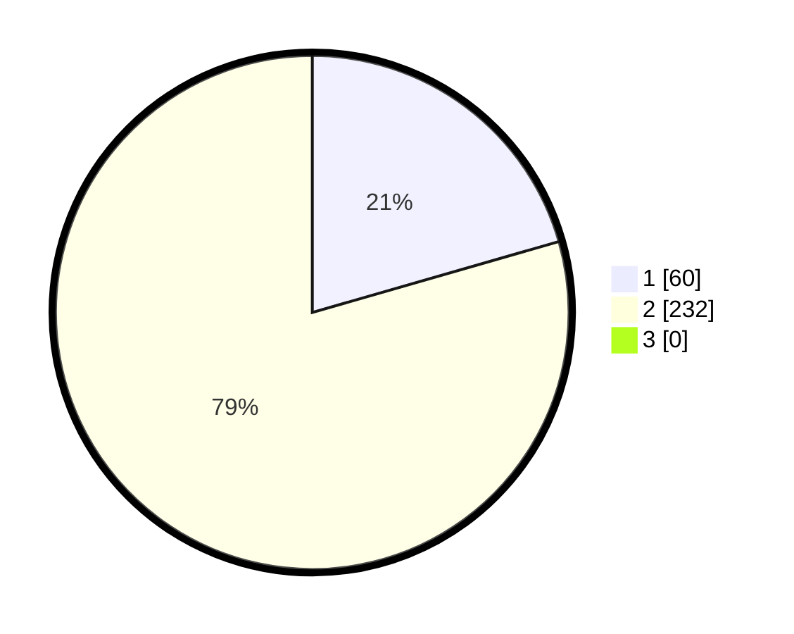

# Hasil

## Grafik

## Tabel

| No. | Nama Paslon    | Suara | Suara (raw) | Persentase |
|:--- |:-------------- | -----:| -----------:| ----------:|
| 1   | ANIES MUHAIMIN | 60    | [60][p-1]   | 20,55      |
| 2   | PRABOWO GIBRAN | 232   | [232][p-2]  | 79,45      |
| 3   | GANJAR MAHFUD  | 0     | [0][p-3]    | 0,00       |

[p-1]: https://github.com/gigit-pemilu/pemilu-2024-35-jawa-timur/blob/main/pilpres/hitung-suara/sub/35-jawa-timur/sub/27-sampang/sub/12-ketapang/sub/2010-ketapang-laok/sub/005-tps/sub/paslon-1.txt
[p-2]: https://github.com/gigit-pemilu/pemilu-2024-35-jawa-timur/blob/main/pilpres/hitung-suara/sub/35-jawa-timur/sub/27-sampang/sub/12-ketapang/sub/2010-ketapang-laok/sub/005-tps/sub/paslon-2.txt
[p-3]: https://github.com/gigit-pemilu/pemilu-2024-35-jawa-timur/blob/main/pilpres/hitung-suara/sub/35-jawa-timur/sub/27-sampang/sub/12-ketapang/sub/2010-ketapang-laok/sub/005-tps/sub/paslon-3.txt

## Foto C Plano

https://sirekap-obj-formc.kpu.go.id/c030/pemilu/ppwp/35/27/12/20/10/3527122010005-20240219-152543--532396ce-6b5a-4ef8-b3ed-d53b93e726cc.jpg

https://sirekap-obj-formc.kpu.go.id/c030/pemilu/ppwp/35/27/12/20/10/3527122010005-20240219-152539--22ba9a63-d039-4e86-b1e1-fd0078750548.jpg

https://sirekap-obj-formc.kpu.go.id/c030/pemilu/ppwp/35/27/12/20/10/3527122010005-20240219-152535--6cf6a8ab-7d71-4aac-8042-19a2377aa674.jpg

## Metadata

| Key        | Value               |
| ---------- | ------------------- |
| Time Stamp | 2024-02-24 22:31:28 |

