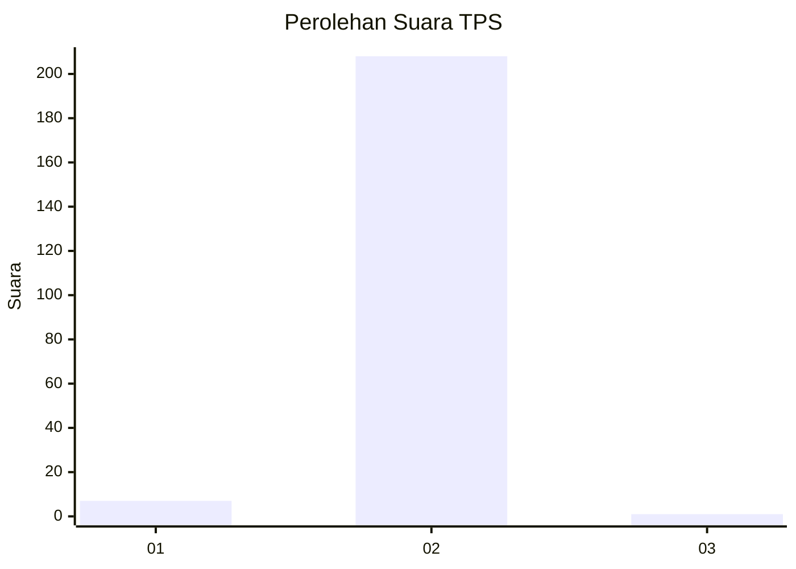
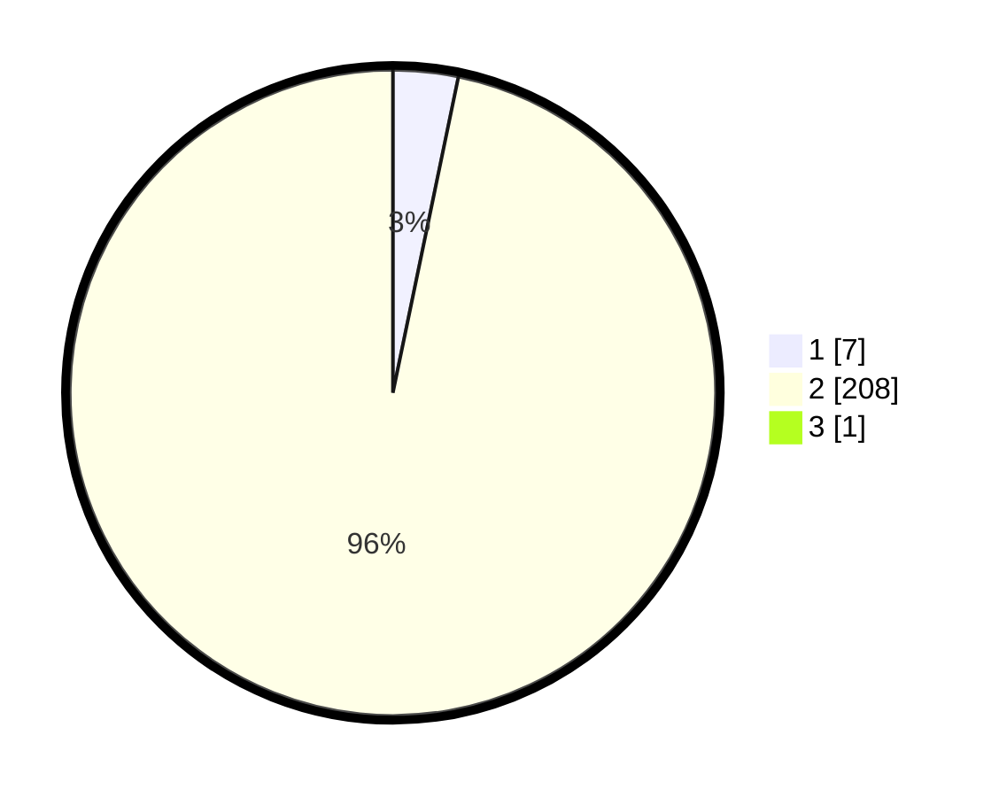

# Hasil

## Grafik

## Tabel

| No. | Nama Paslon    | Suara | Suara (raw) | Persentase |
|:--- |:-------------- | -----:| -----------:| ----------:|
| 1   | ANIES MUHAIMIN | 7     | [7][p-1]    | 3,24       |
| 2   | PRABOWO GIBRAN | 208   | [208][p-2]  | 96,30      |
| 3   | GANJAR MAHFUD  | 1     | [1][p-3]    | 0,46       |

[p-1]: https://github.com/gigit-pemilu/pemilu-2024-35-jawa-timur/blob/main/pilpres/hitung-suara/sub/35-jawa-timur/sub/27-sampang/sub/12-ketapang/sub/2011-ketapang-barat/sub/002-tps/sub/paslon-1.txt
[p-2]: https://github.com/gigit-pemilu/pemilu-2024-35-jawa-timur/blob/main/pilpres/hitung-suara/sub/35-jawa-timur/sub/27-sampang/sub/12-ketapang/sub/2011-ketapang-barat/sub/002-tps/sub/paslon-2.txt
[p-3]: https://github.com/gigit-pemilu/pemilu-2024-35-jawa-timur/blob/main/pilpres/hitung-suara/sub/35-jawa-timur/sub/27-sampang/sub/12-ketapang/sub/2011-ketapang-barat/sub/002-tps/sub/paslon-3.txt

## Foto C Plano

https://sirekap-obj-formc.kpu.go.id/9b10/pemilu/ppwp/35/27/12/20/11/3527122011002-20240215-092057--3e6920db-5963-4bdd-924d-ace7ed5f3111.jpg

https://sirekap-obj-formc.kpu.go.id/9b10/pemilu/ppwp/35/27/12/20/11/3527122011002-20240215-092142--f5d2ad4a-3c7e-4e63-b2b2-fecd8c6df2d3.jpg

https://sirekap-obj-formc.kpu.go.id/9b10/pemilu/ppwp/35/27/12/20/11/3527122011002-20240215-123424--e7da53d3-3d9a-4a88-8732-bf3e468d9972.jpg

## Metadata

| Key        | Value               |
| ---------- | ------------------- |
| Time Stamp | 2024-02-17 01:00:00 |

