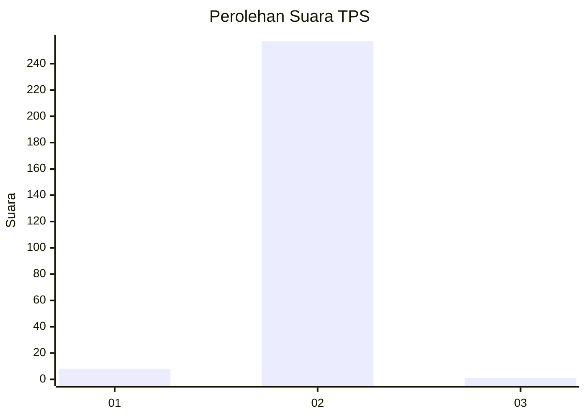
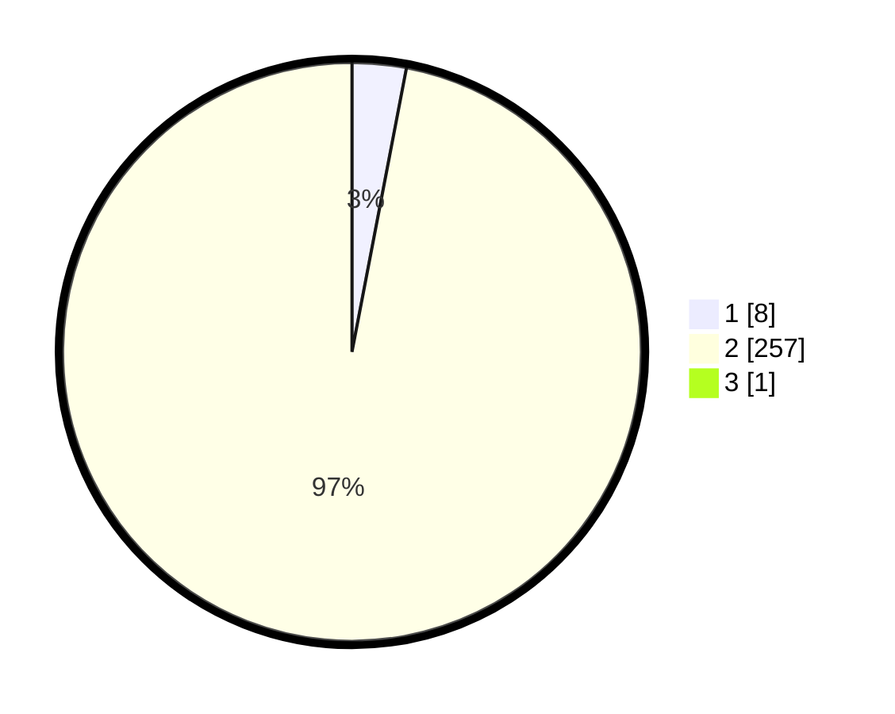

# Hasil

## Grafik

## Tabel

| No. | Nama Paslon    | Suara | Suara (raw) | Persentase |
|:--- |:-------------- | -----:| -----------:| ----------:|
| 1   | ANIES MUHAIMIN | 8     | [8][p-1]    | 3,01       |
| 2   | PRABOWO GIBRAN | 257   | [257][p-2]  | 96,62      |
| 3   | GANJAR MAHFUD  | 1     | [1][p-3]    | 0,38       |

[p-1]: https://github.com/gigit-pemilu/pemilu-2024-35-jawa-timur/blob/main/pilpres/hitung-suara/sub/35-jawa-timur/sub/27-sampang/sub/12-ketapang/sub/2011-ketapang-barat/sub/003-tps/sub/paslon-1.txt
[p-2]: https://github.com/gigit-pemilu/pemilu-2024-35-jawa-timur/blob/main/pilpres/hitung-suara/sub/35-jawa-timur/sub/27-sampang/sub/12-ketapang/sub/2011-ketapang-barat/sub/003-tps/sub/paslon-2.txt
[p-3]: https://github.com/gigit-pemilu/pemilu-2024-35-jawa-timur/blob/main/pilpres/hitung-suara/sub/35-jawa-timur/sub/27-sampang/sub/12-ketapang/sub/2011-ketapang-barat/sub/003-tps/sub/paslon-3.txt

## Foto C Plano

https://sirekap-obj-formc.kpu.go.id/2f41/pemilu/ppwp/35/27/12/20/11/3527122011003-20240214-234045--3d7864a1-af24-44ef-9a20-f131e4e1add7.jpg

https://sirekap-obj-formc.kpu.go.id/2f41/pemilu/ppwp/35/27/12/20/11/3527122011003-20240214-234139--bd3e9c72-251d-4150-8093-fbb8b28ebf07.jpg

https://sirekap-obj-formc.kpu.go.id/2f41/pemilu/ppwp/35/27/12/20/11/3527122011003-20240216-195307--a6395d3f-36ce-487d-94de-660451b13ca7.jpg

## Metadata

| Key        | Value               |
| ---------- | ------------------- |
| Time Stamp | 2024-02-17 01:00:00 |

