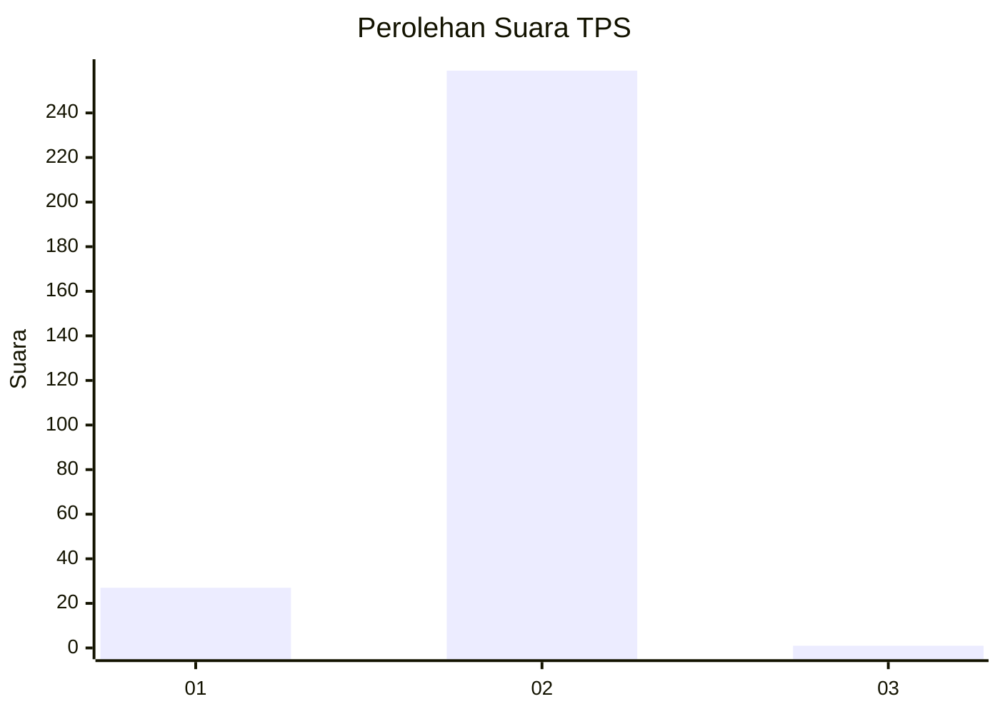
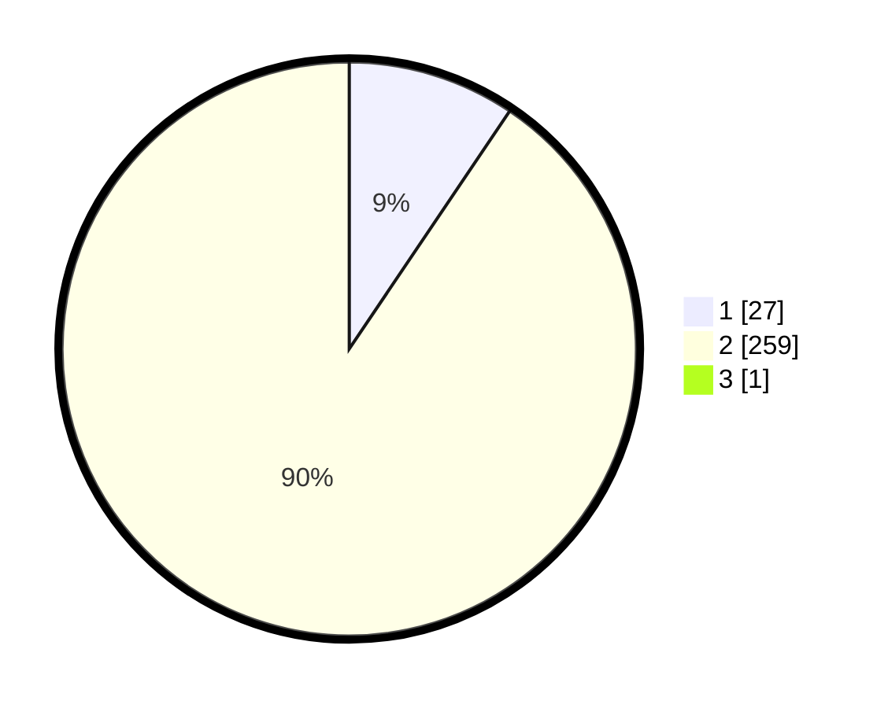

# Hasil

## Grafik

## Tabel

| No. | Nama Paslon    | Suara | Suara (raw) | Persentase |
|:--- |:-------------- | -----:| -----------:| ----------:|
| 1   | ANIES MUHAIMIN | 27    | [27][p-1]   | 9,41       |
| 2   | PRABOWO GIBRAN | 259   | [259][p-2]  | 90,24      |
| 3   | GANJAR MAHFUD  | 1     | [1][p-3]    | 0,35       |

[p-1]: https://github.com/gigit-pemilu/pemilu-2024/blob/main/pilpres/hitung-suara/sub/35-jawa-timur/sub/27-sampang/sub/12-ketapang/sub/2011-ketapang-barat/sub/009-tps/sub/paslon-1.txt
[p-2]: https://github.com/gigit-pemilu/pemilu-2024/blob/main/pilpres/hitung-suara/sub/35-jawa-timur/sub/27-sampang/sub/12-ketapang/sub/2011-ketapang-barat/sub/009-tps/sub/paslon-2.txt
[p-3]: https://github.com/gigit-pemilu/pemilu-2024/blob/main/pilpres/hitung-suara/sub/35-jawa-timur/sub/27-sampang/sub/12-ketapang/sub/2011-ketapang-barat/sub/009-tps/sub/paslon-3.txt

## Foto C Plano

https://sirekap-obj-formc.kpu.go.id/ed4b/pemilu/ppwp/35/27/12/20/11/3527122011009-20240214-200328--649ed8b7-7f75-47d0-ad6e-7bb823fc6cd8.jpg

https://sirekap-obj-formc.kpu.go.id/ed4b/pemilu/ppwp/35/27/12/20/11/3527122011009-20240214-190848--e68a5008-3667-4ca5-bbc4-65b5523ce0a6.jpg

https://sirekap-obj-formc.kpu.go.id/ed4b/pemilu/ppwp/35/27/12/20/11/3527122011009-20240214-190947--7eebf32e-1887-487c-a5bf-b4b0a7bdd3b1.jpg

## Metadata

| Key        | Value               |
| ---------- | ------------------- |
| Time Stamp | 2024-02-15 20:30:46 |

## DATA PEMILIH TETAP

Jumlah pemilih dalam DPT: **272**.
 * L: **545**.
 * P: **146**.

## DATA PENGGUNA HAK PILIH

Jumlah pengguna hak pilih dalam DPT: **288**.
 * L: **345**.
 * P: **484**.

Jumlah pengguna hak pilih dalam DPTb: **0**.
 * L: **0**.
 * P: **888**.

Jumlah pengguna hak pilih dalam DPK: **888**.
 * L: **840**.
 * P: **440**.

Jumlah pengguna hak pilih: **289**.
 * L: **345**.
 * P: **148**.

## JUMLAH SUARA SAH DAN TIDAK SAH

JUMLAH SELURUH SUARA SAH: **287**.

JUMLAH SUARA TIDAK SAH: **2**.

JUMLAH SELURUH SUARA SAH DAN SUARA TIDAK SAH: **289**.

