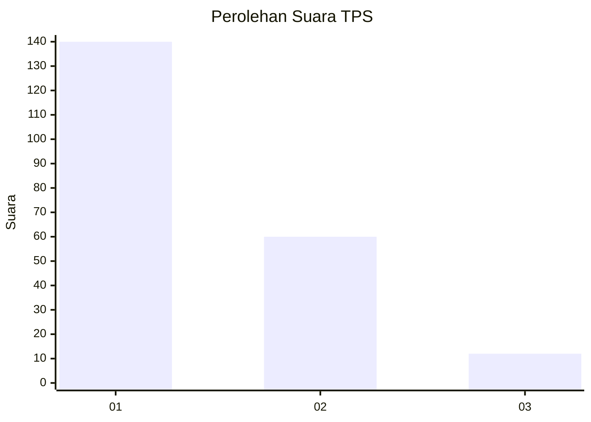
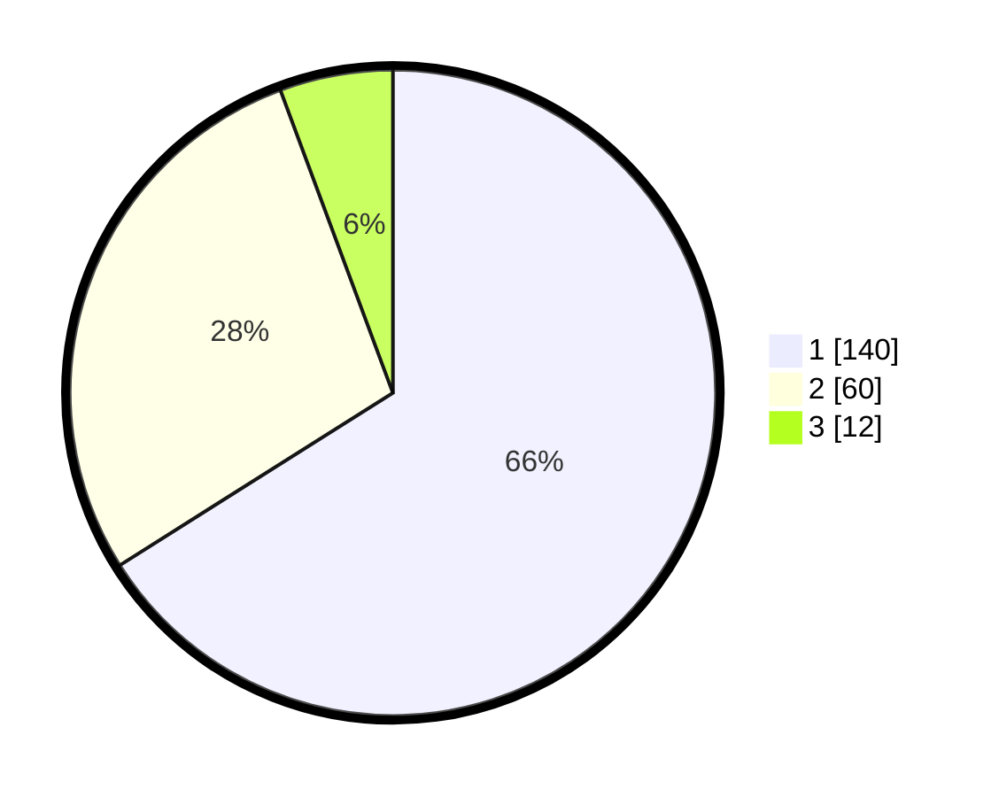

# Hasil

## Grafik

## Tabel

| No. | Nama Paslon    | Suara | Suara (raw) | Persentase |
|:--- |:-------------- | -----:| -----------:| ----------:|
| 1   | ANIES MUHAIMIN | 140   | [140][p-1]  | 66,04      |
| 2   | PRABOWO GIBRAN | 60    | [60][p-2]   | 28,30      |
| 3   | GANJAR MAHFUD  | 12    | [12][p-3]   | 5,66       |

[p-1]: https://github.com/gigit-pemilu/pemilu-2024-35-jawa-timur/blob/main/pilpres/hitung-suara/sub/35-jawa-timur/sub/27-sampang/sub/12-ketapang/sub/2012-paopale-daya/sub/001-tps/sub/paslon-1.txt
[p-2]: https://github.com/gigit-pemilu/pemilu-2024-35-jawa-timur/blob/main/pilpres/hitung-suara/sub/35-jawa-timur/sub/27-sampang/sub/12-ketapang/sub/2012-paopale-daya/sub/001-tps/sub/paslon-2.txt
[p-3]: https://github.com/gigit-pemilu/pemilu-2024-35-jawa-timur/blob/main/pilpres/hitung-suara/sub/35-jawa-timur/sub/27-sampang/sub/12-ketapang/sub/2012-paopale-daya/sub/001-tps/sub/paslon-3.txt

## Foto C Plano

https://sirekap-obj-formc.kpu.go.id/1494/pemilu/ppwp/35/27/12/20/12/3527122012001-20240215-172711--44bb17a6-54db-4ead-b928-9b7a89c6e974.jpg

https://sirekap-obj-formc.kpu.go.id/1494/pemilu/ppwp/35/27/12/20/12/3527122012001-20240215-173032--8be7174f-2e34-4e07-a6cf-83506e4178e2.jpg

https://sirekap-obj-formc.kpu.go.id/1494/pemilu/ppwp/35/27/12/20/12/3527122012001-20240215-173205--54d4747d-b3bc-443b-bcb7-82fa12151e84.jpg

## Metadata

| Key        | Value               |
| ---------- | ------------------- |
| Time Stamp | 2024-02-16 12:51:22 |

