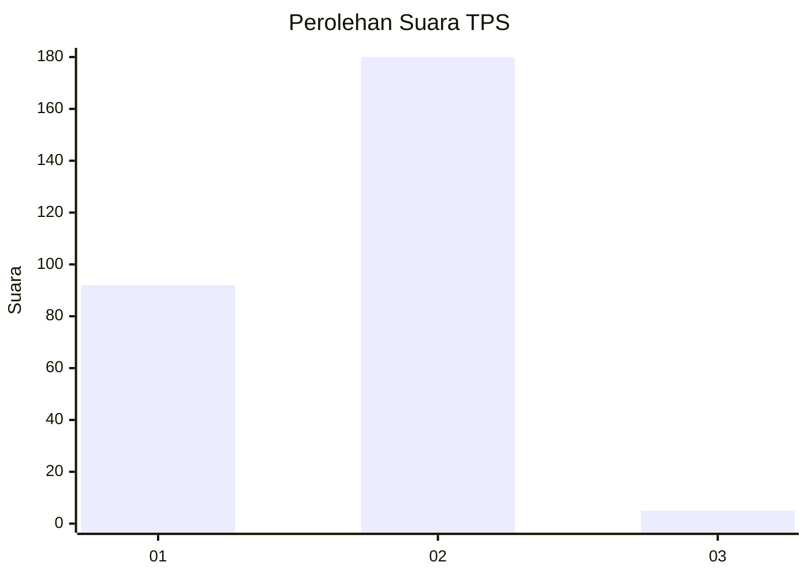
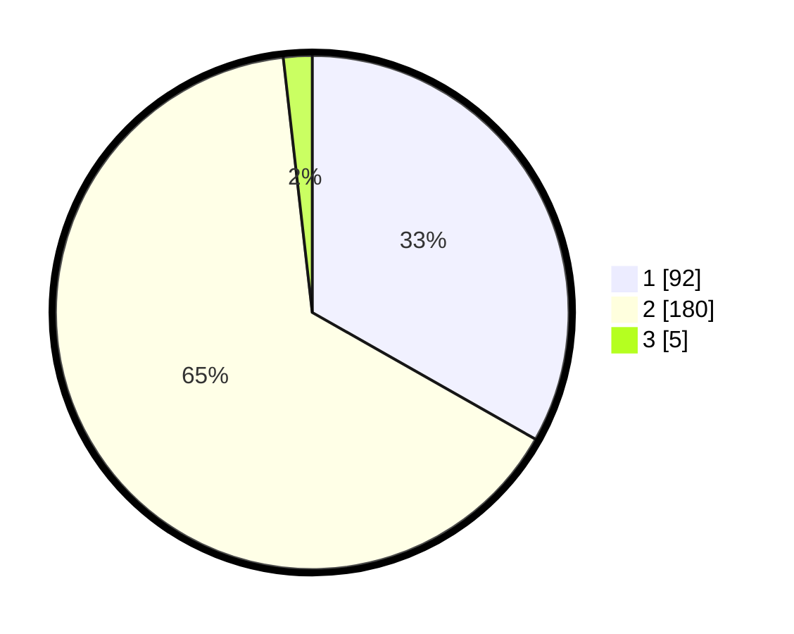

# Hasil

## Grafik

## Tabel

| No. | Nama Paslon    | Suara | Suara (raw) | Persentase |
|:--- |:-------------- | -----:| -----------:| ----------:|
| 1   | ANIES MUHAIMIN | 92    | [92][p-1]   | 33,21      |
| 2   | PRABOWO GIBRAN | 180   | [180][p-2]  | 64,98      |
| 3   | GANJAR MAHFUD  | 5     | [5][p-3]    | 1,81       |

[p-1]: https://github.com/gigit-pemilu/pemilu-2024/blob/main/pilpres/hitung-suara/sub/35-jawa-timur/sub/27-sampang/sub/12-ketapang/sub/2013-rabiyan/sub/003-tps/sub/paslon-1.txt
[p-2]: https://github.com/gigit-pemilu/pemilu-2024/blob/main/pilpres/hitung-suara/sub/35-jawa-timur/sub/27-sampang/sub/12-ketapang/sub/2013-rabiyan/sub/003-tps/sub/paslon-2.txt
[p-3]: https://github.com/gigit-pemilu/pemilu-2024/blob/main/pilpres/hitung-suara/sub/35-jawa-timur/sub/27-sampang/sub/12-ketapang/sub/2013-rabiyan/sub/003-tps/sub/paslon-3.txt

## Foto C Plano

https://sirekap-obj-formc.kpu.go.id/6e3c/pemilu/ppwp/35/27/12/20/13/3527122013003-20240215-200215--de8a465f-ea79-498a-a298-006c5a2d761a.jpg

https://sirekap-obj-formc.kpu.go.id/6e3c/pemilu/ppwp/35/27/12/20/13/3527122013003-20240215-191803--4a4c3bb8-fc91-4529-8994-05b95aef2adb.jpg

https://sirekap-obj-formc.kpu.go.id/6e3c/pemilu/ppwp/35/27/12/20/13/3527122013003-20240215-160308--f6f680e2-862f-426d-bf04-29817f827e91.jpg

## Metadata

| Key        | Value               |
| ---------- | ------------------- |
| Time Stamp | 2024-02-17 01:00:00 |

