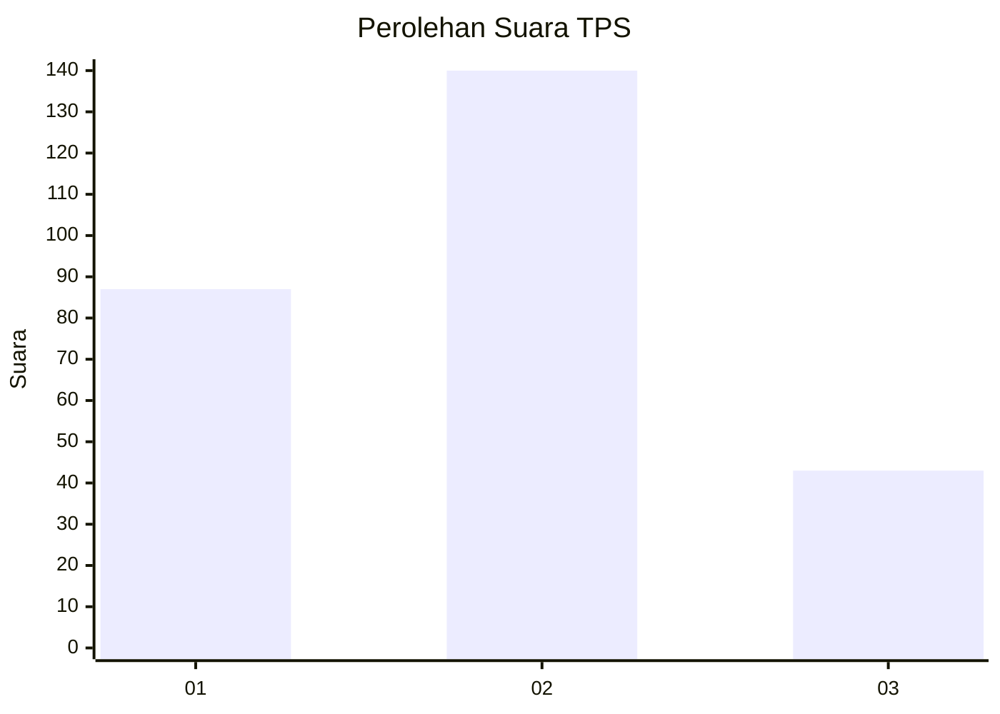
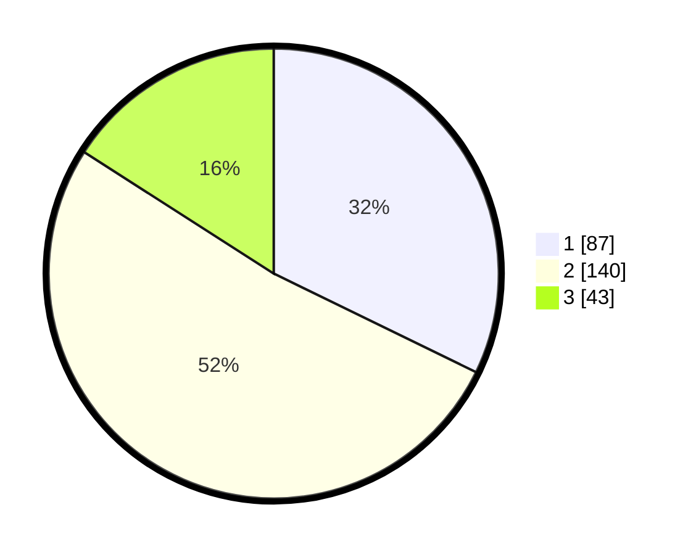

# Hasil

## Grafik

## Tabel

| No. | Nama Paslon    | Suara | Suara (raw) | Persentase |
|:--- |:-------------- | -----:| -----------:| ----------:|
| 1   | ANIES MUHAIMIN | 87    | [87][p-1]   | 32,22      |
| 2   | PRABOWO GIBRAN | 140   | [140][p-2]  | 51,85      |
| 3   | GANJAR MAHFUD  | 43    | [43][p-3]   | 15,93      |

[p-1]: https://github.com/gigit-pemilu/pemilu-2024/blob/main/pilpres/hitung-suara/sub/35-jawa-timur/sub/27-sampang/sub/12-ketapang/sub/2013-rabiyan/sub/004-tps/sub/paslon-1.txt
[p-2]: https://github.com/gigit-pemilu/pemilu-2024/blob/main/pilpres/hitung-suara/sub/35-jawa-timur/sub/27-sampang/sub/12-ketapang/sub/2013-rabiyan/sub/004-tps/sub/paslon-2.txt
[p-3]: https://github.com/gigit-pemilu/pemilu-2024/blob/main/pilpres/hitung-suara/sub/35-jawa-timur/sub/27-sampang/sub/12-ketapang/sub/2013-rabiyan/sub/004-tps/sub/paslon-3.txt

## Foto C Plano

https://sirekap-obj-formc.kpu.go.id/0a47/pemilu/ppwp/35/27/12/20/13/3527122013004-20240215-143653--e91cab9e-8e5d-46e1-a8ce-888a437f4127.jpg

https://sirekap-obj-formc.kpu.go.id/0a47/pemilu/ppwp/35/27/12/20/13/3527122013004-20240215-143916--c2cff395-9b11-4a9e-a304-845998b95e52.jpg

https://sirekap-obj-formc.kpu.go.id/0a47/pemilu/ppwp/35/27/12/20/13/3527122013004-20240215-193522--1fb1c080-0c04-4b20-94ef-4eeecfc6c258.jpg

## Metadata

| Key        | Value               |
| ---------- | ------------------- |
| Time Stamp | 2024-02-17 01:00:00 |

