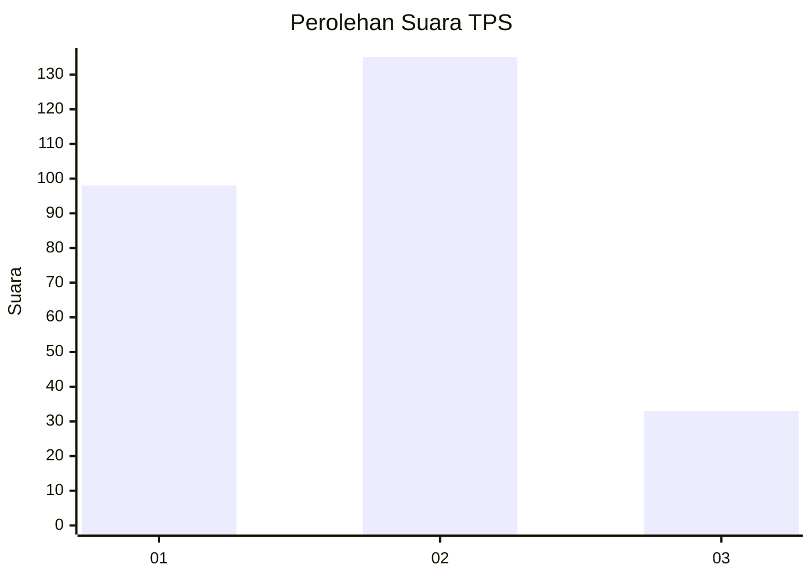
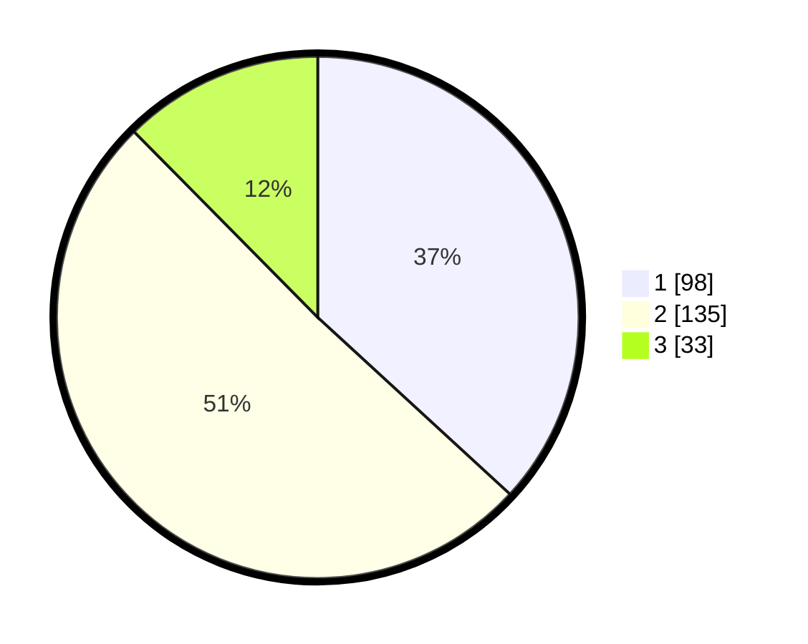

# Hasil

## Grafik

## Tabel

| No. | Nama Paslon    | Suara | Suara (raw) | Persentase |
|:--- |:-------------- | -----:| -----------:| ----------:|
| 1   | ANIES MUHAIMIN | 98    | [98][p-1]   | 36,84      |
| 2   | PRABOWO GIBRAN | 135   | [135][p-2]  | 50,75      |
| 3   | GANJAR MAHFUD  | 33    | [33][p-3]   | 12,41      |

[p-1]: https://github.com/gigit-pemilu/pemilu-2024/blob/main/pilpres/hitung-suara/sub/35-jawa-timur/sub/27-sampang/sub/13-pangarengan/sub/2001-pangarengan/sub/001-tps/sub/paslon-1.txt
[p-2]: https://github.com/gigit-pemilu/pemilu-2024/blob/main/pilpres/hitung-suara/sub/35-jawa-timur/sub/27-sampang/sub/13-pangarengan/sub/2001-pangarengan/sub/001-tps/sub/paslon-2.txt
[p-3]: https://github.com/gigit-pemilu/pemilu-2024/blob/main/pilpres/hitung-suara/sub/35-jawa-timur/sub/27-sampang/sub/13-pangarengan/sub/2001-pangarengan/sub/001-tps/sub/paslon-3.txt

## Foto C Plano

https://sirekap-obj-formc.kpu.go.id/d5c8/pemilu/ppwp/35/27/13/20/01/3527132001001-20240214-213007--97a3388a-23bb-4b89-8161-2e9ef2e298c4.jpg

https://sirekap-obj-formc.kpu.go.id/d5c8/pemilu/ppwp/35/27/13/20/01/3527132001001-20240214-213241--5b66589c-b936-4b6e-8dd3-f805582f12ca.jpg

https://sirekap-obj-formc.kpu.go.id/d5c8/pemilu/ppwp/35/27/13/20/01/3527132001001-20240214-213328--6b5d731a-f21a-461f-8574-04c1035b1d40.jpg

## Metadata

| Key        | Value               |
| ---------- | ------------------- |
| Time Stamp | 2024-02-15 22:00:27 |

