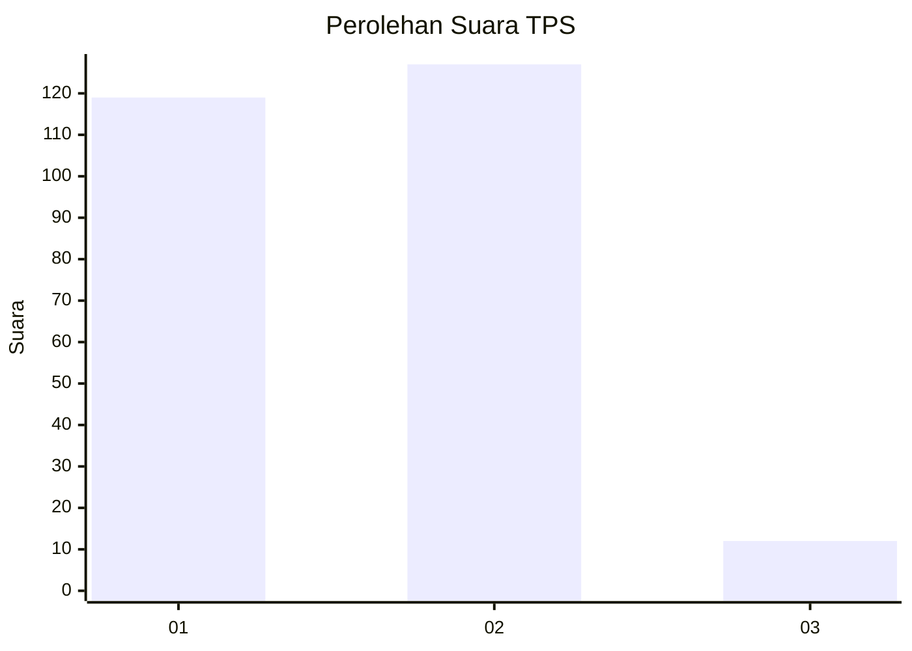
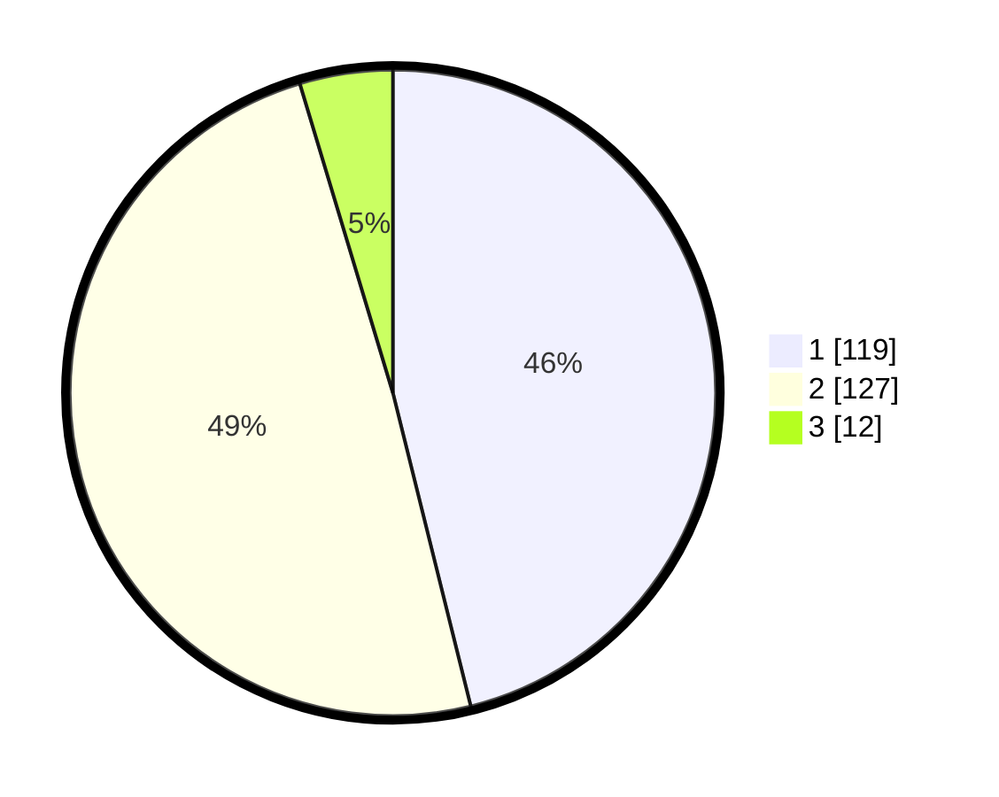

# Hasil

## Grafik

## Tabel

| No. | Nama Paslon    | Suara | Suara (raw) | Persentase |
|:--- |:-------------- | -----:| -----------:| ----------:|
| 1   | ANIES MUHAIMIN | 119   | [119][p-1]  | 46,12      |
| 2   | PRABOWO GIBRAN | 127   | [127][p-2]  | 49,22      |
| 3   | GANJAR MAHFUD  | 12    | [12][p-3]   | 4,65       |

[p-1]: https://github.com/gigit-pemilu/pemilu-2024/blob/main/pilpres/hitung-suara/sub/35-jawa-timur/sub/27-sampang/sub/13-pangarengan/sub/2001-pangarengan/sub/003-tps/sub/paslon-1.txt
[p-2]: https://github.com/gigit-pemilu/pemilu-2024/blob/main/pilpres/hitung-suara/sub/35-jawa-timur/sub/27-sampang/sub/13-pangarengan/sub/2001-pangarengan/sub/003-tps/sub/paslon-2.txt
[p-3]: https://github.com/gigit-pemilu/pemilu-2024/blob/main/pilpres/hitung-suara/sub/35-jawa-timur/sub/27-sampang/sub/13-pangarengan/sub/2001-pangarengan/sub/003-tps/sub/paslon-3.txt

## Foto C Plano

https://sirekap-obj-formc.kpu.go.id/38bb/pemilu/ppwp/35/27/13/20/01/3527132001003-20240214-204650--8dc23268-1f9e-4f59-965e-bc4f2622b237.jpg

https://sirekap-obj-formc.kpu.go.id/38bb/pemilu/ppwp/35/27/13/20/01/3527132001003-20240214-204746--1ffe0c32-c5a1-474d-a32f-38ed875f9422.jpg

https://sirekap-obj-formc.kpu.go.id/38bb/pemilu/ppwp/35/27/13/20/01/3527132001003-20240214-205637--7ac7763e-d51d-4058-8b9f-79a33cdae3d9.jpg

## Metadata

| Key        | Value               |
| ---------- | ------------------- |
| Time Stamp | 2024-02-17 10:30:03 |

