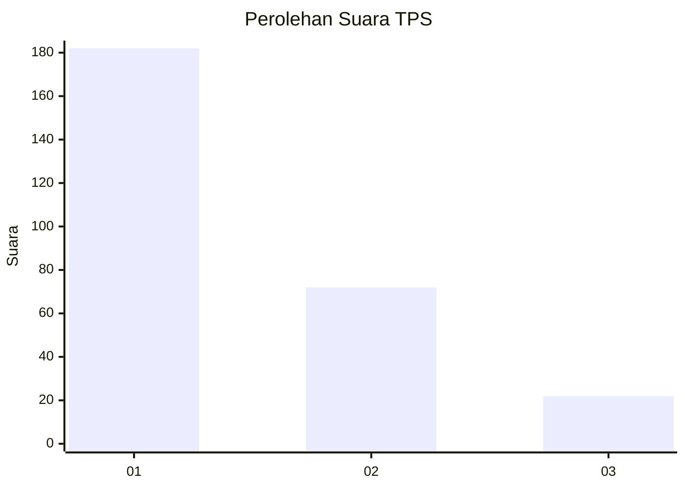
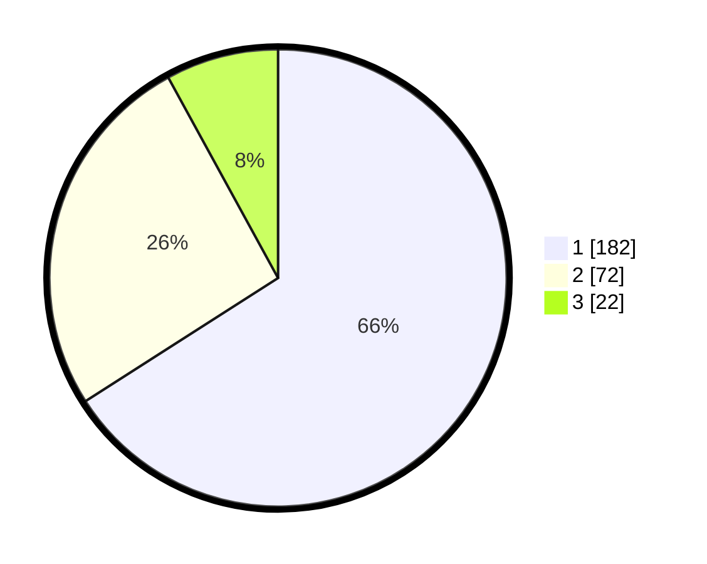

# Hasil

## Grafik

## Tabel

| No. | Nama Paslon    | Suara | Suara (raw) | Persentase |
|:--- |:-------------- | -----:| -----------:| ----------:|
| 1   | ANIES MUHAIMIN | 182   | [182][p-1]  | 65,94      |
| 2   | PRABOWO GIBRAN | 72    | [72][p-2]   | 26,09      |
| 3   | GANJAR MAHFUD  | 22    | [22][p-3]   | 7,97       |

[p-1]: https://github.com/gigit-pemilu/pemilu-2024/blob/main/pilpres/hitung-suara/sub/35-jawa-timur/sub/27-sampang/sub/13-pangarengan/sub/2002-apa-an/sub/001-tps/sub/paslon-1.txt
[p-2]: https://github.com/gigit-pemilu/pemilu-2024/blob/main/pilpres/hitung-suara/sub/35-jawa-timur/sub/27-sampang/sub/13-pangarengan/sub/2002-apa-an/sub/001-tps/sub/paslon-2.txt
[p-3]: https://github.com/gigit-pemilu/pemilu-2024/blob/main/pilpres/hitung-suara/sub/35-jawa-timur/sub/27-sampang/sub/13-pangarengan/sub/2002-apa-an/sub/001-tps/sub/paslon-3.txt

## Foto C Plano

https://sirekap-obj-formc.kpu.go.id/0e27/pemilu/ppwp/35/27/13/20/02/3527132002001-20240214-224914--298a8129-ba97-4609-b4f0-57243bd1ac7e.jpg

https://sirekap-obj-formc.kpu.go.id/0e27/pemilu/ppwp/35/27/13/20/02/3527132002001-20240214-225007--5b32453a-92ea-429d-87e9-3fe9af565ec6.jpg

https://sirekap-obj-formc.kpu.go.id/0e27/pemilu/ppwp/35/27/13/20/02/3527132002001-20240214-225104--6d2dc7ee-1a02-4664-b3c9-ad4e5ec9c40e.jpg

## Metadata

| Key        | Value               |
| ---------- | ------------------- |
| Time Stamp | 2024-02-16 10:30:29 |

