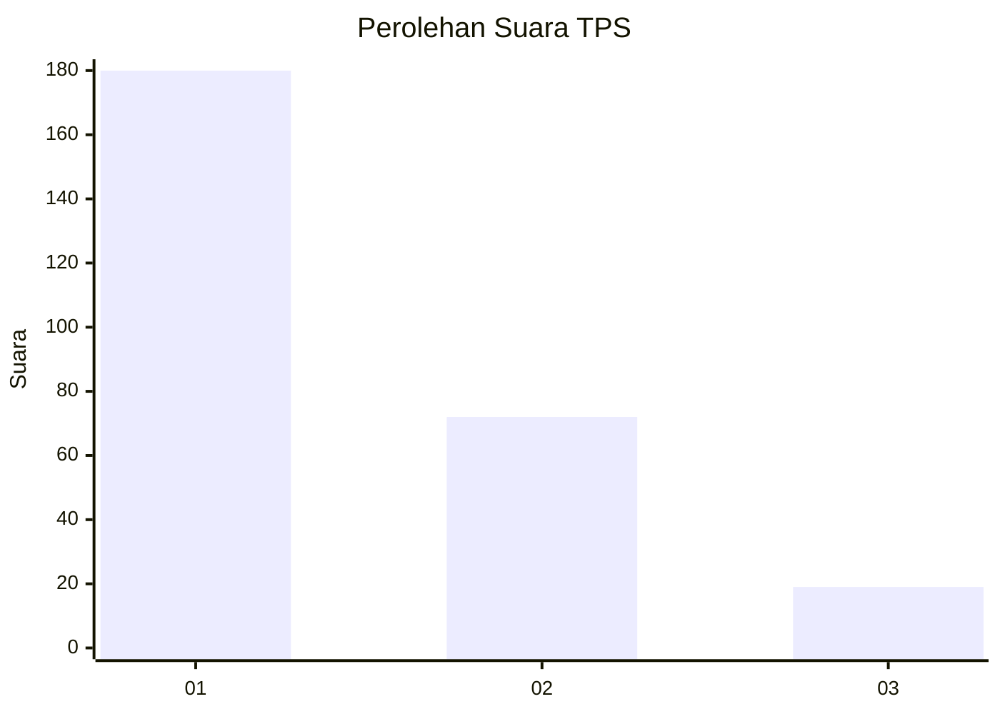
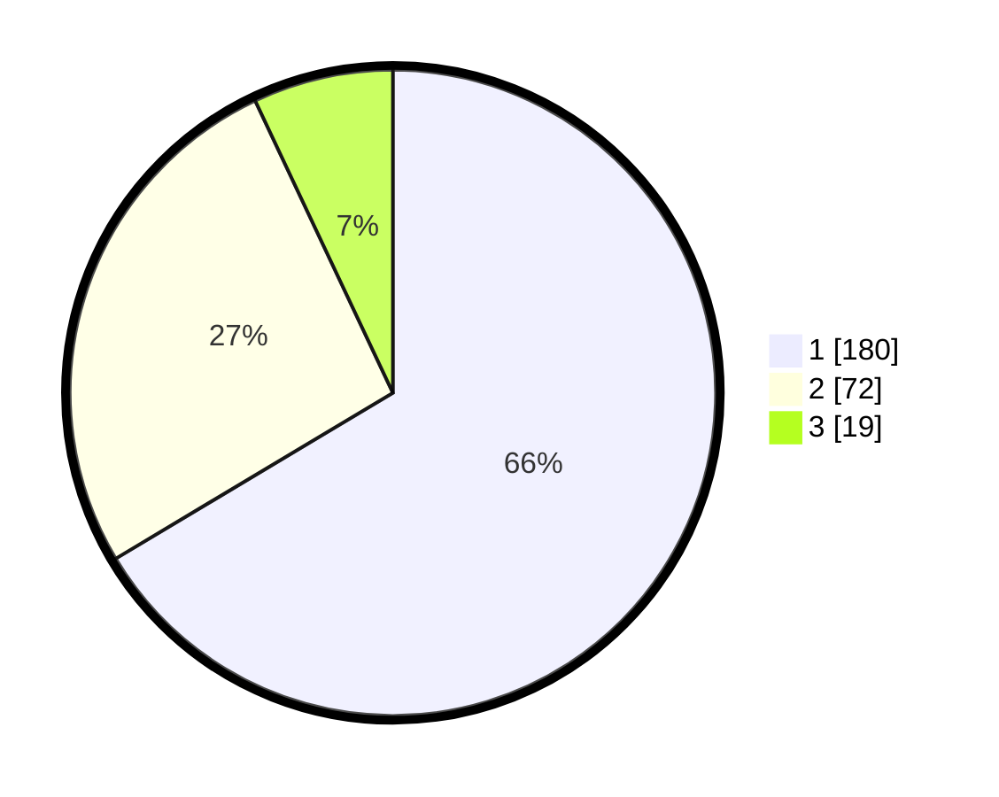

# Hasil

## Grafik

## Tabel

| No. | Nama Paslon    | Suara | Suara (raw) | Persentase |
|:--- |:-------------- | -----:| -----------:| ----------:|
| 1   | ANIES MUHAIMIN | 180   | [180][p-1]  | 66,42      |
| 2   | PRABOWO GIBRAN | 72    | [72][p-2]   | 26,57      |
| 3   | GANJAR MAHFUD  | 19    | [19][p-3]   | 7,01       |

[p-1]: https://github.com/gigit-pemilu/pemilu-2024/blob/main/pilpres/hitung-suara/sub/35-jawa-timur/sub/27-sampang/sub/13-pangarengan/sub/2002-apa-an/sub/002-tps/sub/paslon-1.txt
[p-2]: https://github.com/gigit-pemilu/pemilu-2024/blob/main/pilpres/hitung-suara/sub/35-jawa-timur/sub/27-sampang/sub/13-pangarengan/sub/2002-apa-an/sub/002-tps/sub/paslon-2.txt
[p-3]: https://github.com/gigit-pemilu/pemilu-2024/blob/main/pilpres/hitung-suara/sub/35-jawa-timur/sub/27-sampang/sub/13-pangarengan/sub/2002-apa-an/sub/002-tps/sub/paslon-3.txt

## Foto C Plano

https://sirekap-obj-formc.kpu.go.id/dc03/pemilu/ppwp/35/27/13/20/02/3527132002002-20240214-212245--9f1c5d52-7b4f-443c-9480-ef16f4694738.jpg

https://sirekap-obj-formc.kpu.go.id/dc03/pemilu/ppwp/35/27/13/20/02/3527132002002-20240214-212314--210a2dbc-7ed0-442f-84bc-09afe63b95f2.jpg

https://sirekap-obj-formc.kpu.go.id/dc03/pemilu/ppwp/35/27/13/20/02/3527132002002-20240214-212325--e78e4680-57ab-44f0-aae8-f2e8caae93ab.jpg

## Metadata

| Key        | Value               |
| ---------- | ------------------- |
| Time Stamp | 2024-02-16 10:30:29 |

