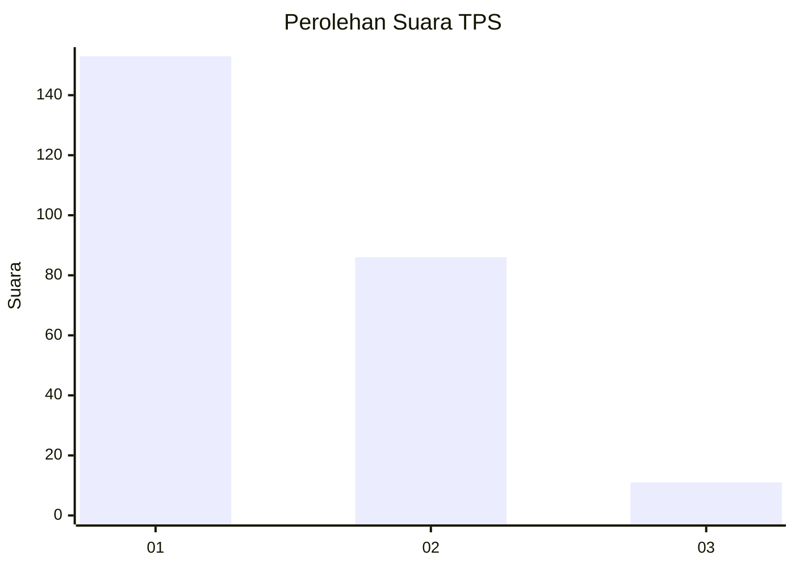
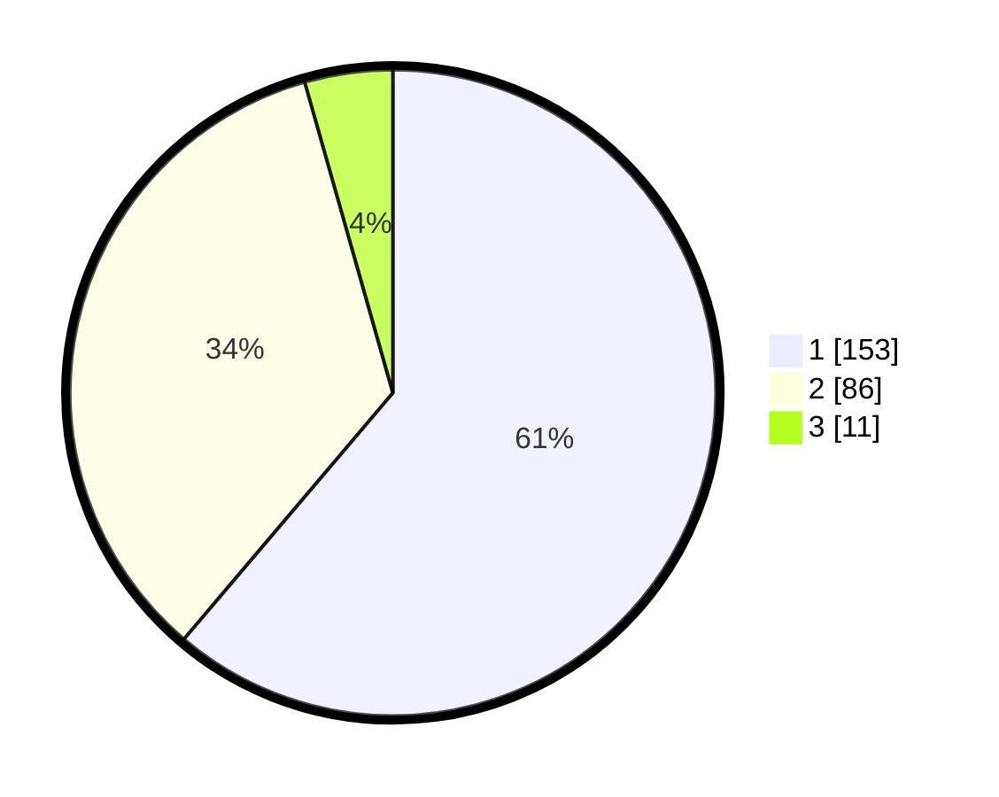

# Hasil

## Grafik

## Tabel

| No. | Nama Paslon    | Suara | Suara (raw) | Persentase |
|:--- |:-------------- | -----:| -----------:| ----------:|
| 1   | ANIES MUHAIMIN | 153   | [153][p-1]  | 61,20      |
| 2   | PRABOWO GIBRAN | 86    | [86][p-2]   | 34,40      |
| 3   | GANJAR MAHFUD  | 11    | [11][p-3]   | 4,40       |

[p-1]: https://github.com/gigit-pemilu/pemilu-2024-35-jawa-timur/blob/main/pilpres/hitung-suara/sub/35-jawa-timur/sub/27-sampang/sub/13-pangarengan/sub/2002-apa-an/sub/004-tps/sub/paslon-1.txt
[p-2]: https://github.com/gigit-pemilu/pemilu-2024-35-jawa-timur/blob/main/pilpres/hitung-suara/sub/35-jawa-timur/sub/27-sampang/sub/13-pangarengan/sub/2002-apa-an/sub/004-tps/sub/paslon-2.txt
[p-3]: https://github.com/gigit-pemilu/pemilu-2024-35-jawa-timur/blob/main/pilpres/hitung-suara/sub/35-jawa-timur/sub/27-sampang/sub/13-pangarengan/sub/2002-apa-an/sub/004-tps/sub/paslon-3.txt

## Foto C Plano

https://sirekap-obj-formc.kpu.go.id/9081/pemilu/ppwp/35/27/13/20/02/3527132002004-20240214-211354--80ebdd62-eee6-4428-b30e-6af46b213802.jpg

https://sirekap-obj-formc.kpu.go.id/9081/pemilu/ppwp/35/27/13/20/02/3527132002004-20240214-211501--4dd1d7c3-445a-451a-8059-41168849eebc.jpg

https://sirekap-obj-formc.kpu.go.id/9081/pemilu/ppwp/35/27/13/20/02/3527132002004-20240214-211542--ea587de8-dc43-4d80-832f-ed67c8269ce1.jpg

## Metadata

| Key        | Value               |
| ---------- | ------------------- |
| Time Stamp | 2024-02-16 11:00:29 |

