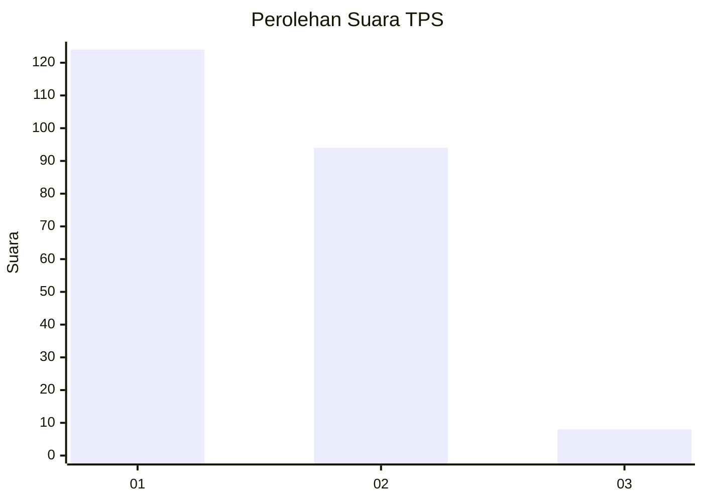
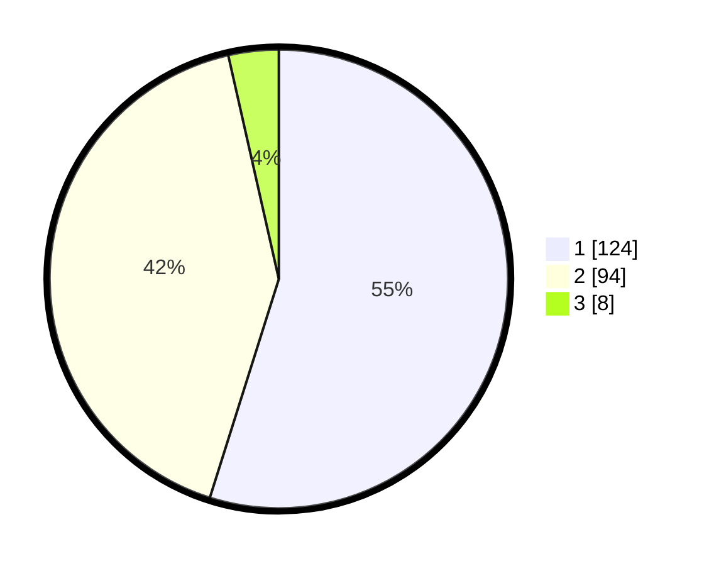

# Hasil

## Grafik

## Tabel

| No. | Nama Paslon    | Suara | Suara (raw) | Persentase |
|:--- |:-------------- | -----:| -----------:| ----------:|
| 1   | ANIES MUHAIMIN | 124   | [124][p-1]  | 54,87      |
| 2   | PRABOWO GIBRAN | 94    | [94][p-2]   | 41,59      |
| 3   | GANJAR MAHFUD  | 8     | [8][p-3]    | 3,54       |

[p-1]: https://github.com/gigit-pemilu/pemilu-2024/blob/main/pilpres/hitung-suara/sub/35-jawa-timur/sub/27-sampang/sub/13-pangarengan/sub/2002-apa-an/sub/006-tps/sub/paslon-1.txt
[p-2]: https://github.com/gigit-pemilu/pemilu-2024/blob/main/pilpres/hitung-suara/sub/35-jawa-timur/sub/27-sampang/sub/13-pangarengan/sub/2002-apa-an/sub/006-tps/sub/paslon-2.txt
[p-3]: https://github.com/gigit-pemilu/pemilu-2024/blob/main/pilpres/hitung-suara/sub/35-jawa-timur/sub/27-sampang/sub/13-pangarengan/sub/2002-apa-an/sub/006-tps/sub/paslon-3.txt

## Foto C Plano

https://sirekap-obj-formc.kpu.go.id/fa71/pemilu/ppwp/35/27/13/20/02/3527132002006-20240214-194247--f66f8a86-0a3d-4431-aa22-a59e8b3e319c.jpg

https://sirekap-obj-formc.kpu.go.id/fa71/pemilu/ppwp/35/27/13/20/02/3527132002006-20240214-194331--75627e5a-42bf-41bc-a3f2-8e9a68ce900d.jpg

https://sirekap-obj-formc.kpu.go.id/fa71/pemilu/ppwp/35/27/13/20/02/3527132002006-20240214-194423--e88460b7-c676-4162-93cf-88efa91f36bd.jpg

## Metadata

| Key        | Value               |
| ---------- | ------------------- |
| Time Stamp | 2024-02-16 10:30:29 |

