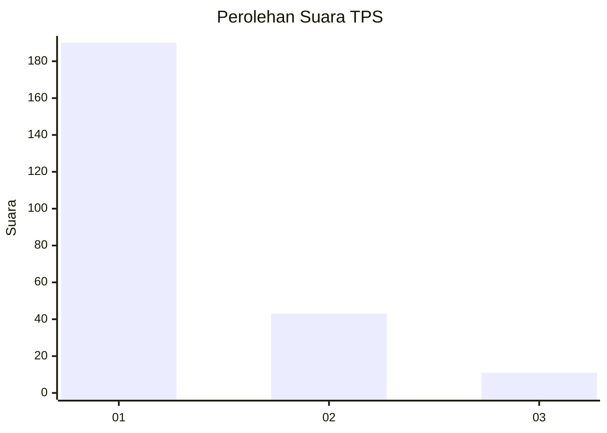
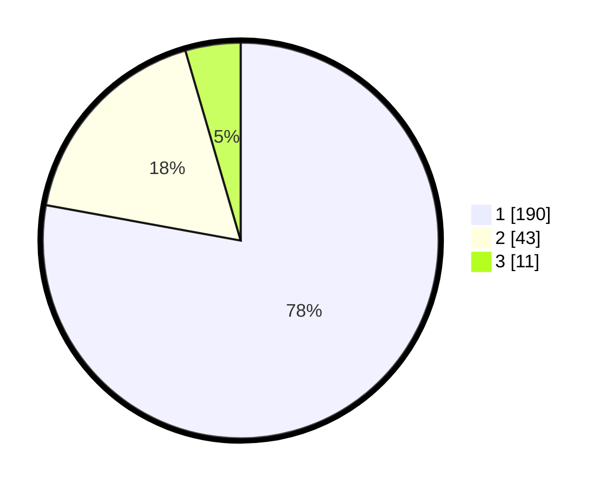

# Hasil

## Grafik

## Tabel

| No. | Nama Paslon    | Suara | Suara (raw) | Persentase |
|:--- |:-------------- | -----:| -----------:| ----------:|
| 1   | ANIES MUHAIMIN | 190   | [190][p-1]  | 77,87      |
| 2   | PRABOWO GIBRAN | 43    | [43][p-2]   | 17,62      |
| 3   | GANJAR MAHFUD  | 11    | [11][p-3]   | 4,51       |

[p-1]: https://github.com/gigit-pemilu/pemilu-2024-35-jawa-timur/blob/main/pilpres/hitung-suara/sub/35-jawa-timur/sub/27-sampang/sub/13-pangarengan/sub/2003-gulbung/sub/006-tps/sub/paslon-1.txt
[p-2]: https://github.com/gigit-pemilu/pemilu-2024-35-jawa-timur/blob/main/pilpres/hitung-suara/sub/35-jawa-timur/sub/27-sampang/sub/13-pangarengan/sub/2003-gulbung/sub/006-tps/sub/paslon-2.txt
[p-3]: https://github.com/gigit-pemilu/pemilu-2024-35-jawa-timur/blob/main/pilpres/hitung-suara/sub/35-jawa-timur/sub/27-sampang/sub/13-pangarengan/sub/2003-gulbung/sub/006-tps/sub/paslon-3.txt

## Foto C Plano

https://sirekap-obj-formc.kpu.go.id/4aaa/pemilu/ppwp/35/27/13/20/03/3527132003006-20240214-225354--1b3bdbf2-3a02-45bd-bd31-8c09925b325d.jpg

https://sirekap-obj-formc.kpu.go.id/4aaa/pemilu/ppwp/35/27/13/20/03/3527132003006-20240214-225358--a83c196e-2a66-406c-9d3e-e5a876ecd479.jpg

https://sirekap-obj-formc.kpu.go.id/4aaa/pemilu/ppwp/35/27/13/20/03/3527132003006-20240214-225406--322a1e8f-e092-4af2-8ce9-065f826200a3.jpg

## Metadata

| Key        | Value               |
| ---------- | ------------------- |
| Time Stamp | 2024-02-16 10:30:29 |

