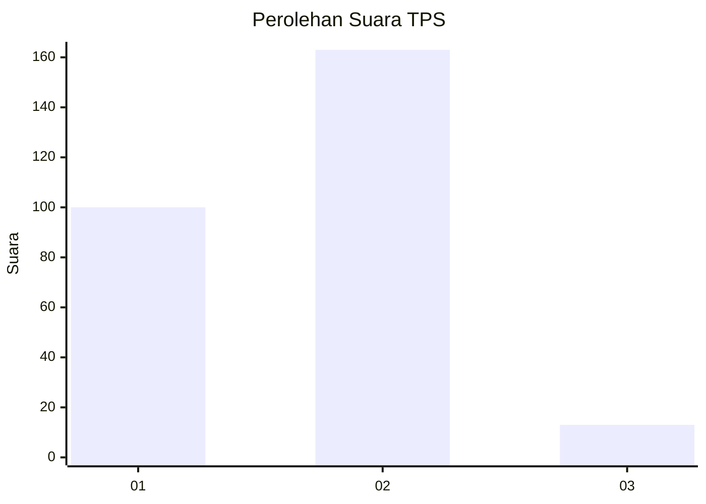
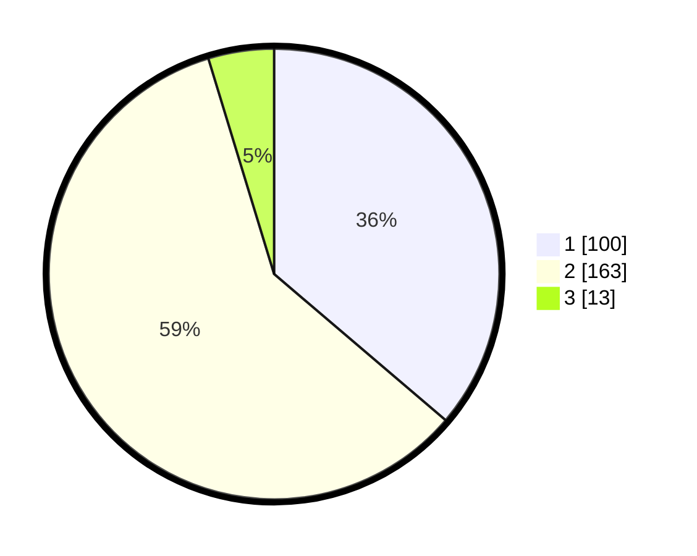

# Hasil

## Grafik

## Tabel

| No. | Nama Paslon    | Suara | Suara (raw) | Persentase |
|:--- |:-------------- | -----:| -----------:| ----------:|
| 1   | ANIES MUHAIMIN | 100   | [100][p-1]  | 36,23      |
| 2   | PRABOWO GIBRAN | 163   | [163][p-2]  | 59,06      |
| 3   | GANJAR MAHFUD  | 13    | [13][p-3]   | 4,71       |

[p-1]: https://github.com/gigit-pemilu/pemilu-2024-35-jawa-timur/blob/main/pilpres/hitung-suara/sub/35-jawa-timur/sub/27-sampang/sub/13-pangarengan/sub/2003-gulbung/sub/012-tps/sub/paslon-1.txt
[p-2]: https://github.com/gigit-pemilu/pemilu-2024-35-jawa-timur/blob/main/pilpres/hitung-suara/sub/35-jawa-timur/sub/27-sampang/sub/13-pangarengan/sub/2003-gulbung/sub/012-tps/sub/paslon-2.txt
[p-3]: https://github.com/gigit-pemilu/pemilu-2024-35-jawa-timur/blob/main/pilpres/hitung-suara/sub/35-jawa-timur/sub/27-sampang/sub/13-pangarengan/sub/2003-gulbung/sub/012-tps/sub/paslon-3.txt

## Foto C Plano

https://sirekap-obj-formc.kpu.go.id/edf3/pemilu/ppwp/35/27/13/20/03/3527132003012-20240215-002400--212e8132-c01f-4161-9001-8649125ae541.jpg

https://sirekap-obj-formc.kpu.go.id/edf3/pemilu/ppwp/35/27/13/20/03/3527132003012-20240215-002507--33ac21c5-16a5-40d3-ab08-1fab995cff9a.jpg

https://sirekap-obj-formc.kpu.go.id/edf3/pemilu/ppwp/35/27/13/20/03/3527132003012-20240215-002549--3f818ab2-edd9-4ddd-92ae-15f05e368032.jpg

## Metadata

| Key        | Value               |
| ---------- | ------------------- |
| Time Stamp | 2024-02-16 11:00:29 |

