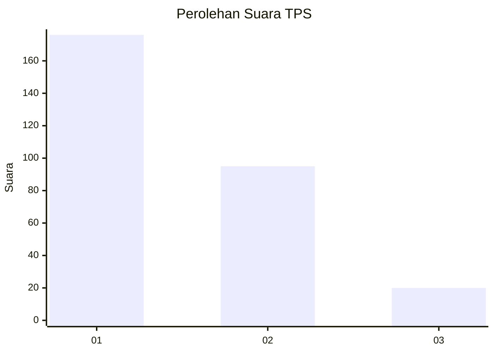
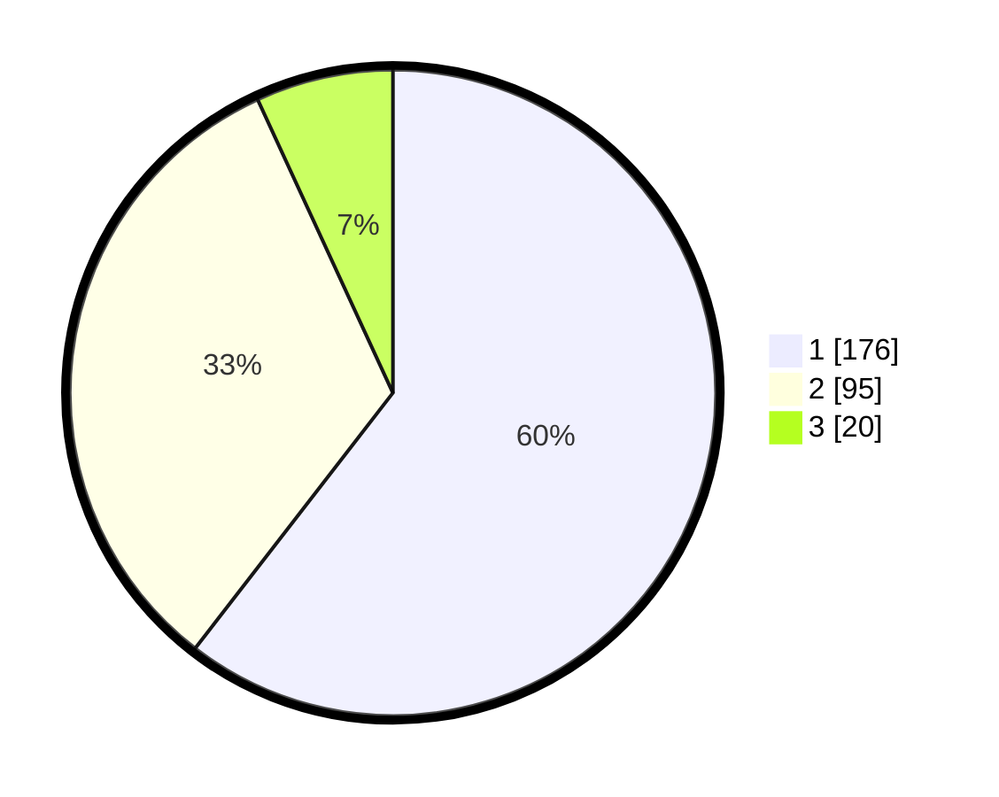

# Hasil

## Grafik

## Tabel

| No. | Nama Paslon    | Suara | Suara (raw) | Persentase |
|:--- |:-------------- | -----:| -----------:| ----------:|
| 1   | ANIES MUHAIMIN | 176   | [176][p-1]  | 60,48      |
| 2   | PRABOWO GIBRAN | 95    | [95][p-2]   | 32,65      |
| 3   | GANJAR MAHFUD  | 20    | [20][p-3]   | 6,87       |

[p-1]: https://github.com/gigit-pemilu/pemilu-2024/blob/main/pilpres/hitung-suara/sub/35-jawa-timur/sub/27-sampang/sub/13-pangarengan/sub/2003-gulbung/sub/015-tps/sub/paslon-1.txt
[p-2]: https://github.com/gigit-pemilu/pemilu-2024/blob/main/pilpres/hitung-suara/sub/35-jawa-timur/sub/27-sampang/sub/13-pangarengan/sub/2003-gulbung/sub/015-tps/sub/paslon-2.txt
[p-3]: https://github.com/gigit-pemilu/pemilu-2024/blob/main/pilpres/hitung-suara/sub/35-jawa-timur/sub/27-sampang/sub/13-pangarengan/sub/2003-gulbung/sub/015-tps/sub/paslon-3.txt

## Foto C Plano

https://sirekap-obj-formc.kpu.go.id/9a90/pemilu/ppwp/35/27/13/20/03/3527132003015-20240214-230951--6808539d-9226-4030-b12f-df5d87bb1eb1.jpg

https://sirekap-obj-formc.kpu.go.id/9a90/pemilu/ppwp/35/27/13/20/03/3527132003015-20240214-231314--a194a780-a309-4e21-892f-49a320cca028.jpg

https://sirekap-obj-formc.kpu.go.id/9a90/pemilu/ppwp/35/27/13/20/03/3527132003015-20240214-231551--a5f86083-72a4-4bf9-8a92-d63fcb273330.jpg

## Metadata

| Key        | Value               |
| ---------- | ------------------- |
| Time Stamp | 2024-02-16 10:30:29 |

