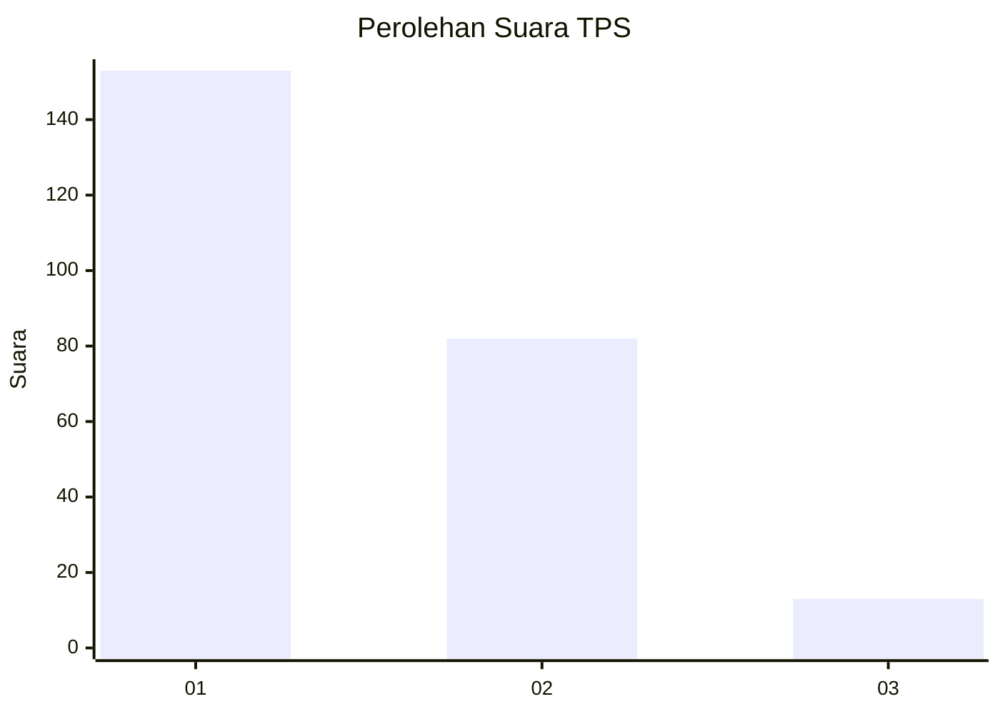
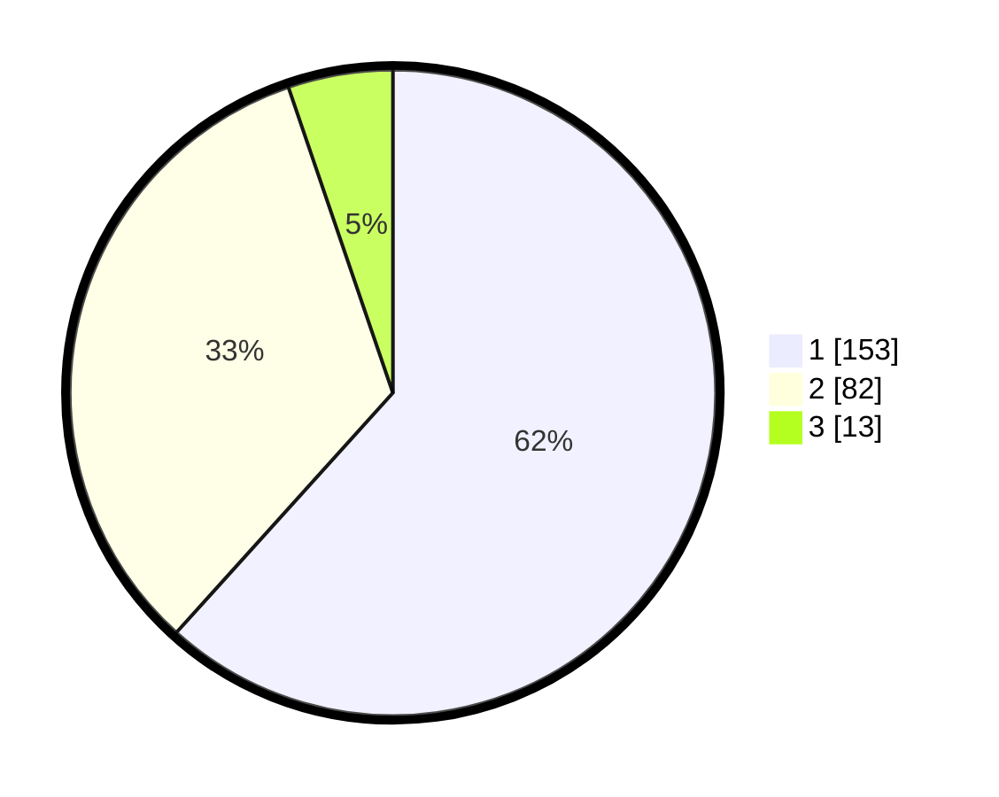

# Hasil

## Grafik

## Tabel

| No. | Nama Paslon    | Suara | Suara (raw) | Persentase |
|:--- |:-------------- | -----:| -----------:| ----------:|
| 1   | ANIES MUHAIMIN | 153   | [153][p-1]  | 61,69      |
| 2   | PRABOWO GIBRAN | 82    | [82][p-2]   | 33,06      |
| 3   | GANJAR MAHFUD  | 13    | [13][p-3]   | 5,24       |

[p-1]: https://github.com/gigit-pemilu/pemilu-2024/blob/main/pilpres/hitung-suara/sub/35-jawa-timur/sub/27-sampang/sub/13-pangarengan/sub/2004-panyirangan/sub/004-tps/sub/paslon-1.txt
[p-2]: https://github.com/gigit-pemilu/pemilu-2024/blob/main/pilpres/hitung-suara/sub/35-jawa-timur/sub/27-sampang/sub/13-pangarengan/sub/2004-panyirangan/sub/004-tps/sub/paslon-2.txt
[p-3]: https://github.com/gigit-pemilu/pemilu-2024/blob/main/pilpres/hitung-suara/sub/35-jawa-timur/sub/27-sampang/sub/13-pangarengan/sub/2004-panyirangan/sub/004-tps/sub/paslon-3.txt

## Foto C Plano

https://sirekap-obj-formc.kpu.go.id/5638/pemilu/ppwp/35/27/13/20/04/3527132004004-20240214-210534--2477f8e3-fd2f-4422-96b3-62756519d599.jpg

https://sirekap-obj-formc.kpu.go.id/5638/pemilu/ppwp/35/27/13/20/04/3527132004004-20240214-204456--49fa84e6-ecaa-4396-9680-53d5e5b8df4a.jpg

https://sirekap-obj-formc.kpu.go.id/5638/pemilu/ppwp/35/27/13/20/04/3527132004004-20240214-204610--5cec40cd-25a4-4402-9bce-1d3b1dc1819a.jpg

## Metadata

| Key        | Value               |
| ---------- | ------------------- |
| Time Stamp | 2024-02-15 20:30:46 |

