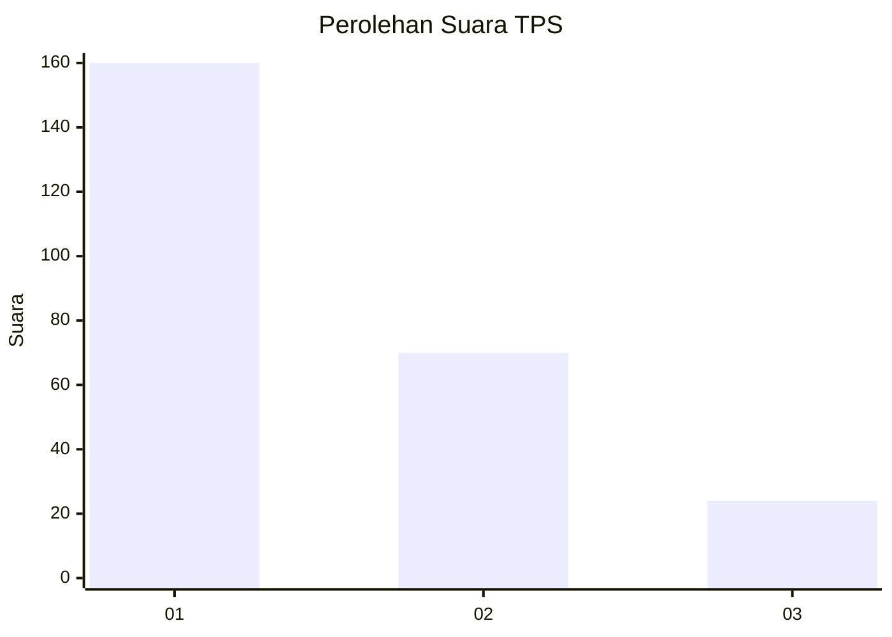
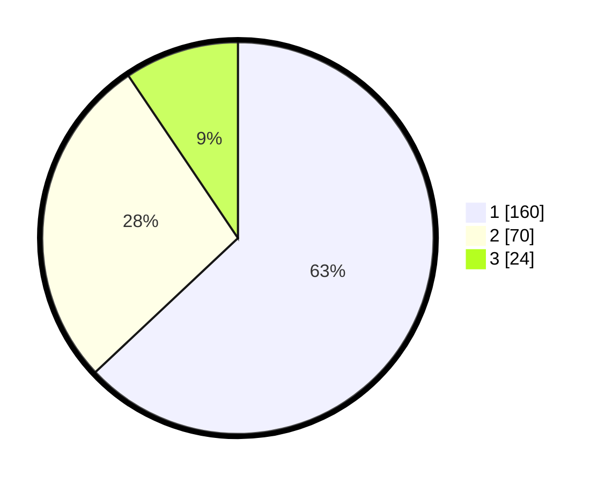

# Hasil

## Grafik

## Tabel

| No. | Nama Paslon    | Suara | Suara (raw) | Persentase |
|:--- |:-------------- | -----:| -----------:| ----------:|
| 1   | ANIES MUHAIMIN | 160   | [160][p-1]  | 62,99      |
| 2   | PRABOWO GIBRAN | 70    | [70][p-2]   | 27,56      |
| 3   | GANJAR MAHFUD  | 24    | [24][p-3]   | 9,45       |

[p-1]: https://github.com/gigit-pemilu/pemilu-2024/blob/main/pilpres/hitung-suara/sub/35-jawa-timur/sub/27-sampang/sub/13-pangarengan/sub/2005-pacangga-an/sub/002-tps/sub/paslon-1.txt
[p-2]: https://github.com/gigit-pemilu/pemilu-2024/blob/main/pilpres/hitung-suara/sub/35-jawa-timur/sub/27-sampang/sub/13-pangarengan/sub/2005-pacangga-an/sub/002-tps/sub/paslon-2.txt
[p-3]: https://github.com/gigit-pemilu/pemilu-2024/blob/main/pilpres/hitung-suara/sub/35-jawa-timur/sub/27-sampang/sub/13-pangarengan/sub/2005-pacangga-an/sub/002-tps/sub/paslon-3.txt

## Foto C Plano

https://sirekap-obj-formc.kpu.go.id/495a/pemilu/ppwp/35/27/13/20/05/3527132005002-20240215-003116--3dab0cf1-370b-4764-a14f-37e0020c0c59.jpg

https://sirekap-obj-formc.kpu.go.id/495a/pemilu/ppwp/35/27/13/20/05/3527132005002-20240215-003022--535414b1-ab03-4b52-b508-35a108d9d2c3.jpg

https://sirekap-obj-formc.kpu.go.id/495a/pemilu/ppwp/35/27/13/20/05/3527132005002-20240215-003326--ce558638-c275-4f2e-851b-3f7690c913dd.jpg

## Metadata

| Key        | Value               |
| ---------- | ------------------- |
| Time Stamp | 2024-02-16 10:30:29 |

