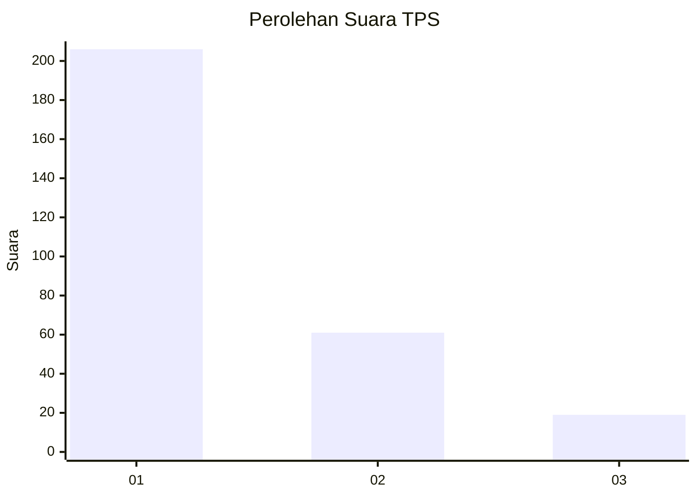
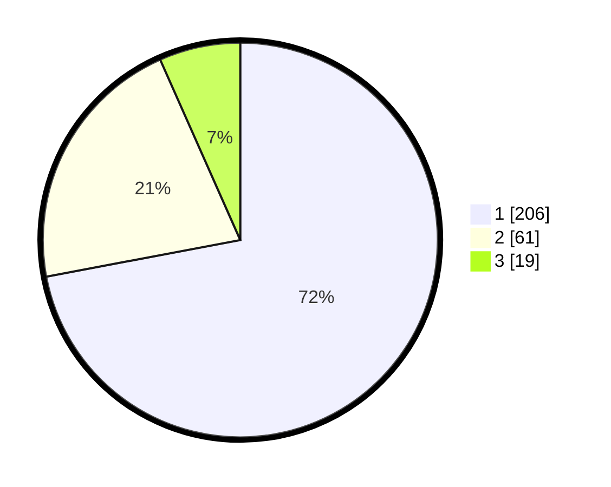

# Hasil

## Grafik

## Tabel

| No. | Nama Paslon    | Suara | Suara (raw) | Persentase |
|:--- |:-------------- | -----:| -----------:| ----------:|
| 1   | ANIES MUHAIMIN | 206   | [206][p-1]  | 72,03      |
| 2   | PRABOWO GIBRAN | 61    | [61][p-2]   | 21,33      |
| 3   | GANJAR MAHFUD  | 19    | [19][p-3]   | 6,64       |

[p-1]: https://github.com/gigit-pemilu/pemilu-2024/blob/main/pilpres/hitung-suara/sub/35-jawa-timur/sub/27-sampang/sub/14-karangpenang/sub/2001-blu-uran/sub/003-tps/sub/paslon-1.txt
[p-2]: https://github.com/gigit-pemilu/pemilu-2024/blob/main/pilpres/hitung-suara/sub/35-jawa-timur/sub/27-sampang/sub/14-karangpenang/sub/2001-blu-uran/sub/003-tps/sub/paslon-2.txt
[p-3]: https://github.com/gigit-pemilu/pemilu-2024/blob/main/pilpres/hitung-suara/sub/35-jawa-timur/sub/27-sampang/sub/14-karangpenang/sub/2001-blu-uran/sub/003-tps/sub/paslon-3.txt

## Foto C Plano

https://sirekap-obj-formc.kpu.go.id/bd6d/pemilu/ppwp/35/27/14/20/01/3527142001003-20240214-202634--8ab451d6-cce6-4e74-a84f-217a7ef73c0a.jpg

https://sirekap-obj-formc.kpu.go.id/bd6d/pemilu/ppwp/35/27/14/20/01/3527142001003-20240214-203550--a95b736f-a1bf-46b5-ba48-4d953ff26abe.jpg

https://sirekap-obj-formc.kpu.go.id/bd6d/pemilu/ppwp/35/27/14/20/01/3527142001003-20240214-203756--ca90d2dc-2735-4bfb-adfa-8441a12449d1.jpg

## Metadata

| Key        | Value               |
| ---------- | ------------------- |
| Time Stamp | 2024-02-17 01:00:00 |

