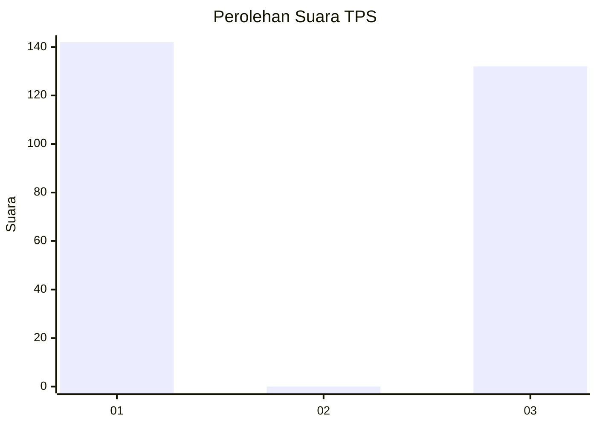
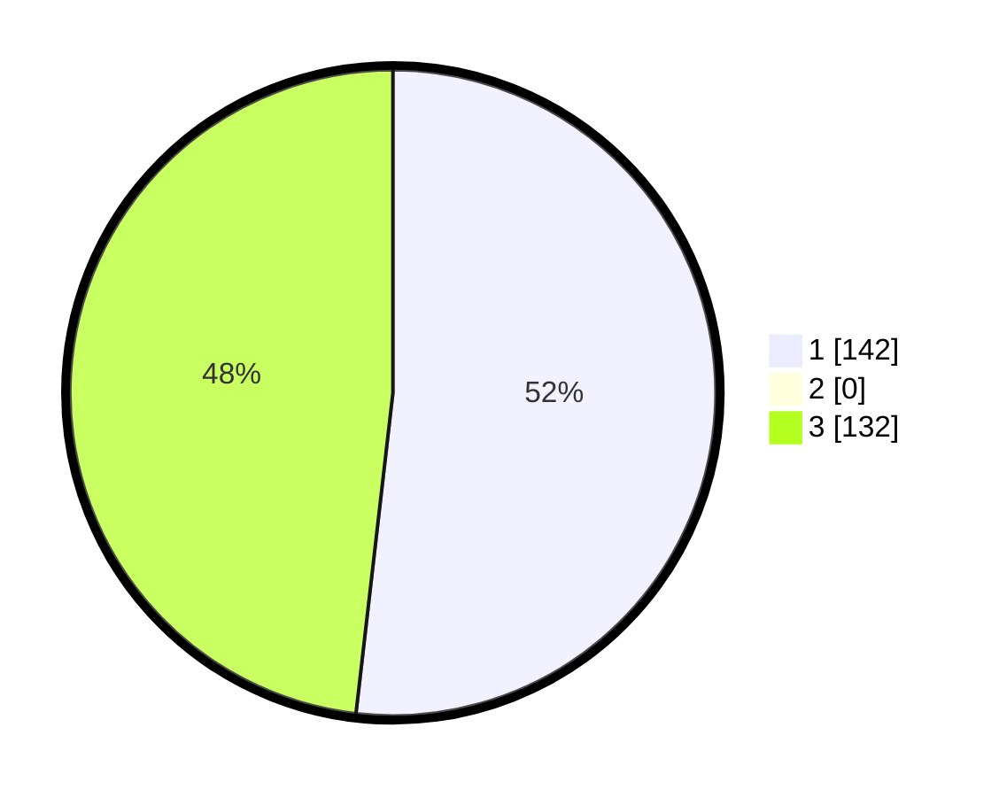

# Hasil

## Grafik

## Tabel

| No. | Nama Paslon    | Suara | Suara (raw) | Persentase |
|:--- |:-------------- | -----:| -----------:| ----------:|
| 1   | ANIES MUHAIMIN | 142   | [142][p-1]  | 51,82      |
| 2   | PRABOWO GIBRAN | 0     | [0][p-2]    | 0,00       |
| 3   | GANJAR MAHFUD  | 132   | [132][p-3]  | 48,18      |

[p-1]: https://github.com/gigit-pemilu/pemilu-2024-35-jawa-timur/blob/main/pilpres/hitung-suara/sub/35-jawa-timur/sub/27-sampang/sub/14-karangpenang/sub/2001-blu-uran/sub/005-tps/sub/paslon-1.txt
[p-2]: https://github.com/gigit-pemilu/pemilu-2024-35-jawa-timur/blob/main/pilpres/hitung-suara/sub/35-jawa-timur/sub/27-sampang/sub/14-karangpenang/sub/2001-blu-uran/sub/005-tps/sub/paslon-2.txt
[p-3]: https://github.com/gigit-pemilu/pemilu-2024-35-jawa-timur/blob/main/pilpres/hitung-suara/sub/35-jawa-timur/sub/27-sampang/sub/14-karangpenang/sub/2001-blu-uran/sub/005-tps/sub/paslon-3.txt

## Foto C Plano

https://sirekap-obj-formc.kpu.go.id/2aa6/pemilu/ppwp/35/27/14/20/01/3527142001005-20240214-184815--6906ac4b-6b06-4e82-84d8-cb4e7a496050.jpg

https://sirekap-obj-formc.kpu.go.id/2aa6/pemilu/ppwp/35/27/14/20/01/3527142001005-20240214-184644--0467b5e5-7ced-46ba-ae8a-4bf40ead6407.jpg

https://sirekap-obj-formc.kpu.go.id/2aa6/pemilu/ppwp/35/27/14/20/01/3527142001005-20240214-185034--801ee5e2-9ed3-4a54-828e-152ff1c9ac44.jpg

## Metadata

| Key        | Value               |
| ---------- | ------------------- |
| Time Stamp | 2024-02-17 01:00:00 |

