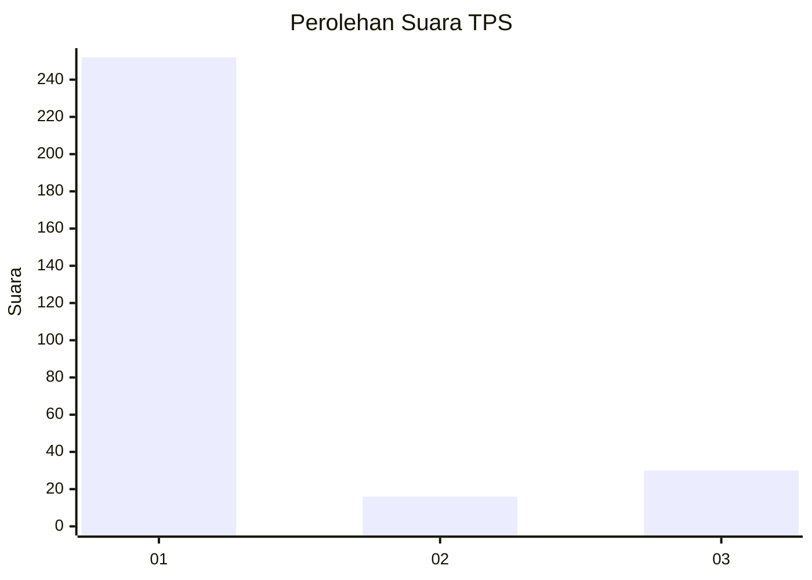
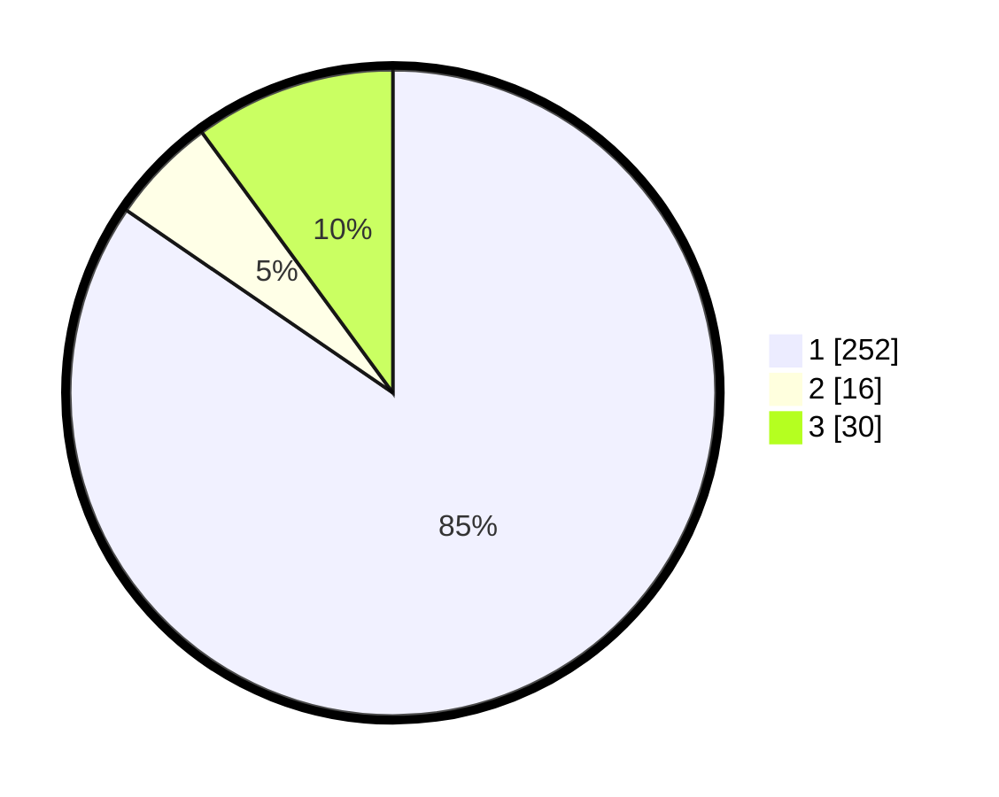

# Hasil

## Grafik

## Tabel

| No. | Nama Paslon    | Suara | Suara (raw) | Persentase |
|:--- |:-------------- | -----:| -----------:| ----------:|
| 1   | ANIES MUHAIMIN | 252   | [252][p-1]  | 84,56      |
| 2   | PRABOWO GIBRAN | 16    | [16][p-2]   | 5,37       |
| 3   | GANJAR MAHFUD  | 30    | [30][p-3]   | 10,07      |

[p-1]: https://github.com/gigit-pemilu/pemilu-2024/blob/main/pilpres/hitung-suara/sub/35-jawa-timur/sub/27-sampang/sub/14-karangpenang/sub/2001-blu-uran/sub/011-tps/sub/paslon-1.txt
[p-2]: https://github.com/gigit-pemilu/pemilu-2024/blob/main/pilpres/hitung-suara/sub/35-jawa-timur/sub/27-sampang/sub/14-karangpenang/sub/2001-blu-uran/sub/011-tps/sub/paslon-2.txt
[p-3]: https://github.com/gigit-pemilu/pemilu-2024/blob/main/pilpres/hitung-suara/sub/35-jawa-timur/sub/27-sampang/sub/14-karangpenang/sub/2001-blu-uran/sub/011-tps/sub/paslon-3.txt

## Foto C Plano

https://sirekap-obj-formc.kpu.go.id/cb3a/pemilu/ppwp/35/27/14/20/01/3527142001011-20240214-210202--cfbf8463-33d5-477f-b120-9dfc579cef50.jpg

https://sirekap-obj-formc.kpu.go.id/cb3a/pemilu/ppwp/35/27/14/20/01/3527142001011-20240214-203857--9960591b-e4c0-4d73-b8b0-ac4569ebbfcf.jpg

https://sirekap-obj-formc.kpu.go.id/cb3a/pemilu/ppwp/35/27/14/20/01/3527142001011-20240214-204007--18597a3b-77ef-4e6e-931e-0a0d7c2c868c.jpg

## Metadata

| Key        | Value               |
| ---------- | ------------------- |
| Time Stamp | 2024-02-16 11:00:29 |

