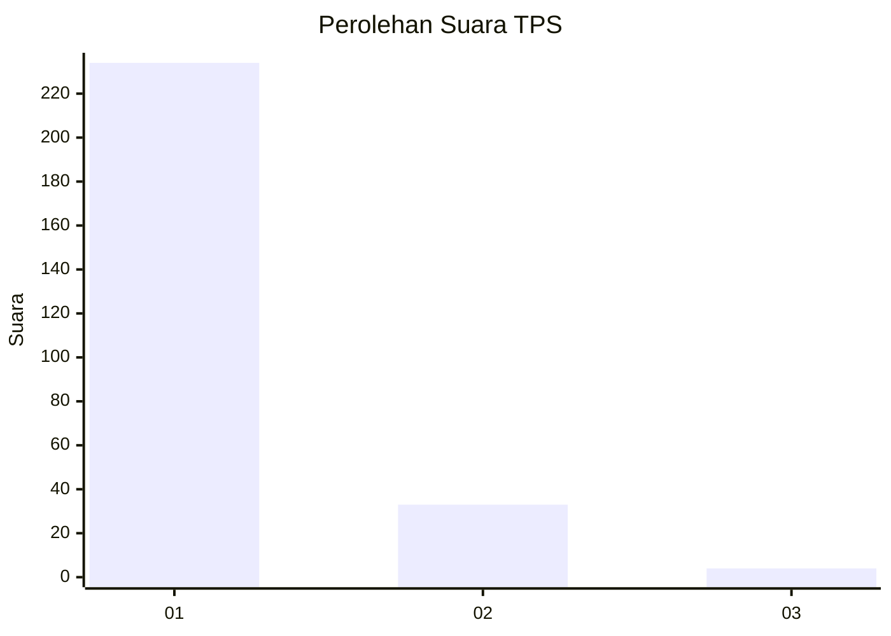
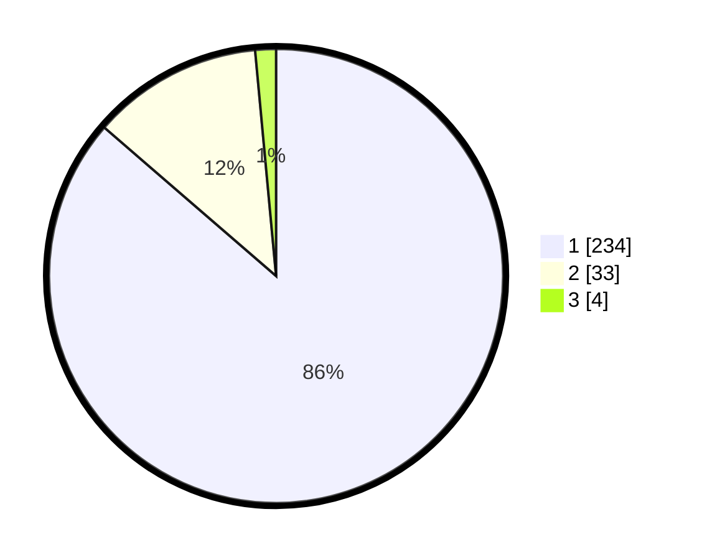

# Hasil

## Grafik

## Tabel

| No. | Nama Paslon    | Suara | Suara (raw) | Persentase |
|:--- |:-------------- | -----:| -----------:| ----------:|
| 1   | ANIES MUHAIMIN | 234   | [234][p-1]  | 86,35      |
| 2   | PRABOWO GIBRAN | 33    | [33][p-2]   | 12,18      |
| 3   | GANJAR MAHFUD  | 4     | [4][p-3]    | 1,48       |

[p-1]: https://github.com/gigit-pemilu/pemilu-2024/blob/main/pilpres/hitung-suara/sub/35-jawa-timur/sub/27-sampang/sub/14-karangpenang/sub/2001-blu-uran/sub/029-tps/sub/paslon-1.txt
[p-2]: https://github.com/gigit-pemilu/pemilu-2024/blob/main/pilpres/hitung-suara/sub/35-jawa-timur/sub/27-sampang/sub/14-karangpenang/sub/2001-blu-uran/sub/029-tps/sub/paslon-2.txt
[p-3]: https://github.com/gigit-pemilu/pemilu-2024/blob/main/pilpres/hitung-suara/sub/35-jawa-timur/sub/27-sampang/sub/14-karangpenang/sub/2001-blu-uran/sub/029-tps/sub/paslon-3.txt

## Foto C Plano

https://sirekap-obj-formc.kpu.go.id/df14/pemilu/ppwp/35/27/14/20/01/3527142001029-20240215-120419--46452b33-ef7c-40dd-a066-601b65e69001.jpg

https://sirekap-obj-formc.kpu.go.id/df14/pemilu/ppwp/35/27/14/20/01/3527142001029-20240215-120540--448064f8-0de0-4d69-8aec-3c76cf2ffa65.jpg

https://sirekap-obj-formc.kpu.go.id/df14/pemilu/ppwp/35/27/14/20/01/3527142001029-20240215-120640--f1e7976f-e035-41d3-8552-4be8585a8a47.jpg

## Metadata

| Key        | Value               |
| ---------- | ------------------- |
| Time Stamp | 2024-02-16 10:30:29 |

