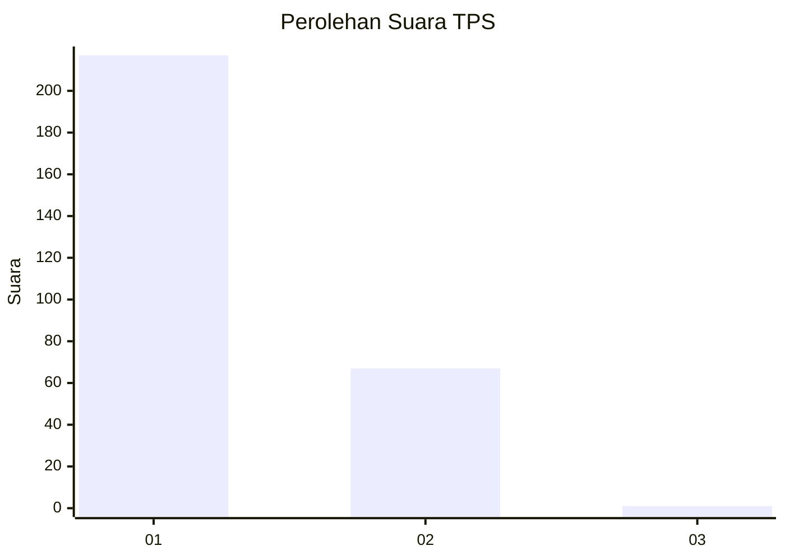
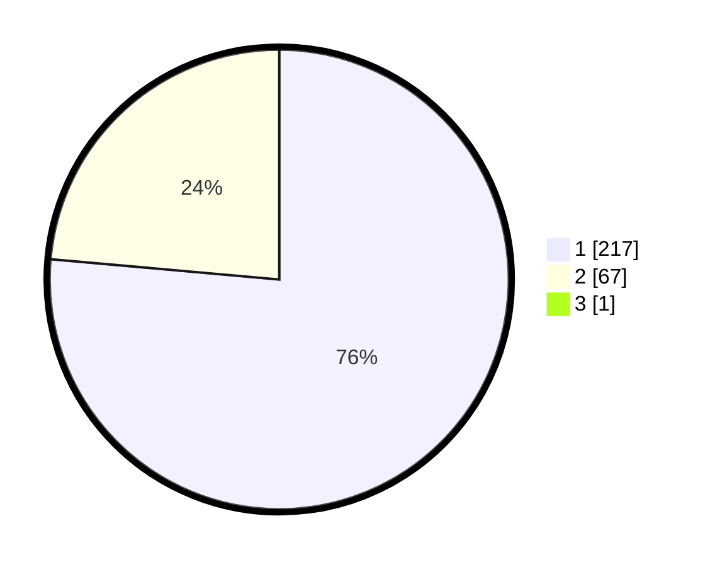

# Hasil

## Grafik

## Tabel

| No. | Nama Paslon    | Suara | Suara (raw) | Persentase |
|:--- |:-------------- | -----:| -----------:| ----------:|
| 1   | ANIES MUHAIMIN | 217   | [217][p-1]  | 76,14      |
| 2   | PRABOWO GIBRAN | 67    | [67][p-2]   | 23,51      |
| 3   | GANJAR MAHFUD  | 1     | [1][p-3]    | 0,35       |

[p-1]: https://github.com/gigit-pemilu/pemilu-2024/blob/main/pilpres/hitung-suara/sub/35-jawa-timur/sub/27-sampang/sub/14-karangpenang/sub/2002-tlambah/sub/001-tps/sub/paslon-1.txt
[p-2]: https://github.com/gigit-pemilu/pemilu-2024/blob/main/pilpres/hitung-suara/sub/35-jawa-timur/sub/27-sampang/sub/14-karangpenang/sub/2002-tlambah/sub/001-tps/sub/paslon-2.txt
[p-3]: https://github.com/gigit-pemilu/pemilu-2024/blob/main/pilpres/hitung-suara/sub/35-jawa-timur/sub/27-sampang/sub/14-karangpenang/sub/2002-tlambah/sub/001-tps/sub/paslon-3.txt

## Foto C Plano

https://sirekap-obj-formc.kpu.go.id/d19b/pemilu/ppwp/35/27/14/20/02/3527142002001-20240216-225008--ad33514c-d1a9-4cf8-a82a-3017fe875473.jpg

https://sirekap-obj-formc.kpu.go.id/d19b/pemilu/ppwp/35/27/14/20/02/3527142002001-20240215-231123--95069775-96a0-43ff-8dd0-6036f99ee83c.jpg

https://sirekap-obj-formc.kpu.go.id/d19b/pemilu/ppwp/35/27/14/20/02/3527142002001-20240215-231243--be5387ee-75af-49cc-a693-6a957dfe3fc8.jpg

## Metadata

| Key        | Value               |
| ---------- | ------------------- |
| Time Stamp | 2024-02-16 23:00:00 |

