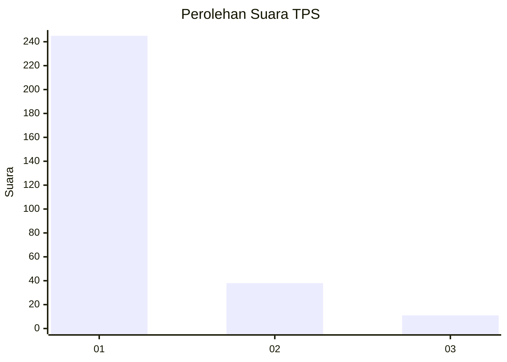
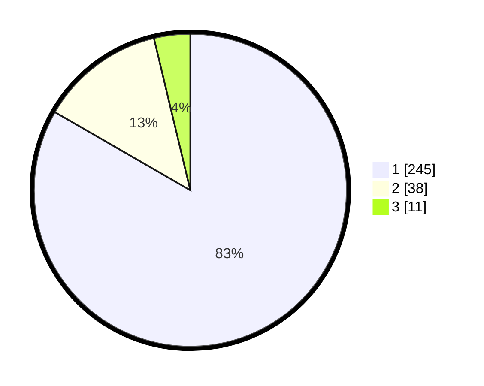

# Hasil

## Grafik

## Tabel

| No. | Nama Paslon    | Suara | Suara (raw) | Persentase |
|:--- |:-------------- | -----:| -----------:| ----------:|
| 1   | ANIES MUHAIMIN | 245   | [245][p-1]  | 83,33      |
| 2   | PRABOWO GIBRAN | 38    | [38][p-2]   | 12,93      |
| 3   | GANJAR MAHFUD  | 11    | [11][p-3]   | 3,74       |

[p-1]: https://github.com/gigit-pemilu/pemilu-2024/blob/main/pilpres/hitung-suara/sub/35-jawa-timur/sub/27-sampang/sub/14-karangpenang/sub/2002-tlambah/sub/004-tps/sub/paslon-1.txt
[p-2]: https://github.com/gigit-pemilu/pemilu-2024/blob/main/pilpres/hitung-suara/sub/35-jawa-timur/sub/27-sampang/sub/14-karangpenang/sub/2002-tlambah/sub/004-tps/sub/paslon-2.txt
[p-3]: https://github.com/gigit-pemilu/pemilu-2024/blob/main/pilpres/hitung-suara/sub/35-jawa-timur/sub/27-sampang/sub/14-karangpenang/sub/2002-tlambah/sub/004-tps/sub/paslon-3.txt

## Foto C Plano

https://sirekap-obj-formc.kpu.go.id/9e41/pemilu/ppwp/35/27/14/20/02/3527142002004-20240215-063747--8cfce8b3-a969-44d1-ac1c-5063a4565697.jpg

https://sirekap-obj-formc.kpu.go.id/9e41/pemilu/ppwp/35/27/14/20/02/3527142002004-20240215-064225--deac99ba-58ad-4f6b-b850-ae254d5e3280.jpg

https://sirekap-obj-formc.kpu.go.id/9e41/pemilu/ppwp/35/27/14/20/02/3527142002004-20240215-064505--b64a52bf-43f4-4a4d-a869-912c3c58fc4b.jpg

## Metadata

| Key        | Value               |
| ---------- | ------------------- |
| Time Stamp | 2024-02-16 11:00:29 |

