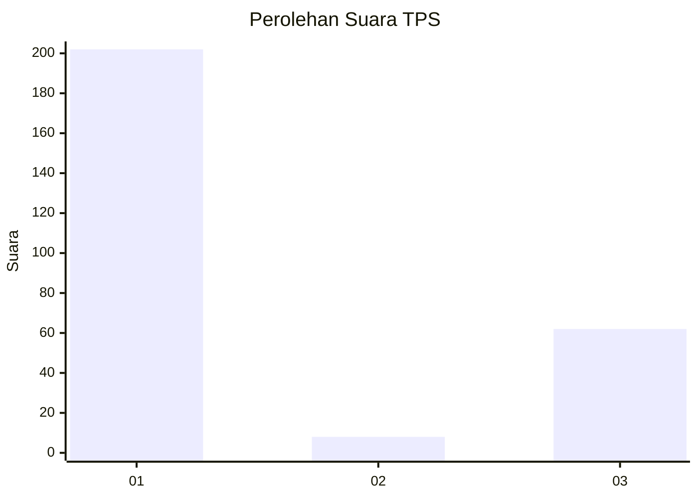
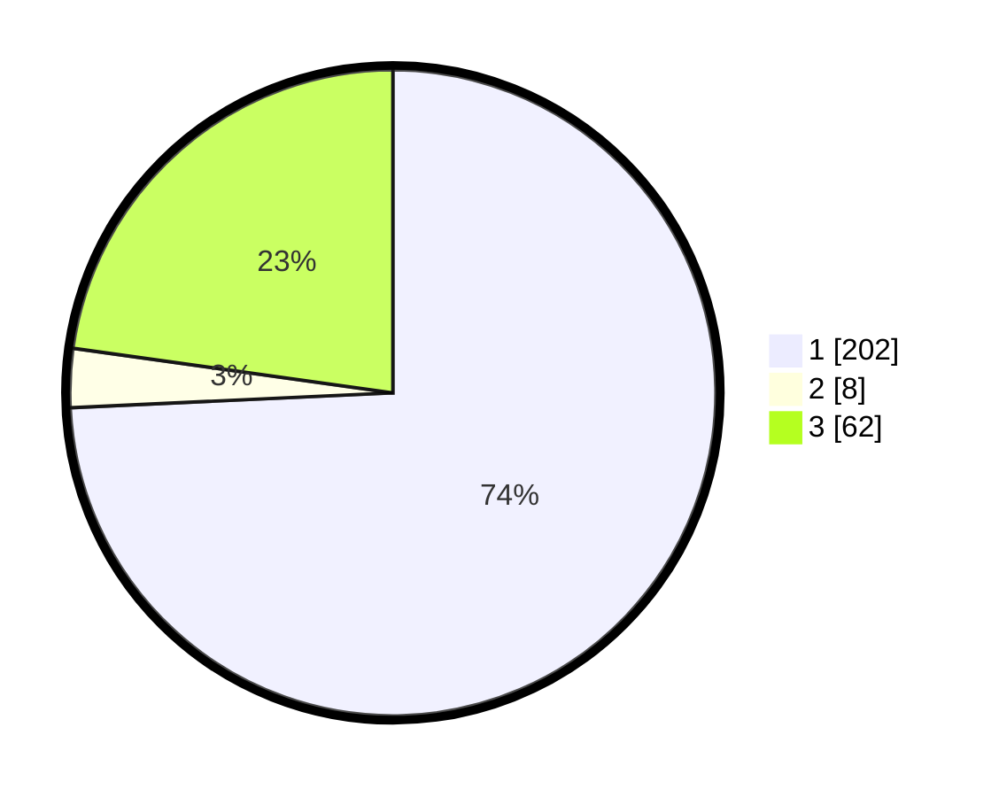

# Hasil

## Grafik

## Tabel

| No. | Nama Paslon    | Suara | Suara (raw) | Persentase |
|:--- |:-------------- | -----:| -----------:| ----------:|
| 1   | ANIES MUHAIMIN | 202   | [202][p-1]  | 74,26      |
| 2   | PRABOWO GIBRAN | 8     | [8][p-2]    | 2,94       |
| 3   | GANJAR MAHFUD  | 62    | [62][p-3]   | 22,79      |

[p-1]: https://github.com/gigit-pemilu/pemilu-2024-35-jawa-timur/blob/main/pilpres/hitung-suara/sub/35-jawa-timur/sub/27-sampang/sub/14-karangpenang/sub/2002-tlambah/sub/007-tps/sub/paslon-1.txt
[p-2]: https://github.com/gigit-pemilu/pemilu-2024-35-jawa-timur/blob/main/pilpres/hitung-suara/sub/35-jawa-timur/sub/27-sampang/sub/14-karangpenang/sub/2002-tlambah/sub/007-tps/sub/paslon-2.txt
[p-3]: https://github.com/gigit-pemilu/pemilu-2024-35-jawa-timur/blob/main/pilpres/hitung-suara/sub/35-jawa-timur/sub/27-sampang/sub/14-karangpenang/sub/2002-tlambah/sub/007-tps/sub/paslon-3.txt

## Foto C Plano

https://sirekap-obj-formc.kpu.go.id/1805/pemilu/ppwp/35/27/14/20/02/3527142002007-20240214-141734--f2f53fd8-0d25-4142-885d-2c51f99146b3.jpg

https://sirekap-obj-formc.kpu.go.id/1805/pemilu/ppwp/35/27/14/20/02/3527142002007-20240214-141848--aab40067-5a75-451d-b9a5-1bb8a32c2cd0.jpg

https://sirekap-obj-formc.kpu.go.id/1805/pemilu/ppwp/35/27/14/20/02/3527142002007-20240214-204910--40930d64-ca42-4fe1-96c4-99fb0c55724d.jpg

## Metadata

| Key        | Value               |
| ---------- | ------------------- |
| Time Stamp | 2024-02-17 01:00:00 |

