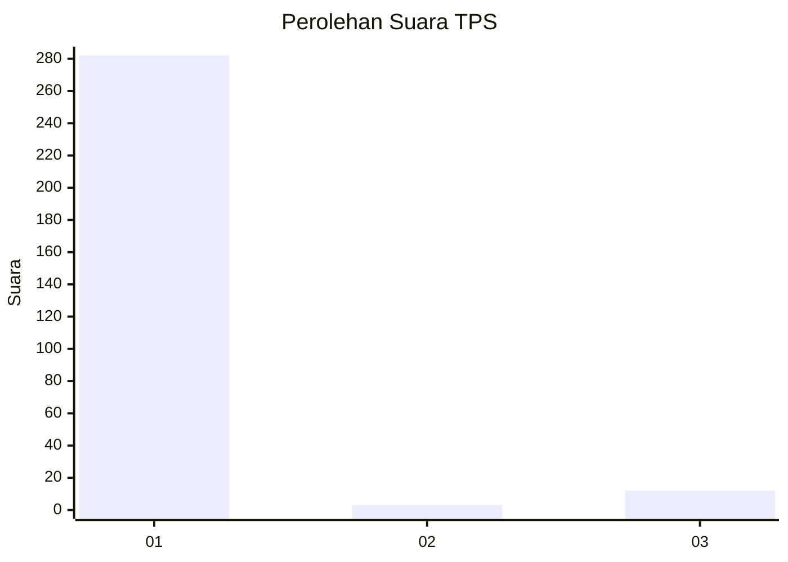
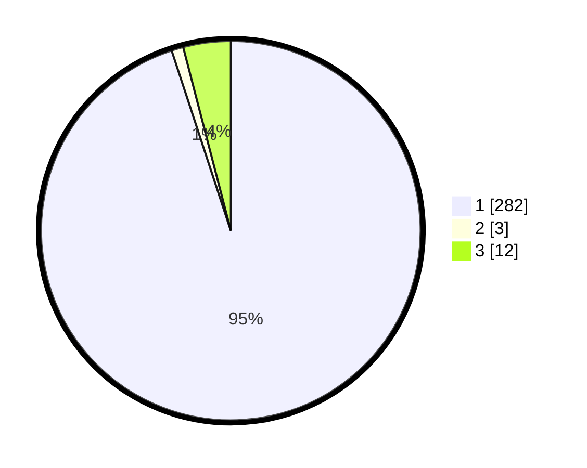

# Hasil

## Grafik

## Tabel

| No. | Nama Paslon    | Suara | Suara (raw) | Persentase |
|:--- |:-------------- | -----:| -----------:| ----------:|
| 1   | ANIES MUHAIMIN | 282   | [282][p-1]  | 94,95      |
| 2   | PRABOWO GIBRAN | 3     | [3][p-2]    | 1,01       |
| 3   | GANJAR MAHFUD  | 12    | [12][p-3]   | 4,04       |

[p-1]: https://github.com/gigit-pemilu/pemilu-2024-35-jawa-timur/blob/main/pilpres/hitung-suara/sub/35-jawa-timur/sub/27-sampang/sub/14-karangpenang/sub/2002-tlambah/sub/009-tps/sub/paslon-1.txt
[p-2]: https://github.com/gigit-pemilu/pemilu-2024-35-jawa-timur/blob/main/pilpres/hitung-suara/sub/35-jawa-timur/sub/27-sampang/sub/14-karangpenang/sub/2002-tlambah/sub/009-tps/sub/paslon-2.txt
[p-3]: https://github.com/gigit-pemilu/pemilu-2024-35-jawa-timur/blob/main/pilpres/hitung-suara/sub/35-jawa-timur/sub/27-sampang/sub/14-karangpenang/sub/2002-tlambah/sub/009-tps/sub/paslon-3.txt

## Foto C Plano

https://sirekap-obj-formc.kpu.go.id/45a4/pemilu/ppwp/35/27/14/20/02/3527142002009-20240214-214729--0c5bf650-2553-42d4-8194-6b9c6dbb0e5b.jpg

https://sirekap-obj-formc.kpu.go.id/45a4/pemilu/ppwp/35/27/14/20/02/3527142002009-20240215-110739--7fd3b7ca-41cd-4ecb-8edf-6fe969929f93.jpg

https://sirekap-obj-formc.kpu.go.id/45a4/pemilu/ppwp/35/27/14/20/02/3527142002009-20240215-110820--ad348ffc-3460-4062-8c50-84395307a3be.jpg

## Metadata

| Key        | Value               |
| ---------- | ------------------- |
| Time Stamp | 2024-02-15 21:30:27 |

