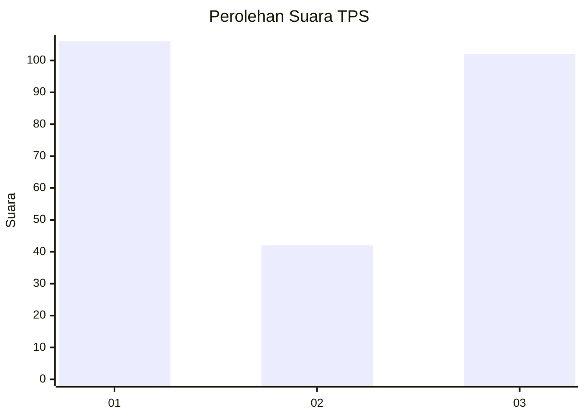
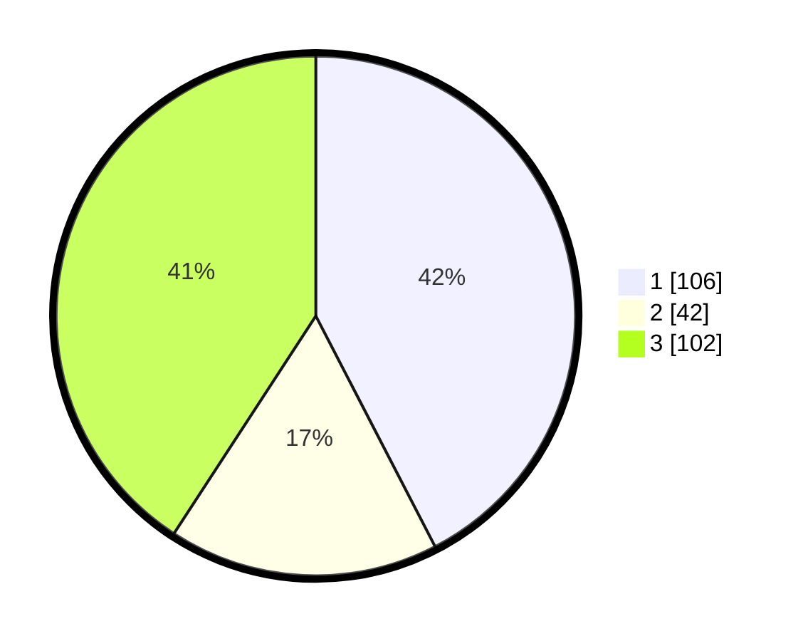

# Hasil

## Grafik

## Tabel

| No. | Nama Paslon    | Suara | Suara (raw) | Persentase |
|:--- |:-------------- | -----:| -----------:| ----------:|
| 1   | ANIES MUHAIMIN | 106   | [106][p-1]  | 42,40      |
| 2   | PRABOWO GIBRAN | 42    | [42][p-2]   | 16,80      |
| 3   | GANJAR MAHFUD  | 102   | [102][p-3]  | 40,80      |

[p-1]: https://github.com/gigit-pemilu/pemilu-2024-35-jawa-timur/blob/main/pilpres/hitung-suara/sub/35-jawa-timur/sub/27-sampang/sub/14-karangpenang/sub/2002-tlambah/sub/010-tps/sub/paslon-1.txt
[p-2]: https://github.com/gigit-pemilu/pemilu-2024-35-jawa-timur/blob/main/pilpres/hitung-suara/sub/35-jawa-timur/sub/27-sampang/sub/14-karangpenang/sub/2002-tlambah/sub/010-tps/sub/paslon-2.txt
[p-3]: https://github.com/gigit-pemilu/pemilu-2024-35-jawa-timur/blob/main/pilpres/hitung-suara/sub/35-jawa-timur/sub/27-sampang/sub/14-karangpenang/sub/2002-tlambah/sub/010-tps/sub/paslon-3.txt

## Foto C Plano

https://sirekap-obj-formc.kpu.go.id/394d/pemilu/ppwp/35/27/14/20/02/3527142002010-20240215-092119--e49d9aff-86a2-4121-95d3-6041badcffa5.jpg

https://sirekap-obj-formc.kpu.go.id/394d/pemilu/ppwp/35/27/14/20/02/3527142002010-20240215-093202--134a46d6-5171-4694-ba48-70df6557644c.jpg

https://sirekap-obj-formc.kpu.go.id/394d/pemilu/ppwp/35/27/14/20/02/3527142002010-20240215-093327--78de7c72-0694-48d4-b1bd-57b5b8bb0443.jpg

## Metadata

| Key        | Value               |
| ---------- | ------------------- |
| Time Stamp | 2024-02-17 01:00:00 |

