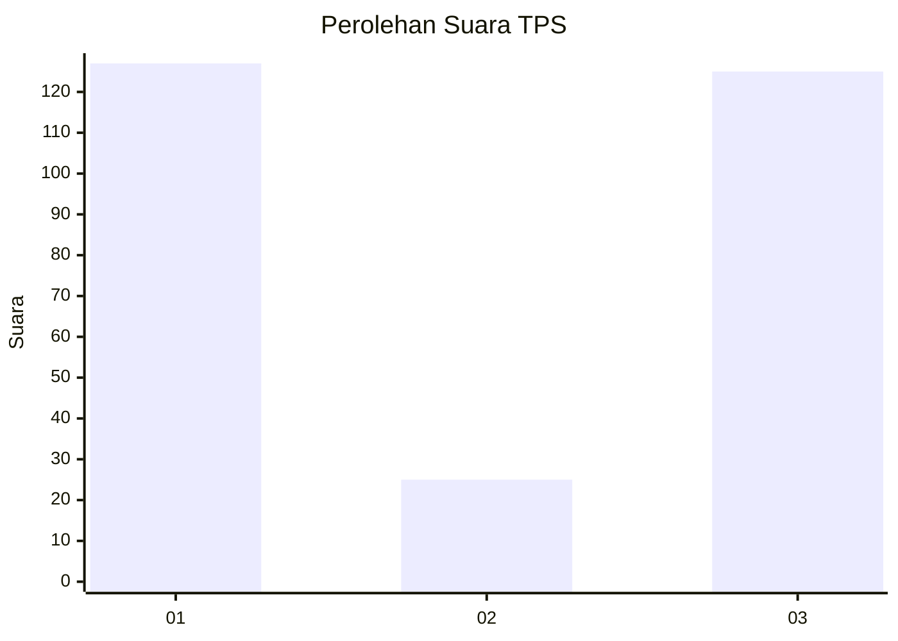
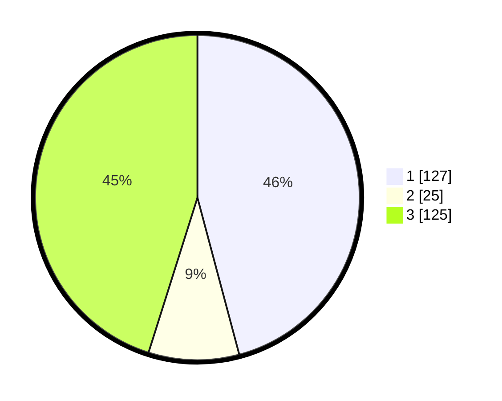

# Hasil

## Grafik

## Tabel

| No. | Nama Paslon    | Suara | Suara (raw) | Persentase |
|:--- |:-------------- | -----:| -----------:| ----------:|
| 1   | ANIES MUHAIMIN | 127   | [127][p-1]  | 45,85      |
| 2   | PRABOWO GIBRAN | 25    | [25][p-2]   | 9,03       |
| 3   | GANJAR MAHFUD  | 125   | [125][p-3]  | 45,13      |

[p-1]: https://github.com/gigit-pemilu/pemilu-2024-35-jawa-timur/blob/main/pilpres/hitung-suara/sub/35-jawa-timur/sub/27-sampang/sub/14-karangpenang/sub/2002-tlambah/sub/011-tps/sub/paslon-1.txt
[p-2]: https://github.com/gigit-pemilu/pemilu-2024-35-jawa-timur/blob/main/pilpres/hitung-suara/sub/35-jawa-timur/sub/27-sampang/sub/14-karangpenang/sub/2002-tlambah/sub/011-tps/sub/paslon-2.txt
[p-3]: https://github.com/gigit-pemilu/pemilu-2024-35-jawa-timur/blob/main/pilpres/hitung-suara/sub/35-jawa-timur/sub/27-sampang/sub/14-karangpenang/sub/2002-tlambah/sub/011-tps/sub/paslon-3.txt

## Foto C Plano

https://sirekap-obj-formc.kpu.go.id/8ac9/pemilu/ppwp/35/27/14/20/02/3527142002011-20240215-061127--294aaca7-f614-47ae-8568-4eaaed6f5702.jpg

https://sirekap-obj-formc.kpu.go.id/8ac9/pemilu/ppwp/35/27/14/20/02/3527142002011-20240215-061455--9870baf5-c4bc-4453-b8ea-bc5449c9ea67.jpg

https://sirekap-obj-formc.kpu.go.id/8ac9/pemilu/ppwp/35/27/14/20/02/3527142002011-20240215-060749--90c01100-05b3-4cab-9f5c-b8797b143715.jpg

## Metadata

| Key        | Value               |
| ---------- | ------------------- |
| Time Stamp | 2024-02-16 11:00:29 |

