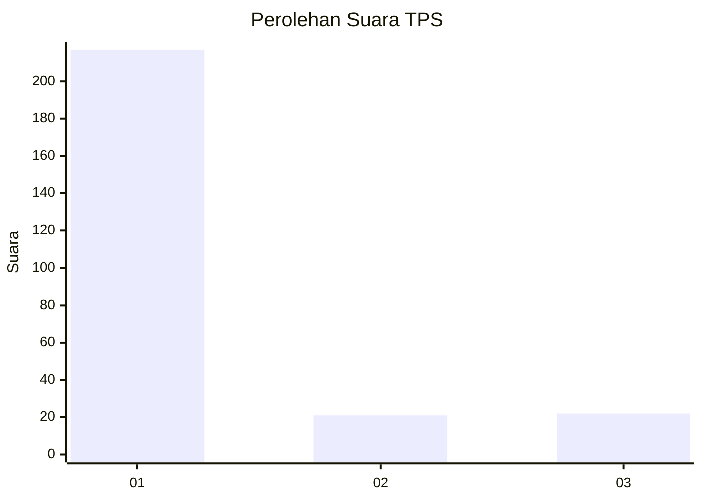
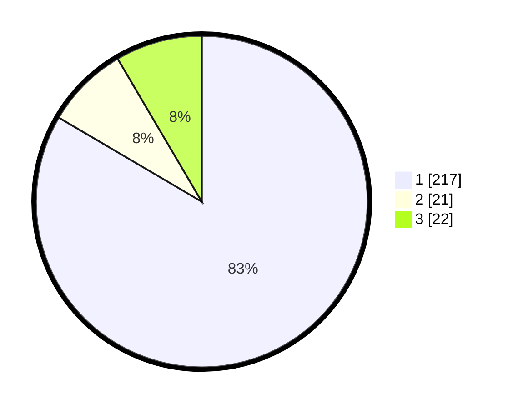

# Hasil

## Grafik

## Tabel

| No. | Nama Paslon    | Suara | Suara (raw) | Persentase |
|:--- |:-------------- | -----:| -----------:| ----------:|
| 1   | ANIES MUHAIMIN | 217   | [217][p-1]  | 83,46      |
| 2   | PRABOWO GIBRAN | 21    | [21][p-2]   | 8,08       |
| 3   | GANJAR MAHFUD  | 22    | [22][p-3]   | 8,46       |

[p-1]: https://github.com/gigit-pemilu/pemilu-2024/blob/main/pilpres/hitung-suara/sub/35-jawa-timur/sub/27-sampang/sub/14-karangpenang/sub/2002-tlambah/sub/012-tps/sub/paslon-1.txt
[p-2]: https://github.com/gigit-pemilu/pemilu-2024/blob/main/pilpres/hitung-suara/sub/35-jawa-timur/sub/27-sampang/sub/14-karangpenang/sub/2002-tlambah/sub/012-tps/sub/paslon-2.txt
[p-3]: https://github.com/gigit-pemilu/pemilu-2024/blob/main/pilpres/hitung-suara/sub/35-jawa-timur/sub/27-sampang/sub/14-karangpenang/sub/2002-tlambah/sub/012-tps/sub/paslon-3.txt

## Foto C Plano

https://sirekap-obj-formc.kpu.go.id/624e/pemilu/ppwp/35/27/14/20/02/3527142002012-20240215-141553--d16f3593-d58c-4e72-b61d-bd8bd96d78ca.jpg

https://sirekap-obj-formc.kpu.go.id/624e/pemilu/ppwp/35/27/14/20/02/3527142002012-20240215-141644--c84cd430-1d93-4d83-ad65-2b8a8d5bfb67.jpg

https://sirekap-obj-formc.kpu.go.id/624e/pemilu/ppwp/35/27/14/20/02/3527142002012-20240215-141729--39c2d106-6f2f-4d48-9352-7926a6b0ae30.jpg

## Metadata

| Key        | Value               |
| ---------- | ------------------- |
| Time Stamp | 2024-02-17 01:00:00 |

