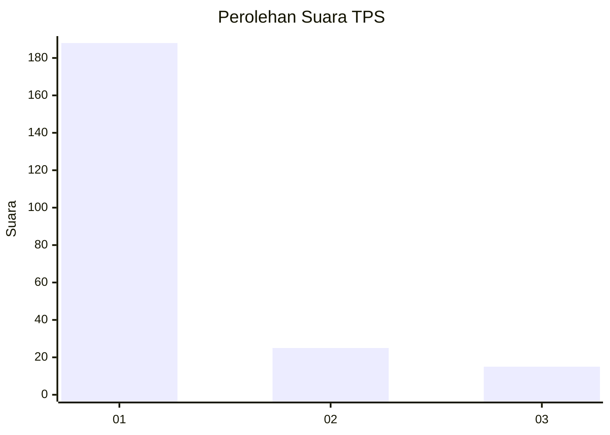
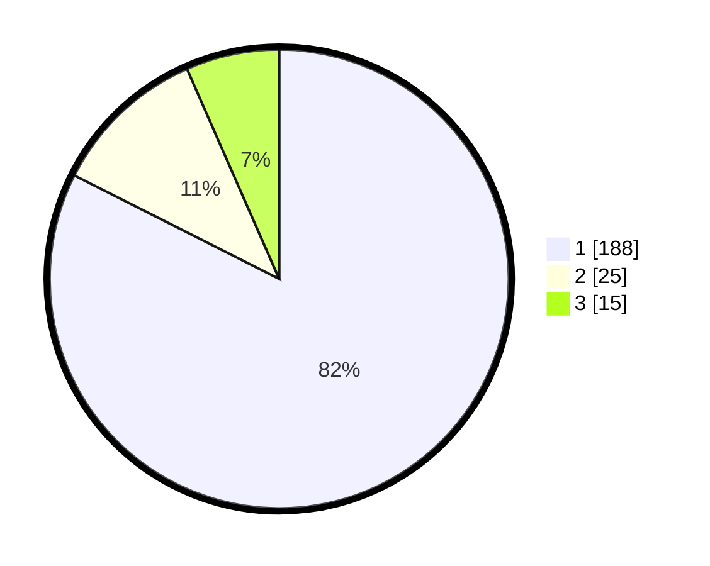

# Hasil

## Grafik

## Tabel

| No. | Nama Paslon    | Suara | Suara (raw) | Persentase |
|:--- |:-------------- | -----:| -----------:| ----------:|
| 1   | ANIES MUHAIMIN | 188   | [188][p-1]  | 82,46      |
| 2   | PRABOWO GIBRAN | 25    | [25][p-2]   | 10,96      |
| 3   | GANJAR MAHFUD  | 15    | [15][p-3]   | 6,58       |

[p-1]: https://github.com/gigit-pemilu/pemilu-2024/blob/main/pilpres/hitung-suara/sub/35-jawa-timur/sub/27-sampang/sub/14-karangpenang/sub/2002-tlambah/sub/013-tps/sub/paslon-1.txt
[p-2]: https://github.com/gigit-pemilu/pemilu-2024/blob/main/pilpres/hitung-suara/sub/35-jawa-timur/sub/27-sampang/sub/14-karangpenang/sub/2002-tlambah/sub/013-tps/sub/paslon-2.txt
[p-3]: https://github.com/gigit-pemilu/pemilu-2024/blob/main/pilpres/hitung-suara/sub/35-jawa-timur/sub/27-sampang/sub/14-karangpenang/sub/2002-tlambah/sub/013-tps/sub/paslon-3.txt

## Foto C Plano

https://sirekap-obj-formc.kpu.go.id/92c8/pemilu/ppwp/35/27/14/20/02/3527142002013-20240214-215154--d8d5c186-b1ca-4df0-b2b8-01a227035612.jpg

https://sirekap-obj-formc.kpu.go.id/92c8/pemilu/ppwp/35/27/14/20/02/3527142002013-20240214-215228--1554ed29-1b5b-44d5-b3be-8475c305a455.jpg

https://sirekap-obj-formc.kpu.go.id/92c8/pemilu/ppwp/35/27/14/20/02/3527142002013-20240214-215306--c46253e4-1810-4f3c-b8aa-ab27e65e606e.jpg

## Metadata

| Key        | Value               |
| ---------- | ------------------- |
| Time Stamp | 2024-02-24 22:31:28 |

