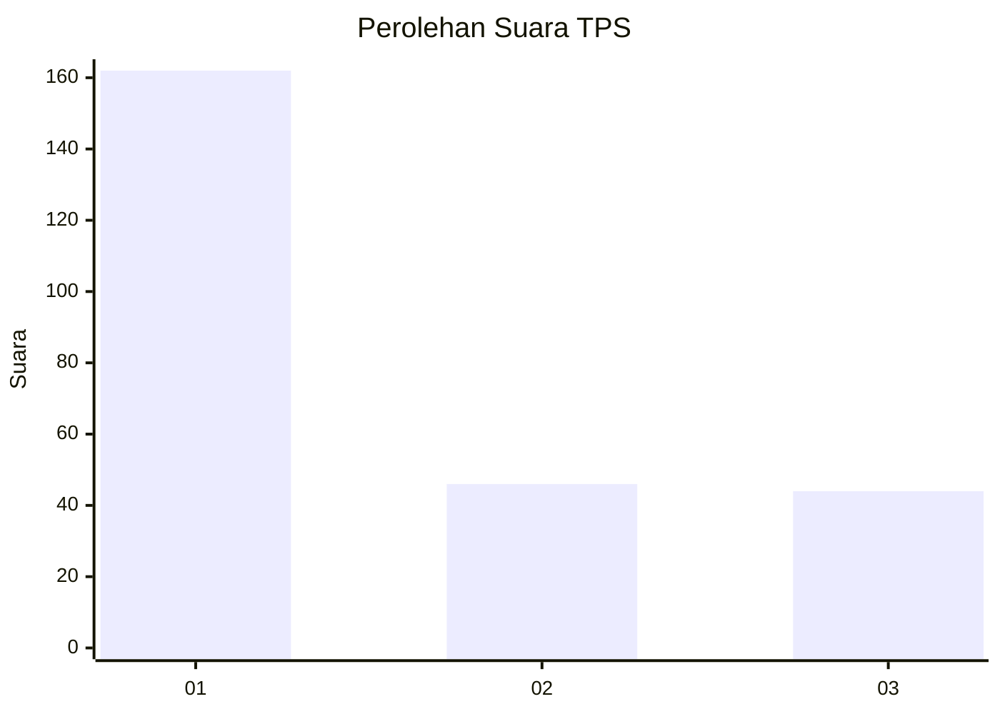
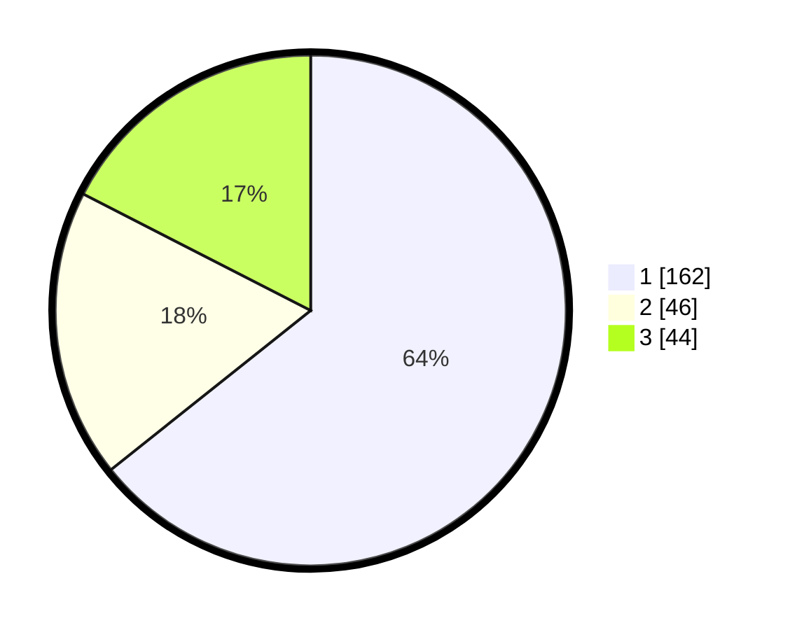

# Hasil

## Grafik

## Tabel

| No. | Nama Paslon    | Suara | Suara (raw) | Persentase |
|:--- |:-------------- | -----:| -----------:| ----------:|
| 1   | ANIES MUHAIMIN | 162   | [162][p-1]  | 64,29      |
| 2   | PRABOWO GIBRAN | 46    | [46][p-2]   | 18,25      |
| 3   | GANJAR MAHFUD  | 44    | [44][p-3]   | 17,46      |

[p-1]: https://github.com/gigit-pemilu/pemilu-2024-35-jawa-timur/blob/main/pilpres/hitung-suara/sub/35-jawa-timur/sub/27-sampang/sub/14-karangpenang/sub/2002-tlambah/sub/014-tps/sub/paslon-1.txt
[p-2]: https://github.com/gigit-pemilu/pemilu-2024-35-jawa-timur/blob/main/pilpres/hitung-suara/sub/35-jawa-timur/sub/27-sampang/sub/14-karangpenang/sub/2002-tlambah/sub/014-tps/sub/paslon-2.txt
[p-3]: https://github.com/gigit-pemilu/pemilu-2024-35-jawa-timur/blob/main/pilpres/hitung-suara/sub/35-jawa-timur/sub/27-sampang/sub/14-karangpenang/sub/2002-tlambah/sub/014-tps/sub/paslon-3.txt

## Foto C Plano

https://sirekap-obj-formc.kpu.go.id/4f61/pemilu/ppwp/35/27/14/20/02/3527142002014-20240215-000127--1d54dda6-b130-4c09-821d-98052f0322ba.jpg

https://sirekap-obj-formc.kpu.go.id/4f61/pemilu/ppwp/35/27/14/20/02/3527142002014-20240215-000318--2c73b106-da21-4446-8c8c-b32ed7829cfc.jpg

https://sirekap-obj-formc.kpu.go.id/4f61/pemilu/ppwp/35/27/14/20/02/3527142002014-20240215-000440--21091be7-ed26-4b6e-9b14-ecbfc430bc66.jpg

## Metadata

| Key        | Value               |
| ---------- | ------------------- |
| Time Stamp | 2024-02-17 01:00:00 |

